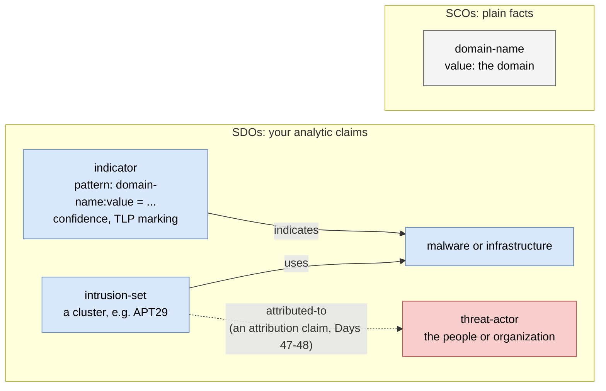
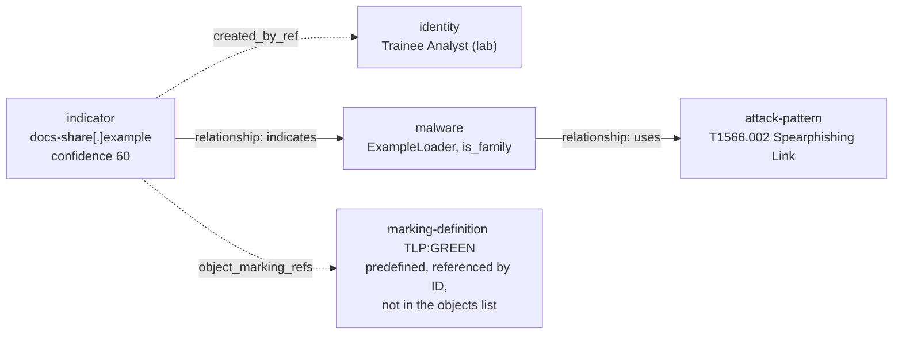

# Day 43: Writing threat intelligence in STIX 2.1

Phase: 3. Cyber Threat Intelligence · Track goal: Express your Day 40 findings as a valid STIX 2.1 bundle that another analyst's tools can ingest, with your confidence and sharing restrictions carried inside the data.

## Concept
STIX (Structured Threat Information Expression) is an OASIS standard JSON format for threat intelligence. You have already used it without noticing: the ATT&CK file from Day 35 is a STIX 2.1 bundle, and every group in it is an object of type `intrusion-set`.

STIX 2.1 describes the world as a graph:

| Kind | What it is | Examples |
|---|---|---|
| STIX Domain Objects (SDOs) | Analytic concepts | `indicator`, `malware`, `attack-pattern`, `intrusion-set`, `threat-actor`, `infrastructure`, `campaign`, `report`, `vulnerability` |
| STIX Cyber-observable Objects (SCOs) | Facts seen on a network or host | `domain-name`, `ipv4-addr`, `url`, `file`, `x509-certificate` |
| STIX Relationship Objects | Edges | `relationship` (with a `relationship_type` such as `indicates`, `uses`, `attributed-to`), `sighting` |
| Meta objects | Handling and extensions | `marking-definition` (TLP), `extension-definition` |
| Bundle | A wrapper for sending objects together | `bundle` (has no meaning of its own) |

Three distinctions trip people up.

An `indicator` is an analyst's claim that a pattern is worth detecting, written in the STIX patterning language, for example `[domain-name:value = 'login-portal.example']`. A `domain-name` SCO is simply the fact that the domain exists. Put your judgment in indicators and relationships, and keep plain observations as observables.

An `intrusion-set` is a cluster of adversary activity, which is what APT29 is in ATT&CK. A `threat-actor` is the individuals or organization believed to be behind it. Linking the two with `attributed-to` is an attribution claim (Days 47 and 48), so use it deliberately.

Both distinctions in one graph. Solid edges are `relationship` objects you create; the dotted `attributed-to` edge is the one this lab does not draw yet:



The indicator's pattern names the same domain the `domain-name` object records, but one is a judgment that it is worth detecting and the other is only the fact that it exists.

Every SDO and relationship can carry `confidence` (an integer from 0 to 100) and `object_marking_refs` (such as TLP:GREEN). Your uncertainty and your sharing restrictions travel with each object, rather than sitting in a cover email that gets lost.

## Resources
- [STIX 2.1 specification](https://docs.oasis-open.org/cti/stix/v2.1/os/stix-v2.1-os.html): section 4 (SDOs) and section 9 (patterning) are the parts you will look things up in.
- [OASIS CTI documentation site](https://oasis-open.github.io/cti-documentation/): examples and walkthroughs for STIX and TAXII.
- [stix2 Python library docs](https://stix2.readthedocs.io/): build objects in code and let the library generate IDs and timestamps.
- [cti-stix-validator](https://github.com/oasis-open/cti-stix-validator): the official validator (installed from PyPI as `stix2-validator`).
- [STIX visualizer](https://oasis-open.github.io/cti-stix-visualization/): paste a bundle, get a node-link graph.

## Practical: stix2 and the STIX visualizer (a validated STIX bundle and its relationship graph)
The data you encode today comes from your Day 40 work, which was built from a published vendor report and passive lookups. Do not add indicators you collected any other way.

### 1. Read a minimal bundle by hand
This bundle passed `stix2_validator` with no errors. It uses the placeholder domain from Day 40:

```json
{
  "type": "bundle",
  "id": "bundle--ee1feaeb-4d87-4743-99f8-8b8dff5ec362",
  "objects": [
    {
      "type": "identity", "spec_version": "2.1",
      "id": "identity--054213a1-ee0a-4ddc-8ebb-4257cfe6e084",
      "created": "2026-09-30T12:00:00.000Z", "modified": "2026-09-30T12:00:00.000Z",
      "name": "Trainee Analyst (lab)", "identity_class": "individual"
    },
    {
      "type": "indicator", "spec_version": "2.1",
      "id": "indicator--54eac790-404d-4a24-9695-b4a96fd71033",
      "created_by_ref": "identity--054213a1-ee0a-4ddc-8ebb-4257cfe6e084",
      "created": "2026-09-30T12:00:00.000Z", "modified": "2026-09-30T12:00:00.000Z",
      "name": "Phishing landing domain from lab seed report",
      "description": "Domain listed in the seed report as hosting a credential phishing page.",
      "indicator_types": ["malicious-activity"],
      "pattern": "[domain-name:value = 'docs-share.example']",
      "pattern_type": "stix",
      "valid_from": "2026-09-30T12:00:00Z",
      "valid_until": "2026-12-31T00:00:00Z",
      "confidence": 60,
      "object_marking_refs": ["marking-definition--34098fce-860f-48ae-8e50-ebd3cc5e41da"]
    },
    {
      "type": "malware", "spec_version": "2.1",
      "id": "malware--c2a1012f-5dcf-43a9-aedb-882438e77826",
      "created": "2026-09-30T12:00:00.000Z", "modified": "2026-09-30T12:00:00.000Z",
      "name": "ExampleLoader", "description": "Illustrative downloader family used for this lab.",
      "is_family": true, "malware_types": ["downloader"]
    },
    {
      "type": "attack-pattern", "spec_version": "2.1",
      "id": "attack-pattern--f71f51a9-f77e-4eb4-8304-0f0a58410942",
      "created": "2026-09-30T12:00:00.000Z", "modified": "2026-09-30T12:00:00.000Z",
      "name": "Spearphishing Link",
      "external_references": [{"source_name": "mitre-attack", "external_id": "T1566.002", "url": "https://attack.mitre.org/techniques/T1566/002/"}]
    },
    {
      "type": "relationship", "spec_version": "2.1",
      "id": "relationship--bc3bf2cd-8f90-4b71-85f6-bf40c7d1d03a",
      "created": "2026-09-30T12:00:00.000Z", "modified": "2026-09-30T12:00:00.000Z",
      "relationship_type": "indicates",
      "source_ref": "indicator--54eac790-404d-4a24-9695-b4a96fd71033",
      "target_ref": "malware--c2a1012f-5dcf-43a9-aedb-882438e77826"
    },
    {
      "type": "relationship", "spec_version": "2.1",
      "id": "relationship--dbd0d499-303a-44fa-82a2-4f55de00ce98",
      "created": "2026-09-30T12:00:00.000Z", "modified": "2026-09-30T12:00:00.000Z",
      "relationship_type": "uses",
      "source_ref": "malware--c2a1012f-5dcf-43a9-aedb-882438e77826",
      "target_ref": "attack-pattern--f71f51a9-f77e-4eb4-8304-0f0a58410942"
    }
  ]
}
```
Drawn as a graph, the bundle's six objects become four nodes and two solid edges (the two `relationship` objects), plus a reference to a predefined marking. `created_by_ref` and `object_marking_refs` are properties inside the indicator, drawn dotted:



Compare this with what the STIX visualizer draws in step 5. The `build.py` bundle in step 3 has a different shape: several indicators, each with an `indicates` edge to one `infrastructure` node.

Before moving on, answer these from the JSON alone:
- Which fields are required on an indicator? (`pattern`, `pattern_type` and `valid_from`, plus the common `type`, `spec_version`, `id`, `created` and `modified`.)
- Why does `malware` carry `is_family: true`? (It describes a family rather than one sample. `name` is required when it is true.)
- What does `marking-definition--34098fce-...` mean? (It is the predefined TLP:GREEN marking in STIX 2.1. The standard also predefines WHITE, AMBER and RED from TLP 1.0. TLP 2.0 labels such as CLEAR and AMBER+STRICT need an extension, covered on Day 44.)
- IDs are the object type, two hyphens, and a UUID. For objects you create, use random version 4 UUIDs.

### 2. Validate it
```bash
mkdir -p ~/cti-lab/day43 && cd ~/cti-lab/day43
python3 -m venv .venv && source .venv/bin/activate
pip install stix2 "stix2-validator==3.2.0"
stix2_validator minimal.json
```
Expected result:
```
[+] STIX JSON: Valid
    [!] Warning: attack-pattern--f71f51a9-...: {302} External reference 'mitre-attack' has a URL but no hash.
```
Warnings flag "SHOULD" rules in the spec. Errors flag "MUST" rules. When tested in September 2026 on Python 3.14, `stix2-validator` 3.3.1 installed without its schema files and reported every file as invalid with "Cannot locate a schema". Pinning 3.2.0 fixed it. If you see that message on a file you believe is correct, check the installed package before you debug your JSON.

Break the file on purpose to learn the error messages: delete `valid_from`, change `is_family` to `"yes"`, and change `spec_version` to `"2.0"`. Run the validator after each change.

### 3. Build your Day 40 cluster in Python
Writing UUIDs and timestamps by hand does not scale. Save as `build.py` and replace the placeholders with your Day 40 nodes:

```python
from stix2 import Identity, Indicator, Infrastructure, Relationship, Bundle, TLP_GREEN

me = Identity(name="Trainee Analyst (lab)", identity_class="individual")

domain_ind = Indicator(
    name="Phishing domain from seed report",
    description="Listed in <seed report title>, <vendor>, <date>.",
    pattern="[domain-name:value = 'login-portal.example']",
    pattern_type="stix",
    valid_from="2026-09-30T00:00:00Z",
    indicator_types=["malicious-activity"],
    confidence=70,
    created_by_ref=me,
    object_marking_refs=[TLP_GREEN],
)
ip_ind = Indicator(
    name="IP sharing a favicon with the seed infrastructure",
    description="Found by Shodan favicon-hash pivot (12 results). Not listed in the seed report.",
    pattern="[ipv4-addr:value = '198.51.100.23']",
    pattern_type="stix",
    valid_from="2026-09-30T00:00:00Z",
    indicator_types=["malicious-activity"],
    confidence=40,
    created_by_ref=me,
    object_marking_refs=[TLP_GREEN],
)
infra = Infrastructure(name="Phishing cluster A (lab)", infrastructure_types=["phishing"], created_by_ref=me)

rels = [
    Relationship(domain_ind, "indicates", infra, created_by_ref=me),
    Relationship(ip_ind, "indicates", infra, created_by_ref=me,
                 description="Shared favicon hash -1137583931; single pivot, medium strength."),
]
bundle = Bundle(me, domain_ind, ip_ind, infra, *rels, TLP_GREEN)
open("cluster-a.json", "w").write(bundle.serialize(pretty=True))
print(len(bundle.objects), "objects written")
```
```bash
python build.py && stix2_validator cluster-a.json
```
The two indicators carry different confidence values. The domain came from the vendor report (70). The IP came from your single favicon pivot (40). Your Day 40 edge-strength labels should map onto these numbers consistently. Write your mapping down, for example strong = 70, medium = 40, weak = 20.

Extend the script so every Day 40 node that you placed in the cluster becomes an indicator, and every pivot becomes a relationship whose `description` names the pivot and its result count. Nodes you drew as "unconfirmed" either stay out, or go in with confidence 20 or lower and a description that says why.

### 4. Useful patterning syntax
| Need | Pattern |
|---|---|
| File by hash | `[file:hashes.'SHA-256' = 'e3b0...b855']` |
| URL | `[url:value = 'https://login-portal.example/owa/']` |
| Either of two IPs | `[ipv4-addr:value = '203.0.113.7' OR ipv4-addr:value = '198.51.100.23']` |
| Certificate by serial | `[x509-certificate:serial_number = '2caeeaf0743459d7e5f82a75123c58f3']` |
| Two observations in sequence | `[domain-name:value = 'login-portal.example'] FOLLOWEDBY [ipv4-addr:value = '203.0.113.7'] WITHIN 600 SECONDS` |

Only use the empty-file hash in the first row as a syntax example. As Day 40 showed, it matches everything.

### 5. Visualize the bundle
Open the [STIX visualizer](https://oasis-open.github.io/cti-stix-visualization/), paste `cluster-a.json`, and take a screenshot of the graph. Compare it with your Gephi graph from Day 40. Anything in Gephi that has no counterpart in STIX is a finding you have not yet expressed in the shared format.

### What you have when you finish
- `cluster-a.json`: a validated STIX 2.1 bundle of your Day 40 cluster, with TLP:GREEN markings, per-object confidence, and pivot evidence in relationship descriptions.
- A screenshot of the bundle in the STIX visualizer, placed next to your Day 40 Gephi export.
- A three-line note mapping your edge-strength labels to STIX confidence values.

## Checkpoint
- `stix2_validator cluster-a.json` returns Valid with no errors.
- Every indicator's `description` names where it came from (the seed report or a specific pivot).
- No object in the bundle is a `threat-actor`.
- No relationship in the bundle is `attributed-to`. You have not made an attribution claim yet.
- You can explain the difference between an `indicator` for a domain and a `domain-name` observable in one sentence.
