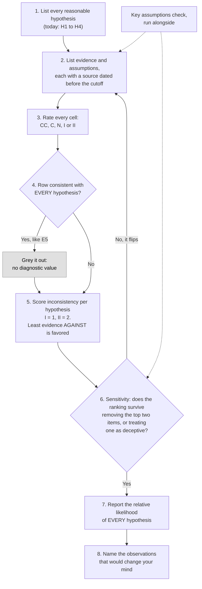

# Day 45: Structured analysis with competing hypotheses

Phase: 3. Cyber Threat Intelligence · Track goal: Use Analysis of Competing Hypotheses and a key assumptions check on a real, well-documented incident, so your conclusions come from evidence that rules things out rather than evidence that merely fits.

## Concept
Analysts, like everyone else, settle on a first explanation quickly and then read new evidence as support for it. Richards Heuer's Psychology of Intelligence Analysis (CIA, 1999) describes this in detail. His remedy, Analysis of Competing Hypotheses (ACH), forces you to work across hypotheses instead of down one:

1. List every reasonable hypothesis, including ones you think are unlikely.
2. List the evidence and the assumptions that matter.
3. Build a matrix: hypotheses across the top, evidence down the side. Rate each cell: consistent (C), very consistent (CC), inconsistent (I), very inconsistent (II), or not applicable (N).
4. Delete evidence that is consistent with every hypothesis. It has no diagnostic value, however striking it is.
5. Draw tentative conclusions by counting inconsistencies. The hypothesis with the least evidence against it is favored. The one with the most evidence for it is not automatically favored, because many pieces of evidence fit several stories at once.
6. Check sensitivity: which few items drive the result? What if one of them is wrong or deceptive?
7. Report the relative likelihood of every hypothesis, including the ones you rejected.
8. Name the future observations that would change your mind.

The eight steps as a process. The loop back from step 6 is the part people skip: a ranking that collapses when one item is removed is not a conclusion yet.



A key assumptions check runs alongside it. Write down every assumption your reasoning depends on, then ask of each: why do I believe this, what would make it untrue, and has it been true in the past?

Today's case is NotPetya, the destructive malware outbreak of June 27, 2017. It was presented as ransomware and hit Ukraine first and hardest before spreading worldwide. You will work only from evidence that was public within about ten days of the outbreak, then compare your result with what governments stated months later.

## Resources
- [Richards J. Heuer Jr., Psychology of Intelligence Analysis](https://www.cia.gov/resources/csi/books-monographs/psychology-of-intelligence-analysis-2/): chapter 8 is ACH. Free.
- [US Government, "A Tradecraft Primer: Structured Analytic Techniques for Improving Intelligence Analysis" (2009)](https://www.cia.gov/resources/csi/static/Tradecraft-Primer-apr09.pdf): short descriptions of the key assumptions check, ACH and other techniques.
- Evidence sources for the lab, all public:
  - [ESET, "TeleBots are back: supply-chain attacks against Ukraine"](https://www.welivesecurity.com/2017/06/30/telebots-back-supply-chain-attacks-against-ukraine/) (June 30, 2017)
  - [Kaspersky, "ExPetr/Petya/NotPetya is a Wiper, Not Ransomware"](https://securelist.com/expetrpetyanotpetya-is-a-wiper-not-ransomware/78902/) (June 28, 2017)
  - [Posteo, statement on the blocked contact address](https://posteo.de/en/blog/info-on-the-petrwrappetya-ransomware-email-account-in-question-already-blocked-since-midday) (June 27, 2017, with later updates)
  - Cisco Talos, "The MeDoc Connection" (July 2017), on the software update mechanism used for initial delivery
- For the comparison step only: [UK Foreign Office statement attributing NotPetya](https://www.gov.uk/government/news/foreign-office-minister-condemns-russia-for-notpetya-attacks) (February 15, 2018).

## Practical: LibreOffice Calc (an ACH matrix heatmap with a key assumptions check)
The whole exercise runs on published vendor, provider and government reporting about a 2017 incident. Leave the organizations hit by NotPetya out of your matrix; they are victims and add nothing to the question.

Any spreadsheet works. The steps below use LibreOffice Calc because it is free and has the conditional formatting you need.

### 1. Set the analytic question and date cutoff
Write at the top of the sheet:

> Question: What was the primary purpose of the June 27, 2017 malware outbreak?
> Evidence cutoff: public sources dated on or before July 7, 2017.

The cutoff is part of the exercise. You are reconstructing what a careful analyst could have concluded at the time, without the benefit of the 2018 attributions.

### 2. List hypotheses
Use at least these four:

| ID | Hypothesis |
|---|---|
| H1 | Financially motivated ransomware, working as designed |
| H2 | Financially motivated ransomware, broken by poor engineering |
| H3 | Destructive attack by a state-linked actor, disguised as ransomware |
| H4 | Destructive attack by a non-state actor (hacktivists or criminals seeking disruption) |

Keep H2 in the list. Without it, every sign of failed decryption automatically counts for H3.

### 3. List evidence, each with a source
Start with these, and verify each against its source before using it. Add at least three more from the sources above.

| ID | Evidence | Source |
|---|---|---|
| E1 | Initial delivery came through the update mechanism of M.E.Doc, accounting software widely used by businesses in Ukraine | ESET; Talos |
| E2 | Most detections were in Ukraine | ESET |
| E3 | Victims were told to contact a single address at a mainstream German email provider. The provider blocked it on June 27 and the attackers did not replace it | Posteo |
| E4 | The "installation key" shown to victims was random data, so the attackers could not have produced a working decryption key even for a victim who paid | Kaspersky |
| E5 | The malware spread inside networks using the EternalBlue and EternalRomance exploits, plus stolen credentials with legitimate admin tools | ESET and others |
| E6 | The outbreak began the day before Ukraine's Constitution Day, a public holiday | Calendar |
| E7 | ESET linked the operation to TeleBots, a group it had tracked attacking Ukrainian targets, including an earlier supply-chain intrusion | ESET |

### 4. Rate the matrix
Put hypotheses in columns and evidence in rows. Enter one of `CC`, `C`, `N`, `I`, `II` in each cell. Worked rows (illustrative ratings; argue with them):

| | H1 ransomware, working | H2 ransomware, broken | H3 state-linked, disguised | H4 non-state destructive |
|---|---|---|---|---|
| E3 single blocked email, not replaced | II | C | C | C |
| E4 random installation key | II | C | CC | C |
| E5 worm spreading with leaked exploits | C | C | C | C |

E5 is consistent with every hypothesis, so under step 4 it gets deleted from the scoring, even though it is the most technically interesting fact in the case. Keep it visible in a grey row so readers see you considered it.

Apply conditional formatting to the rating range (Format, then Conditional, then Condition, with "cell value is equal to"): II dark red, I light red, N grey, C light green, CC dark green. Add a row at the bottom that scores inconsistency for each hypothesis:
```
=COUNTIF(B4:B12;"I") + 2*COUNTIF(B4:B12;"II")
```
LibreOffice uses semicolons between function arguments by default. Excel and Google Sheets use commas.

### 5. Key assumptions check
On a second sheet:

| Assumption | Why I believe it | What would make it false | Rating (solid / caveated / unsupported) |
|---|---|---|---|
| The random installation key was a design decision, not a bug | Kaspersky's analysis of the code | A later analysis showing a recoverable key in some versions | |
| Initial infection was mostly through M.E.Doc updates | ESET and Talos | Evidence of large-scale separate delivery paths | |
| Geographic concentration reflects targeting, not just M.E.Doc's customer base | | M.E.Doc's user base alone explains the spread | |

The third row is the kind of assumption that tends to sit unexamined. Concentration in Ukraine is exactly what you would expect from a Ukrainian software supply chain, whatever the attacker's purpose. Decide whether E2 still carries weight after that.

### 6. Sensitivity and conclusion
Write a short paragraph:
- Which hypothesis has the lowest inconsistency score, and by how much.
- The two evidence items that drive the result. What happens to the ranking if each one is removed?
- One item that could be deceptive (planted to mislead), and what would change if it were.
- What you would need to see to separate H3 from H4. (Most of the matrix will not separate them. Say so.)

Only after writing it, read the February 2018 UK statement. Record where your conclusion agreed with the later government attribution and where your matrix could not reach it from the evidence available at the time.

### What you have when you finish
- An ACH matrix of at least 4 hypotheses and 10 evidence items, color-coded as a heatmap, with inconsistency scores and non-diagnostic rows greyed out.
- A key assumptions sheet with at least five assumptions, each rated.
- A conclusion paragraph with sensitivity analysis, and a short comparison with the 2018 attribution.

## Checkpoint
- Every evidence row names a source dated on or before July 7, 2017.
- At least one evidence item was greyed out as non-diagnostic, and you can explain why.
- Your conclusion names a favored hypothesis and also states how you rank the others.
- Your write-up says plainly which question your matrix could not answer (most likely H3 versus H4), rather than letting the 2018 attribution answer it for you.
