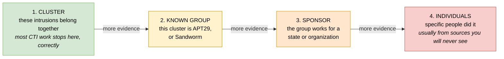
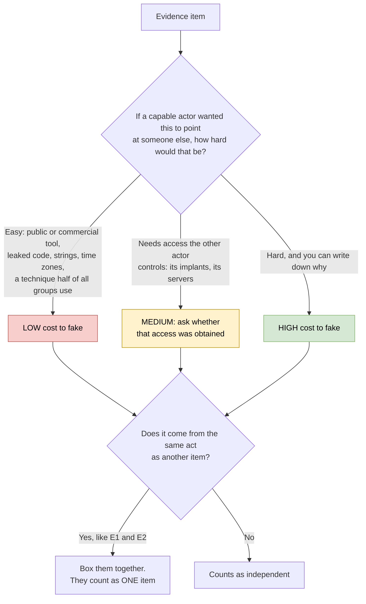
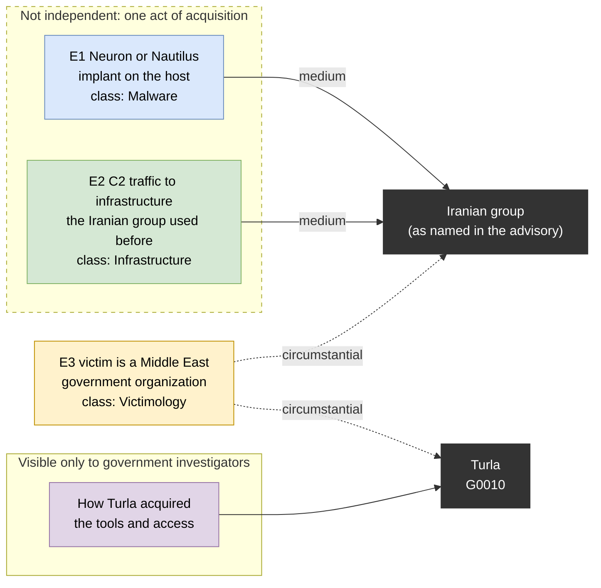

# Day 47: Attribution methodology and the shared-tooling trap

Phase: 3. Cyber Threat Intelligence · Track goal: Grade attribution evidence by how easily it can be copied, stolen or faked, and see from a real case how tools and infrastructure end up pointing at the wrong actor.

## Concept
Attribution means answering "who did this", and it has levels that each need more evidence than the one before:

1. Clustering: these intrusions belong together (same tools, infrastructure, behavior). Most CTI work stops here, correctly.
2. Linking to a known group: this cluster is APT29, or Sandworm, as others have defined those groups.
3. Linking to a sponsor: the group works for, or on behalf of, a particular state or organization.
4. Linking to individuals: specific people did it. This usually comes from law enforcement or intelligence sources that you will never see.

Thomas Rid and Ben Buchanan's "Attributing Cyber Attacks" (Journal of Strategic Studies, 2015) describes attribution as a process that runs at technical, operational and strategic levels, plus the decision to communicate it. Their central point is that attribution is a judgment made under uncertainty, and what counts as enough evidence depends on who is asking and what they intend to do with the answer. The ODNI's "A Guide to Cyber Attribution" (2018) lists the evidence classes governments use (tradecraft, infrastructure, malware, intent, and indicators from external sources) and notes that assessments are expressed with confidence levels, not as proof.

What you can see as an outside analyst is mostly technical evidence, and most of it can be copied, stolen or faked:

| Evidence | Why it points somewhere | How it misleads |
|---|---|---|
| Shared malware code | Groups reuse private code | Code gets leaked, sold, copied from open source, or deliberately borrowed |
| Shared tools | Same toolkit, same operator | Many tools are public or commercial and used by dozens of groups |
| Shared infrastructure | Same servers, same operator | Infrastructure can be rented from the same providers, or hijacked from another actor |
| Language strings, compile times, time zones | Hints at the authors' locale and working hours | Trivial to plant or alter |
| TTPs | Habits are hard to change | Common techniques are shared by half of all groups (Day 38) |
| Victimology and "who benefits" | Targets reflect a sponsor's interests | Many actors share interests. It is circumstantial at best |

The shared-tooling fallacy is the step from "this intrusion used tool X" and "group Y uses tool X" to "group Y did this". In ATT&CK v19.2, counting only direct group-to-software relationships, Mimikatz is linked to 51 groups, PsExec to 38, Cobalt Strike to 30, PlugX to 15 and AdFind to 12. Leaked tools spread the problem further. EternalBlue, published in the 2017 Shadow Brokers leak, was used in both WannaCry and NotPetya, which the US and UK governments later attributed to two different states. The leak of the LockBit 3.0 ransomware builder in 2022 let unrelated operators produce LockBit-branded payloads.

## Resources
- [NCSC and NSA, "Turla group exploits Iranian APT to expand coverage of victims"](https://www.ncsc.gov.uk/news/turla-group-exploits-iran-apt-to-expand-coverage-of-victims) (October 2019): today's case. The full [joint advisory PDF](https://media.defense.gov/2019/Oct/18/2002197242/-1/-1/0/NSA_CSA_TURLA_20191021%20VER%203%20-%20COPY.PDF) has the technical detail.
- [ODNI, "A Guide to Cyber Attribution"](https://www.dni.gov/files/CTIIC/documents/ODNI_A_Guide_to_Cyber_Attribution.pdf): four pages, worth reading in full.
- [Thomas Rid and Ben Buchanan, "Attributing Cyber Attacks"](https://doi.org/10.1080/01402390.2014.977382): the Q Model paper. Check a university library if you hit the paywall.
- ATT&CK group pages for [Turla (G0010)](https://attack.mitre.org/groups/G0010/) and [OilRig (G0049)](https://attack.mitre.org/groups/G0049/).
- [diagrams.net](https://app.diagrams.net/): free diagram tool for the evidence graph.

## Practical: diagrams.net (an attribution evidence graph and an evidence-grading table)
You are re-analyzing a published government advisory. Do not try to reproduce the agencies' work against live infrastructure, and do not research anyone named in reporting about either group.

### 1. Understand the case
In October 2019 the UK NCSC and the US NSA published a joint advisory. It said that Turla, a group that both governments associate with Russia (ATT&CK G0010, aliases include Snake, Venomous Bear and Secret Blizzard), had obtained implants called Neuron and Nautilus that the agencies assessed to be of Iranian origin. Turla also gained access to infrastructure belonging to an Iranian group, and used these tools against victims, many in the Middle East. The advisory assessed that the Iranian operators were almost certainly unaware their tools were being used this way.

Read the advisory and the PDF. Then put yourself in the place of an analyst who responded to one of those victims before October 2019 and had only the technical artifacts from that one network.

### 2. Extract the evidence items
List every piece of evidence the advisory describes that an incident responder at a victim site could have found, for example:

| ID | Evidence item | Points toward | Evidence class (ODNI) |
|---|---|---|---|
| E1 | Neuron or Nautilus implant on the host | Iranian group (tools assessed as Iranian in origin) | Malware |
| E2 | Command-and-control traffic to infrastructure previously used by the Iranian group | Iranian group | Infrastructure |
| E3 | Victim is a government organization in the Middle East | Either; both groups have targeted the region | Victimology |
| E4 | (continue from the advisory) | | |

Aim for eight to twelve items. Add a column for items that only the agencies could see (such as knowledge of how Turla acquired the tools). Mark those "not visible to a responder".

### 3. Grade each item
Add three columns and fill them for every item:

| ID | Cost for another actor to copy or fake (low / medium / high) | Independent of other items? | Weight you would have given it before October 2019 |
|---|---|---|---|
| E1 | Medium: requires obtaining the implant and its operating data, which Turla did | No, tied to E2 | |
| E2 | Medium: requires access to the other group's infrastructure, which Turla had | No, tied to E1 | |

The question to ask of each row is: if a capable actor wanted this item to point at someone else, how hard would that be? E1 and E2 look like two independent confirmations, but they come from the same act of acquisition. Record that dependency. Two dependent items count as one.

Grade every row with the same two questions:

### 4. Build the evidence graph
In diagrams.net, draw:
- One node per candidate actor: "Iranian group (as named in the advisory)" and "Turla".
- One node per evidence item, colored by ODNI evidence class.
- An edge from each evidence item to the actor it appears to support, labeled with its forgery cost.
- A dashed box around items that are not independent of each other.
- A separate panel, "Visible only to government investigators", holding the items that actually resolved the case.

Export the diagram as PNG and SVG.

Here is the finished graph's layout, filled with the three sample rows from step 2 only. Use it as the skeleton: add your remaining items, color each by its ODNI class, and draw the forgery-cost label from your step 3 grading on every edge. You can edit this version at [mermaid.live](https://mermaid.live/) to test the layout before redrawing it in diagrams.net.

Read the responder-visible part on its own. Everything outside the government panel points at the Iranian group or at nobody in particular, which is the situation step 5 asks you to reason from.

### 5. Write the counterfactual
In one paragraph, answer: using only the evidence in the responder-visible part of your graph, what would a careful analyst have concluded in mid-2019, and with what likelihood and confidence (use your Day 46 scale)? Then say what the correct conclusion turned out to be, and which single category of evidence made the difference.

### 6. Apply the fallacy check to your own work
Go back to your Day 37 profile's "Tooling" table and your Day 38 overlap table. For every tool or technique there, add the number of ATT&CK groups that share it. Mark anything shared by more than ten groups as "not identifying".

### What you have when you finish
- An evidence table of eight to twelve items from the Turla advisory, graded by forgery cost and independence.
- An evidence graph in diagrams.net that shows which items point toward which actor, how they depend on each other, and what only government investigators could see.
- A counterfactual paragraph with a calibrated likelihood and confidence.
- Your Day 37 and Day 38 tables updated with shared-by counts.

## Checkpoint
- No evidence item in your graph is graded "high cost to fake" without a stated reason.
- Your graph shows at least one pair of items that looked independent but were not.
- Your counterfactual paragraph concludes the wrong actor, or concludes that the evidence could not decide.
- Your counterfactual paragraph explains why it reached that conclusion.
- Every evidence item your counterfactual paragraph relies on sits outside the "Visible only to government investigators" panel. If the paragraph reaches the right answer, this is where hindsight usually crept in.
- Every Day 37 tooling entry now has a shared-by count.
