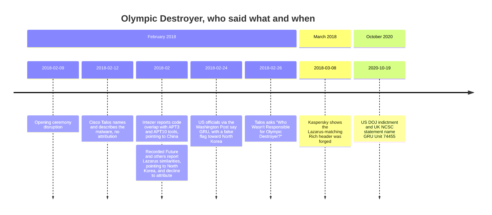
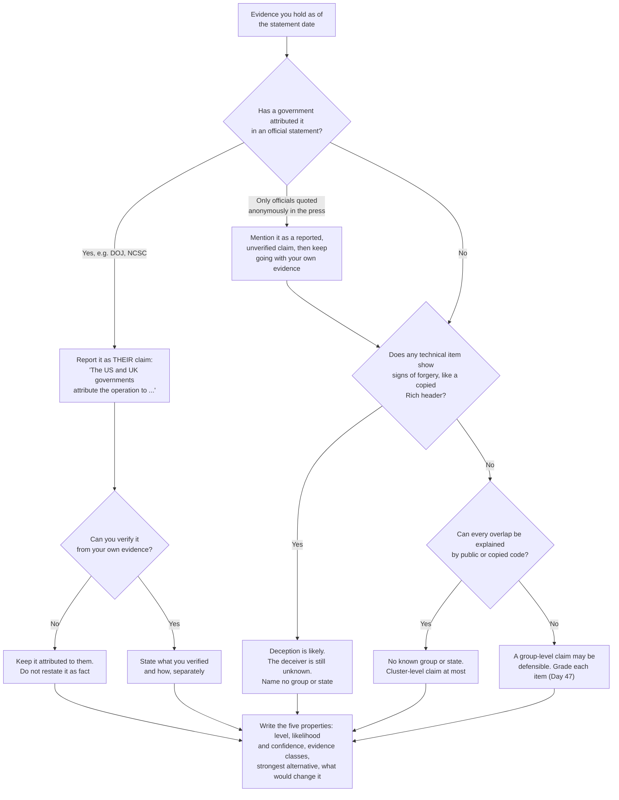

# Day 48: False flags, and writing an attribution statement you can defend

Phase: 3. Cyber Threat Intelligence · Track goal: Trace how public attribution of a real false-flag operation changed over two and a half years, then write an attribution statement whose confidence matches its evidence. This closes Phase 3.

## Concept
A false flag is evidence planted to make an operation look like someone else's. Olympic Destroyer is the best-documented public example. On February 9, 2018, during the opening ceremony of the PyeongChang Winter Olympics, destructive malware disrupted the organizers' IT systems, including the official website and Wi-Fi at the Olympic media centre. Over the following weeks, credible researchers found technical links pointing to three different countries:

- Intezer reported code shared with tools attributed to the China-linked groups APT3 and APT10. Talos later noted that the APT3 overlap came from a credential stealer based on Mimikatz, which anyone can download.
- Several researchers, including Recorded Future, reported code similarities with malware attributed to North Korea's Lazarus Group.
- Kaspersky found that the malware's Rich header, metadata that Microsoft's build tools write into Windows executables, matched one found in Lazarus malware but was inconsistent with how the rest of the file had been built. Someone had copied it in. Kaspersky titled its March 2018 write-up "OlympicDestroyer is here to trick the industry."

On February 24, 2018, the Washington Post reported that US intelligence officials had concluded Russian military intelligence (GRU) carried out the attack and tried to make it look like North Korea's work. In October 2020, the US Department of Justice indicted six officers of GRU Unit 74455 for operations including Olympic Destroyer and NotPetya, and the UK NCSC published the same attribution. ATT&CK now links the Olympic Destroyer software (S0365) to Sandworm Team (G0034).

The public claims in date order. Technical findings from outside researchers point in three directions during February; the answer that held came from governments:

The technical evidence available to outside researchers produced three contradictory answers. The final attribution came from governments using sources outside the malware. Talos's February 26, 2018 post was titled "Who Wasn't Responsible for Olympic Destroyer?", and for outside analysts at that stage, that was the correct question.

An attribution statement you can defend has five properties. It names the level of attribution (cluster, group, sponsor or individual), gives a likelihood and a confidence level, states the evidence classes it rests on, names the strongest alternative hypothesis, and says what would change the assessment.

## Resources
- [Cisco Talos, "Who Wasn't Responsible for Olympic Destroyer?"](https://blog.talosintelligence.com/2018/02/who-wasnt-responsible-for-olympic.html) (February 26, 2018), and the longer [VB2018 paper by the same authors](https://www.virusbulletin.com/virusbulletin/2018/10/vb2018-paper-who-wasnt-responsible-olympic-destroyer/).
- [Kaspersky, "OlympicDestroyer is here to trick the industry"](https://securelist.com/olympicdestroyer-is-here-to-trick-the-industry/84295/) (March 8, 2018): the Rich header analysis.
- [Recorded Future, "Targeting of Olympic Games IT Infrastructure Remains Unattributed"](https://www.recordedfuture.com/research/olympic-destroyer-malware) (February 2018): a vendor publicly declining to attribute.
- [Washington Post, February 24, 2018](https://www.washingtonpost.com/world/national-security/russian-spies-hacked-the-olympics-and-tried-to-make-it-look-like-north-korea-did-it-us-officials-say/2018/02/24/44b5468e-18f2-11e8-92c9-376b4fe57ff7_story.html): the first public report of the US government's conclusion (may be paywalled).
- [US Department of Justice, October 19, 2020 indictment announcement](https://www.justice.gov/opa/pr/six-russian-gru-officers-charged-connection-worldwide-deployment-destructive-malware-and).
- [TimelineJS](https://timeline.knightlab.com/): free timeline builder that runs from a Google Sheets template.

## Practical: TimelineJS (an attribution-claims timeline and a calibrated attribution statement)
The subject is a publicly reported operation and the government units named in official statements. The indictment names individual officers. Do not research, profile or list those individuals. Your timeline records claims about groups and organizations.

### 1. Build the claims table
Each row is a public claim about who was, or was not, responsible. Start with these and verify every date and summary against its source. Add at least four more from the sources above and from the links inside them.

| Date | Who made the claim | Claim (level) | Evidence class | Forgeable? (Day 47 grading) |
|---|---|---|---|---|
| 2018-02-09 | (event) | Disruption during opening ceremony | n/a | n/a |
| 2018-02-12 | Cisco Talos | Malware named and described; no attribution | Malware analysis | n/a |
| 2018-02 | Intezer | Code overlaps with APT3 and APT10 tools (group) | Shared code | Yes: Mimikatz-derived code is public |
| 2018-02 | Recorded Future and others | Similarities with Lazarus malware; declined to attribute | Shared code | Yes |
| 2018-02-24 | US officials, via Washington Post | GRU, with a false flag toward North Korea (sponsor) | Not disclosed (government sources) | Not assessable from outside |
| 2018-03-08 | Kaspersky | Lazarus-matching Rich header was forged | Malware metadata | This finding exposed a forgery |
| 2020-10-19 | US DOJ; UK NCSC | GRU Unit 74455 (sponsor and individuals) | Legal process; intelligence | Not assessable from outside |

### 2. Build the timeline
1. Open TimelineJS and make a copy of its Google Sheets template.
2. Put one claim per row. Use the `Headline` column for "who claimed what" and the `Text` column for the evidence class and your forgeability note. Put the source link in `Media` or in the text.
3. Use the `Group` column to put each claim in a lane: "Pointed to China", "Pointed to North Korea", "Pointed to Russia", "No attribution / evidence of forgery".
4. Publish the sheet to the web (File, then Share, then Publish to web), paste its URL into the TimelineJS generator, and save the embed link and a screenshot.

The lanes make the pattern visible: early technical claims scattered across three lanes, then collapsed into one after government statements.

### 3. Write three attribution statements
Write the attribution statement a careful outside analyst could have defended at three points in time. Use the five properties from the Concept section and your Day 46 probability scale.

Before each statement, walk the evidence you hold on that date through this path. It decides what level of claim you can make and whose claim it is:

February 20 inputs end at "no known group or state", as the worked example does. March 10 inputs pass the press branch (the Washington Post report) and then the forgery branch (Kaspersky). October 20, 2020 inputs take the official-statement branch.

As of February 20, 2018 (worked example):
> We assess that the Olympic Destroyer operation was carried out by a capable actor that deliberately planted misleading evidence (likely; moderate confidence). Code overlaps with tools attributed to China-linked groups and to Lazarus are each explainable by public or copied code, and the evidence available to us does not support attribution to any known group or state. The strongest alternative is that one of those overlaps is genuine. Recovery of non-public tooling or infrastructure unique to a known group would change this assessment.

As of March 10, 2018: write it yourself. The Kaspersky Rich header finding should raise your confidence that there was deliberate deception. Does it tell you who the deceiver was?

As of October 20, 2020: write it yourself. Separate what the governments stated from what you could verify independently. "The US and UK governments attribute the operation to GRU Unit 74455" is a sourced statement of fact about their claim. "GRU Unit 74455 carried out the operation" is a claim you did not verify.

### 4. Assemble the Phase 3 case file
Collect your phase artifacts into one folder with a short index:

| Day | Artifact |
|---|---|
| 35 | Sub-technique density heatmap; technique ID card |
| 36 | Evidence-backed Volt Typhoon layer; comparison heatmap |
| 37 | APT29 profile; alias crosswalk; Diamond sheet |
| 38 | Base-rate heatmap; APT29 vs APT28 comparison; behavior timeline |
| 39 | IOC enrichment table |
| 40 | Infrastructure pivot graph; pivot log |
| 41 | Install log; collection plan; source-risk heatmap |
| 42 | Leak-site heatmaps with caveats |
| 43 | Validated STIX bundle; visualizer screenshot |
| 44 | TAXII pull log; sharing decision record |
| 45 | NotPetya ACH matrix; key assumptions check |
| 46 | One-page brief |
| 47 | Turla evidence graph |
| 48 | Olympic Destroyer timeline; three attribution statements |

### 5. Test one statement on a non-specialist
Read any one of your statements aloud to someone outside the field. They should be able to say how sure you are and why without asking you. If they cannot, revise the statement and try again. Note the outcome in your case file index, without naming the person.

### What you have when you finish
- A published TimelineJS timeline of at least eleven dated attribution claims in four lanes, each with a source and a forgeability note.
- Three attribution statements dated February 2018, March 2018 and October 2020, each with level, likelihood, confidence, evidence classes, the strongest alternative, and what would change your mind.
- An indexed Phase 3 case file, including the step 5 note.

## Checkpoint
- Your February 2018 statement does not name a state as responsible.
- Your October 2020 statement attributes the claim to the governments that made it.
- Your October 2020 statement does not present that claim as something you verified.
- Every timeline entry links to a primary source or to reporting that quotes one.
- Your case file index notes that a listener outside the field could say how sure you are and why, without asking you, after hearing one statement read aloud.
- No individual is named anywhere in your timeline or statements.
- Without notes, state the difference between "The US and UK governments attribute the operation to GRU Unit 74455" and "GRU Unit 74455 carried out the operation".
