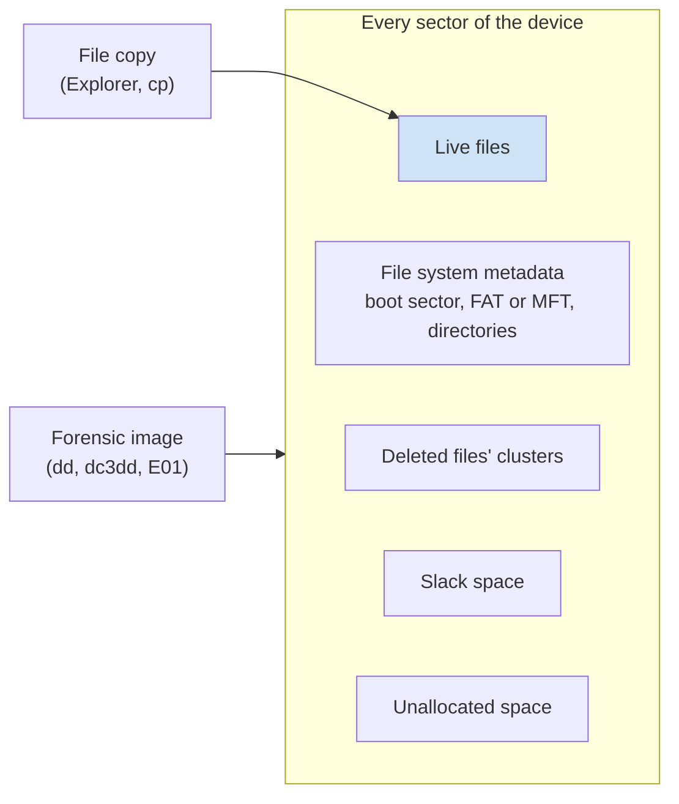
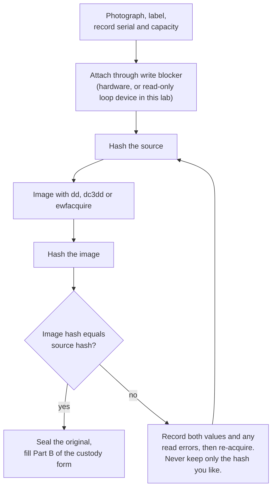
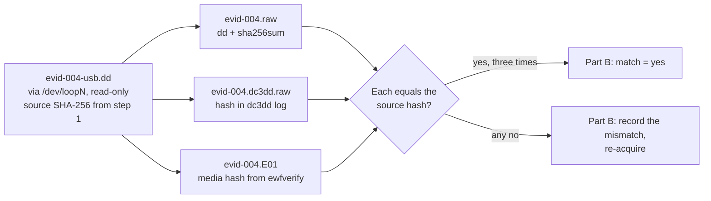

# Day 50: Bit-for-bit disk imaging

Phase 4, digital forensics and incident investigation. Track goal: produce a verified forensic image of a storage device and an acquisition record another examiner could repeat.

## Concept

A forensic image copies every sector of a device, including unallocated space, slack space and the file system's own metadata. Copying files with Explorer or `cp` gets only the live files and changes access times on the source. Deleted files, the previous contents of reused clusters, and the structures you will parse tomorrow all live outside what a file copy sees.

Three image formats cover nearly all work. Raw (also called dd, `.dd`, `.img`, `.001`) is a plain byte-for-byte copy with no metadata; every tool reads it. EnCase Evidence File (E01, "EWF") stores the same bytes compressed, in segments, with the case details and an embedded hash; FTK Imager, `ewfacquire` and most commercial suites write it. AFF4 is an open format used mostly for memory and large-scale acquisition.

Before anything reads the source, a write blocker sits between it and your workstation. Hardware blockers (Tableau and similar) pass read commands and drop writes. On Linux you can mark a device read-only in software with `blockdev --setro /dev/sdX`, but a software block is weaker evidence than a hardware one and your notes must say which you used. Operating systems write to devices you connect: Windows may create `System Volume Information`, and desktop Linux may auto-mount and update the journal.

The acquisition is only finished when the image hash matches the source hash. If a disk has bad sectors, the tool must record which ones and what it wrote in their place; a mismatch you cannot explain is written down, never ignored.

Order of operations for a powered-off device: photograph and label, record serial and capacity, attach through the write blocker, hash the source, image, hash the image, compare, seal the original, and log every step with UTC times.

What a file copy reaches compared with an image:



The acquisition as a loop that only ends on a match:



## Resources

- [dc3dd](https://sourceforge.net/projects/dc3dd/) (DoD Cyber Crime Center's forensic fork of dd with built-in hashing and logging; packaged in Debian/Ubuntu as `dc3dd`).
- [libewf / ewfacquire](https://github.com/libyal/libewf) (Debian/Ubuntu package `ewf-tools`).
- [FTK Imager](https://www.exterro.com/digital-forensics-software/ftk-imager), free, Windows GUI; registration required to download.
- [GNU ddrescue manual](https://www.gnu.org/software/ddrescue/manual/ddrescue_manual.html) for failing media.
- NIST [Computer Forensics Tool Testing (CFTT)](https://www.nist.gov/itl/ssd/software-quality-group/computer-forensics-tool-testing-program-cftt) reports on disk imaging tools.

## Practical: dd, dc3dd and ewfacquire on synthetic evidence EVID-004

You need a Linux machine or VM (a Debian or Ubuntu VM is fine). Install the tools:

```bash
sudo apt install dosfstools mtools dc3dd ewf-tools
```

1. Build the "device". [`resources/case-lab-p4/disk/make-evid-004.sh`](resources/case-lab-p4/disk/make-evid-004.sh) creates `evid-004-usb.dd`, a 16 MiB FAT16 volume with a few invented finance files and one deleted file. In real work this would be a physical USB stick; here the file stands in for it.

   ```bash
   cd ~/lab-p4/evidence
   bash /path/to/repo/docs/curriculum/phase-4-digital-forensics-incident-investigation/resources/case-lab-p4/disk/make-evid-004.sh
   chmod a-w evid-004-usb.dd
   ```

   The script prints the SHA-256 of the "device". Write it on a new custody form for EVID-004 as the source hash. Your hash will differ from other learners' because FAT records creation times at build time. That is fine; what matters is that your source and image hashes match each other.

2. Attach it read-only, the way you would a real device behind a write blocker.

   ```bash
   sudo losetup --find --show --read-only evid-004-usb.dd     # prints e.g. /dev/loop3
   sudo blockdev --getro /dev/loop3                           # 1 means read-only
   sudo blockdev --getsize64 /dev/loop3                       # 16777216
   ```

3. Image with plain `dd` and verify.

   ```bash
   sudo dd if=/dev/loop3 of=~/lab-p4/work/evid-004.raw bs=64K conv=noerror,sync status=progress
   sudo sha256sum /dev/loop3 ~/lab-p4/work/evid-004.raw
   ```

   Both lines must show the same hash. Know what the flags do: `conv=noerror` keeps going after a read error, and `sync` pads the failed block with zeros so later offsets stay correct. With a large `bs` a single bad sector zeroes the whole block, which is why failing drives go to `ddrescue` instead and why a small block size is safer with `dd`.

4. Image with `dc3dd`, which hashes and logs in one pass.

   ```bash
   sudo dc3dd if=/dev/loop3 of=~/lab-p4/work/evid-004.dc3dd.raw hash=sha256 log=~/lab-p4/notes/evid-004.dc3dd.log
   cat ~/lab-p4/notes/evid-004.dc3dd.log
   ```

   The log lists the input hash, the output hash and the sector count. Confirm the input hash equals the one from step 1.

5. Image to E01 with `ewfacquire` and verify the container.

   ```bash
   sudo ewfacquire -t ~/lab-p4/work/evid-004 -f encase6 -c deflate:best \
     -C LAB-P4 -D "EVID-004 synthetic USB image" -E EVID-004 -e "Your Name" \
     -N "Lab acquisition, loop device read-only" -d sha256 -u /dev/loop3
   ewfverify -d sha256 ~/lab-p4/work/evid-004.E01
   ewfinfo ~/lab-p4/work/evid-004.E01
   ```

   `-u` runs unattended with the values given; without it `ewfacquire` asks each question interactively. `ewfverify` recomputes the hash of the stored media and compares it to the hash embedded at acquisition. `ewfinfo` shows the case metadata you entered.

6. Detach: `sudo losetup -d /dev/loop3`.

7. If you have Windows available, repeat once in FTK Imager: File, Create Disk Image, Image File, select `evid-004-usb.dd`, add a destination, choose E01, fill in the case fields, and tick "Verify images after they are created". Save the `.txt` log it writes next to the image and compare its SHA-256 line to yours.

The finished acquisition should have this shape. One source hash, three images, three comparisons:



8. In your notes, write one paragraph on what you would write on the form if the source hash taken after imaging did not match the one taken before, and what you would do next. (Hint: USB flash controllers remap blocks; say what you observed, re-acquire, and do not quietly pick the hash you like.)

Artifact: an acquisition record for EVID-004 filled into Part B of the custody form, with three image files whose hashes all equal the source hash, plus the dc3dd log and `ewfinfo` output saved in `notes/`.

## Checkpoint

- Your acquisition record lists the tool name and version for each tool used (`dc3dd --version`, `ewfacquire -V`).
- Your acquisition record lists the exact command for each of the three images.
- Your acquisition record lists the source hash for each of the three images.
- Your acquisition record lists the image hash for each of the three images.
- Your acquisition record has a yes/no match entry for each of the three images.
- `ewfverify` reports success.
- Your step 8 paragraph says to record the mismatch as observed.
- Your step 8 paragraph says to re-acquire.
- Your step 8 paragraph does not pick either source hash as the correct one.
- Without notes, you can say what `conv=noerror` and `sync` each do in a `dd` command.
