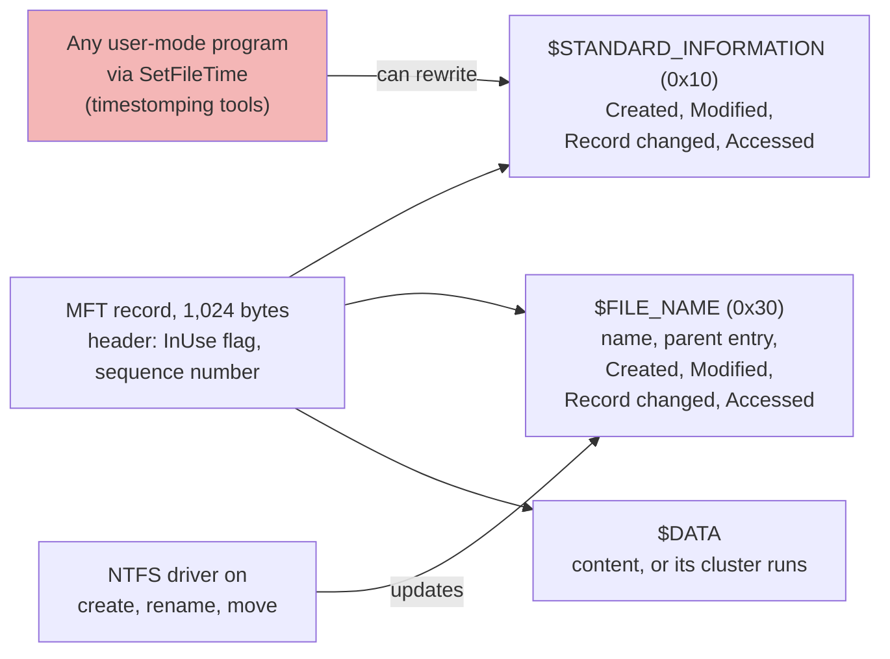
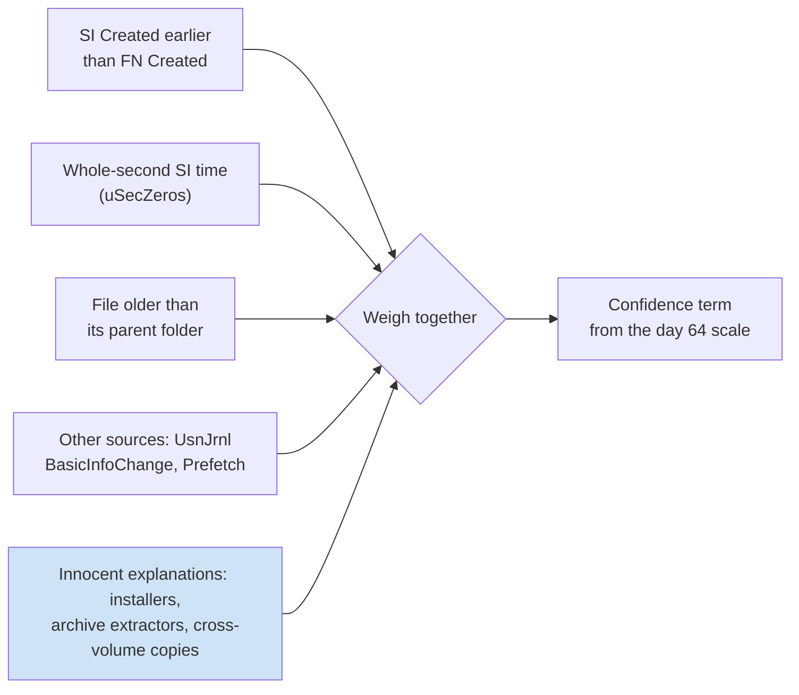

# Day 52: NTFS artifacts, the MFT and timestamp manipulation

Phase 4, digital forensics and incident investigation. Track goal: read NTFS metadata well enough to spot a file whose visible timestamps were altered, and say how confident you are.

## Concept

On NTFS every file and folder has at least one record in the Master File Table (`$MFT`), normally 1,024 bytes each. A record holds attributes. Two of them carry timestamps.

`$STANDARD_INFORMATION` (attribute type 0x10) holds the four times Explorer, `dir` and most tools show: created, modified, MFT record changed, accessed. Any program running as the user can set these through the Windows `SetFileTime` API, which is how timestamp-altering ("timestomping") tools work.

`$FILE_NAME` (type 0x30) holds another four times plus the name and parent folder reference. User-mode APIs do not expose a way to set these directly; Windows updates them mainly when a file is created, renamed or moved. So when `$SI` Created says 2019 and `$FN` Created says yesterday, the file most likely existed only since yesterday and someone or something rewrote the `$SI` value.

Two more signals help. NTFS stores times in 100-nanosecond intervals, so a real creation time almost never has seven zeros after the second. A value like `09:14:00.0000000` suggests a tool wrote a whole-second time. Tools such as MFTECmd flag this as `uSecZeros`. Neither signal is proof on its own: some legitimate installers and archive extractors also write whole-second `$SI` times, and copying a file across volumes produces its own odd combinations. You look for agreement between signals and with other evidence.

Where the two timestamp sets live in one MFT record, and what can write each:



No single signal settles a timestomp question. You weigh them together, with the innocent explanations on the same scale:



The other NTFS artifacts you will meet: `$UsnJrnl:$J`, the change journal, records create, rename, data-overwrite and delete events with a reason code and its own timestamp, and survives some deletions. `$LogFile` is the transaction log for metadata changes, short-lived but detailed. The `InUse` flag on an MFT record tells you whether it is allocated; a record with `InUse=False` is a deleted file whose name and times are still readable until the record is reused.

## Resources

- [MFTECmd](https://github.com/EricZimmerman/MFTECmd) and [Timeline Explorer](https://ericzimmerman.github.io/) by Eric Zimmerman, free.
- [analyzeMFT](https://github.com/rowingdude/analyzeMFT), a Python alternative that runs on Linux and macOS.
- SANS poster "Windows Forensic Analysis" (free with registration) for the timestamp rules table.
- Microsoft documentation on [the change journal](https://learn.microsoft.com/en-us/windows/win32/fileio/change-journals).

## Practical: MFTECmd-format analysis of WS-FIN-07, ending in a timestamp anomaly table

Real MFT data comes from a Windows image: extract `$MFT` with FTK Imager (File, Add Evidence Item, then right-click `$MFT` in the root and Export Files) or with KAPE, then parse it:

```powershell
MFTECmd.exe -f "E:\export\C\$MFT" --csv E:\out --csvf ws-fin-07-mft.csv
MFTECmd.exe -f "E:\export\C\$Extend\$J" --csv E:\out --csvf ws-fin-07-usnj.csv
```

For this lab you get the parsed result directly: [`resources/case-lab-p4/filesystem/ws-fin-07-mft-excerpt.csv`](resources/case-lab-p4/filesystem/ws-fin-07-mft-excerpt.csv) is a synthetic, eight-row excerpt in the MFTECmd column layout (a real `$MFT` for a workstation produces hundreds of thousands of rows). Hash it and log it under EVID-002 first.

1. Open it in Timeline Explorer (Windows) or LibreOffice Calc. If you prefer the command line, `csvkit` works on any OS:

   ```bash
   pip install csvkit
   F=resources/case-lab-p4/filesystem/ws-fin-07-mft-excerpt.csv
   csvcut -c EntryNumber,InUse,ParentPath,FileName,SI\<FN,uSecZeros,Created0x10,Created0x30 "$F" | csvlook
   ```

2. Filter to rows where `SI<FN` is `True`. MFTECmd sets that flag when the `$SI` created time is earlier than the `$FN` created time.

   ```bash
   csvgrep -c 'SI<FN' -m True "$F" | csvcut -c FileName,ParentPath,Created0x10,Created0x30,uSecZeros | csvlook
   ```

   Expected result, two rows (abridged; csvlook may pad or reformat columns differently):

   ```text
   | FileName       | ParentPath                                         | Created0x10         | Created0x30                 | uSecZeros |
   | synchelper.exe | .\Users\acct.clerk01\AppData\Roaming\SyncHelper    | 2019-06-11 09:14:00 | 2026-03-13 16:42:30.1102964 | True      |
   | svchost.exe    | .\Users\Public                                      | 2018-09-15 07:28:00 | 2026-03-13 16:44:08.8811220 | True      |
   ```

3. For each flagged file, check the other signals and write them down:
   - Parent folder: `SyncHelper` (entry 88412) was itself created at 2026-03-13 16:42:29, one second before `synchelper.exe`. A file cannot plausibly predate the folder it was created in by seven years.
   - `LastRecordChange0x10` for `synchelper.exe` is 16:42:31, just after creation, consistent with the `$SI` times being rewritten right after the file landed.
   - Location and name: a file called `svchost.exe` in `C:\Users\Public` is a masquerade pattern; the real one lives in `System32` (compare entry 23105, whose `$SI` and `$FN` agree).

4. Look at the deleted row. `Invoice_0313.zip` (entry 88398, `InUse=False`) sat in Outlook's attachment cache folder, was created at 16:41:52, and its record changed at 16:48:03. Write down what you can and cannot say: the record shows a zip of that name existed in the Outlook cache 38 seconds before `SyncHelper` appeared. It does not show that the zip contained `synchelper.exe`.

   Six of the eight excerpt rows drawn by parent folder, with the two time sets side by side. Red rows are the `SI<FN` hits; the System32 `svchost.exe` is the known-good comparison.

   ```mermaid
   graph TD
       OL["Content.Outlook cache folder"] --> Z["88398 Invoice_0313.zip<br/>InUse False (deleted)<br/>created 16:41:52"]
       RO["AppData\Roaming"] --> SH["88412 SyncHelper folder<br/>created 16:42:29"]
       SH --> EXE["88413 synchelper.exe<br/>SI Created 2019-06-11 09:14:00<br/>FN Created 2026-03-13 16:42:30"]
       SH --> CFG["88414 config.dat<br/>SI and FN agree, 16:42:30"]
       PUB["Users\Public"] --> SV["88420 svchost.exe<br/>SI Created 2018-09-15 07:28:00<br/>FN Created 2026-03-13 16:44:08"]
       S32["Windows\System32"] --> SVOK["23105 svchost.exe<br/>SI and FN agree, 2025-11-12"]
       style EXE fill:#f4b6b6
       style SV fill:#f4b6b6
       style Z fill:#e0e0e0
       style SVOK fill:#cfe3f6
   ```

5. Build the artifact: a table with one row per anomaly and these columns: file, MFT entry, observed signals (list), alternative explanations considered, your confidence (use the scale from day 64: confirmed, highly likely, likely, possible), and what further evidence would raise it (for example, `$UsnJrnl` entries showing `FileCreate` then `BasicInfoChange` for entry 88413 within seconds, or Prefetch showing first execution).

   Start from this skeleton. The signals already filled in come from steps 2 and 3; the rest is yours.

   ```markdown
   | File | MFT entry | Observed signals | Alternatives considered | Confidence | Evidence that would raise it |
   |---|---|---|---|---|---|
   | synchelper.exe | 88413 | SI<FN; uSecZeros; parent 88412 created 16:42:29, one second before FN Created; LastRecordChange0x10 16:42:31 | | | |
   | svchost.exe (Users\Public) | 88420 | SI<FN; uSecZeros; | | | |
   ```

Artifact: `notes/day52-timestamp-anomalies.md` with the anomaly table and a four-line mini-timeline for 16:41:52 to 16:44:09 on 13 March 2026 UTC.

## Checkpoint

- Your table names both `SI<FN` files.
- Each of those two rows lists at least two independent signals.
- At least one row has a written alternative explanation.
- That row says whether you kept or dropped the alternative, and why.
- Your note on `Invoice_0313.zip` says "preceded" and not "delivered" or "contained". The difference is the whole point of calibrated language.
- You can explain in one sentence, without notes, why `$FN` times are harder to alter than `$SI` times, without claiming they are impossible to alter (kernel-level tools and some rename tricks can change them).
