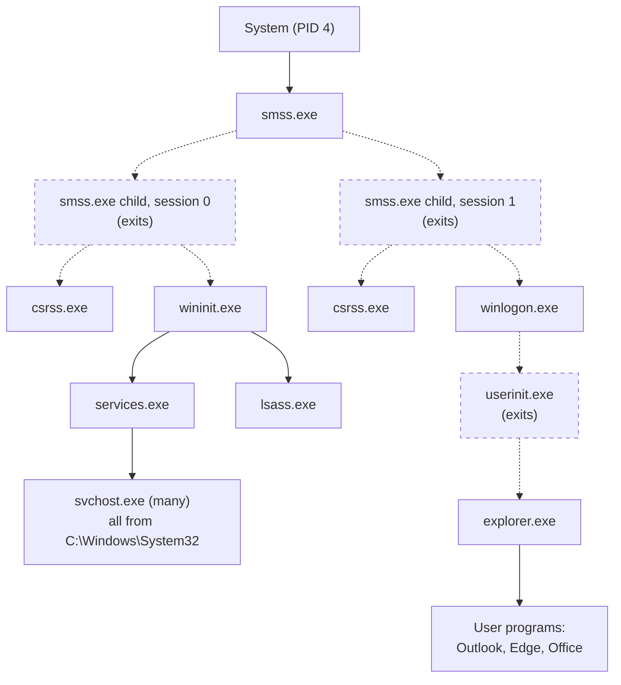
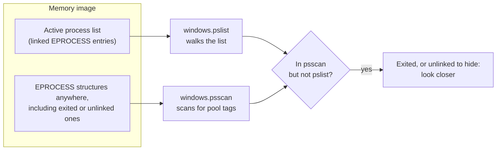

# Day 53: Memory forensics, acquisition and the process tree

Phase 4, digital forensics and incident investigation. Track goal: capture memory in the right order, run the core Volatility 3 process plugins, and draw the process tree as a graph that shows which parent-child pairs are abnormal.

## Concept

RAM holds what the disk never records: running processes, their command lines, open network connections, decrypted strings, and code injected straight into another process. It is also the most volatile evidence you will collect, so on a live system memory comes before disk (day 49, order of volatility).

Acquisition tools run on the live host and therefore change it slightly; you choose the tool with the smallest footprint and write down that you used it. Common free options: WinPmem and FTK Imager ("Capture Memory") on Windows, AVML or LiME on Linux, and hypervisor snapshots for VMs (a VMware `.vmem` or a Hyper-V saved state can be analysed directly). Write the image to external media or a network share, never to the suspect disk, then hash it immediately.

Volatility 3 parses the image by locating kernel structures, using symbol tables it downloads from Microsoft for Windows. The first plugins you run answer "what was running and who started it":

| Plugin | What it reads | What it reveals |
|---|---|---|
| `windows.info` | Kernel debugger block | OS build, capture time; confirms symbols resolved |
| `windows.pslist` | The active process linked list | Processes as the OS reports them |
| `windows.psscan` | Pool-tag scan of all memory | Also finds exited or unlinked processes; a process in psscan but not pslist deserves a look |
| `windows.pstree` | pslist arranged by parent PID | Parent-child chains |
| `windows.cmdline` | Each process's PEB | The exact command line |

The pstree is where most triage starts, because Windows has a known-normal shape. `smss.exe` is started by `System`; `wininit.exe` and `winlogon.exe` come from short-lived `smss` children whose PIDs no longer exist; `services.exe` and `lsass.exe` are children of `wininit.exe`; every legitimate `svchost.exe` is a child of `services.exe` and runs from `C:\Windows\System32`. User programs descend from `explorer.exe`. Deviations are leads, not verdicts: an Office program launching `powershell.exe` is common in attacks and also in some legitimate add-ins.

The known-normal shape. Dotted boxes are short-lived parents that exit during start-up, which is why `wininit.exe`, `csrss.exe`, `winlogon.exe` and `explorer.exe` show a parent PID that matches no running process.



Why you run both `pslist` and `psscan`:



## Resources

- [Volatility 3 documentation](https://volatility3.readthedocs.io/) and [source](https://github.com/volatilityfoundation/volatility3). Install with `pip install volatility3`, which provides the `vol` command.
- [WinPmem](https://github.com/Velocidex/WinPmem), [AVML](https://github.com/microsoft/avml), [LiME](https://github.com/504ensicsLabs/LiME).
- SANS "Hunt Evil" poster (free with registration): the normal Windows process tree on one page.
- [Graphviz](https://graphviz.org/) for drawing the tree.
- Lawful practice images: the [MemLabs](https://github.com/stuxnet999/MemLabs) CTF series publishes Windows memory images built for training.

## Practical: Volatility 3 output to a Graphviz process tree for WS-FIN-07

This repo does not ship a raw memory image (they are gigabytes and would need a real OS install to produce). The folder [`resources/case-lab-p4/memory/`](resources/case-lab-p4/memory/) holds synthetic text in the layout Volatility 3 prints, for the fictional host WS-FIN-07. Commands below show what you would run against a real image; the analysis steps work on the provided text. If you want to run the commands for real, use a MemLabs image and apply the same steps to its output.

1. The commands against a real image (`ws-fin-07.mem`), each saved to a file so your notes cite exact output:

   ```bash
   vol -f ws-fin-07.mem windows.info                  > info.txt
   vol -f ws-fin-07.mem windows.pslist                > pslist.txt
   vol -f ws-fin-07.mem windows.psscan                > psscan.txt
   vol -f ws-fin-07.mem windows.pstree                > pstree.txt
   vol -f ws-fin-07.mem windows.cmdline               > cmdline.txt
   vol -f ws-fin-07.mem -r csv windows.pslist         > pslist.csv
   vol -f ws-fin-07.mem windows.pslist --pid 7316 7488
   ```

   `-r csv` (or `-r json`) switches the renderer so you can load results into a spreadsheet. `--pid` limits output to the listed processes.

2. Read [`windows.pstree.txt`](resources/case-lab-p4/memory/windows.pstree.txt). The asterisks show depth. Walk it against the normal tree above and list every deviation. You should find at least these:

   - `OUTLOOK.EXE` (6632) is the parent of `powershell.exe` (7316), started at 16:42:18 UTC with `-WindowStyle Hidden -EncodedCommand`.
   - `synchelper.exe` (7488) runs from `AppData\Roaming\SyncHelper`, parent 7316. The same path is the timestomped file from day 52.
   - `rundll32.exe` (7704) has no DLL argument. `rundll32` exists to load a DLL export, so a bare command line is unusual.
   - `svchost.exe` (5124) is a child of `explorer.exe` and runs from `C:\Users\Public`.

3. Decode the encoded command. PowerShell's `-EncodedCommand` is Base64 of UTF-16LE text.

   ```bash
   B64=$(awk -F'\t' '$1==7316 {print $3}' resources/case-lab-p4/memory/windows.cmdline.txt | awk '{print $NF}')
   echo "$B64" | base64 -d | iconv -f UTF-16LE -t UTF-8; echo
   ```

   In this synthetic lab it decodes to a harmless placeholder: `Write-Output 'LAB-P4 synthetic placeholder, no payload'`. In real work, decode in an isolated analysis VM and treat the decoded text as evidence to document, not something to run.

4. Turn the tree into a graph. Write `pstree.dot` by hand or with a few lines of awk; nodes are `name (PID)`, edges are parent to child, and anomalous nodes are filled red with the reason in the label.

   ```dot
   digraph pstree {
     rankdir=LR; node [shape=box, fontname="Helvetica"];
     p4120 [label="explorer.exe (4120)"];
     p6632 [label="OUTLOOK.EXE (6632)"];
     p7316 [label="powershell.exe (7316)\n-EncodedCommand, hidden window\n16:42:18Z", style=filled, fillcolor="#f4b6b6"];
     p7488 [label="synchelper.exe (7488)\nAppData\\Roaming, timestomped (day 52)", style=filled, fillcolor="#f4b6b6"];
     p7704 [label="rundll32.exe (7704)\nno DLL argument", style=filled, fillcolor="#f4b6b6"];
     p5124 [label="svchost.exe (5124)\nC:\\Users\\Public, parent explorer", style=filled, fillcolor="#f4b6b6"];
     p6208 [label="msedge.exe (6208)"];
     p4120 -> p6632 -> p7316 -> p7488 -> p7704;
     p4120 -> p5124; p4120 -> p6208;
   }
   ```

   Add the system branch too (`System` → `smss.exe`; `wininit.exe` → `services.exe` → the three normal `svchost.exe`; `wininit.exe` → `lsass.exe`), drawn in the default style, so a reader sees normal and abnormal side by side. Render it:

   ```bash
   dot -Tpng pstree.dot -o ws-fin-07-pstree.png
   ```

5. Under the graph, write a findings list with one line per red node: the observation, the file and line it came from, and one legitimate explanation you considered. One line in the expected format, with the explanation left for you:

   ```text
   rundll32.exe (7704) | Cmd column is the bare path C:\Windows\system32\rundll32.exe, no DLL argument | windows.pstree.txt, PID 7704 row | legitimate explanation considered: ...
   ```

Artifact: `ws-fin-07-pstree.png` with every process from the pstree file, anomalies in red with a reason in the label, plus the findings list.

## Checkpoint

- Every one of the 19 processes in the text file appears on your graph with the right parent.
- Four nodes are red, each with a reason tied to a specific column (path, parent, command line).
- Your notes explain why `wininit.exe` and `csrss.exe` appear with parent PIDs (444, 524) that match no running process, and why that is normal.
- You can name which plugin you would run to find a process that had already exited, and why `pslist` would miss it.

## Note

A raw memory image for WS-FIN-07 does not exist and will not be added; the text files are the lab data. To practise the commands end to end, download a MemLabs image and hash it before use.
