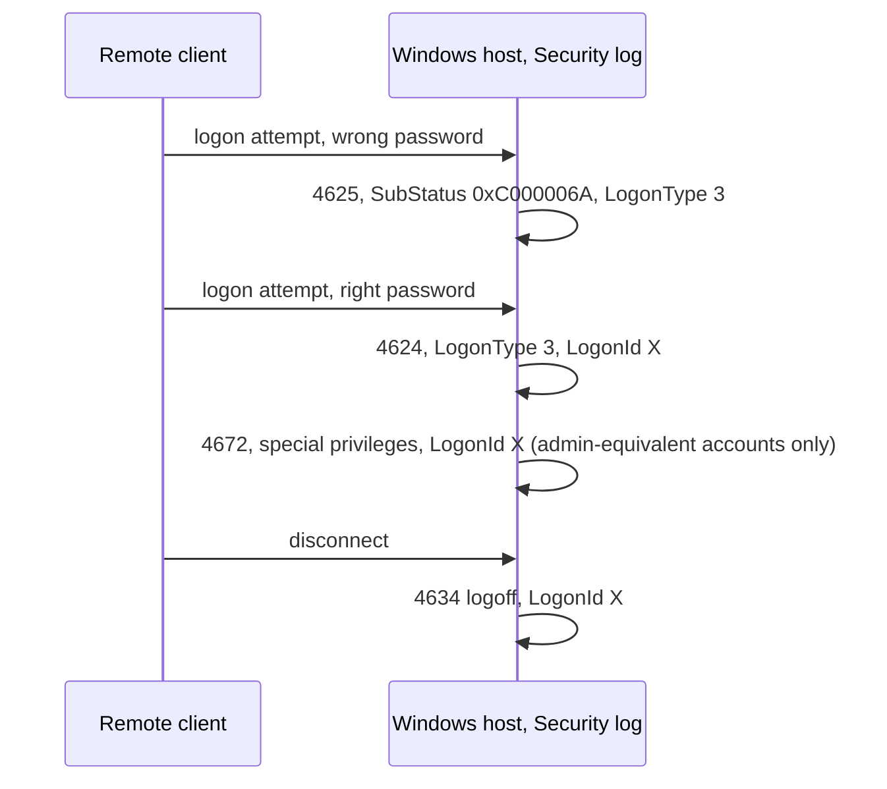
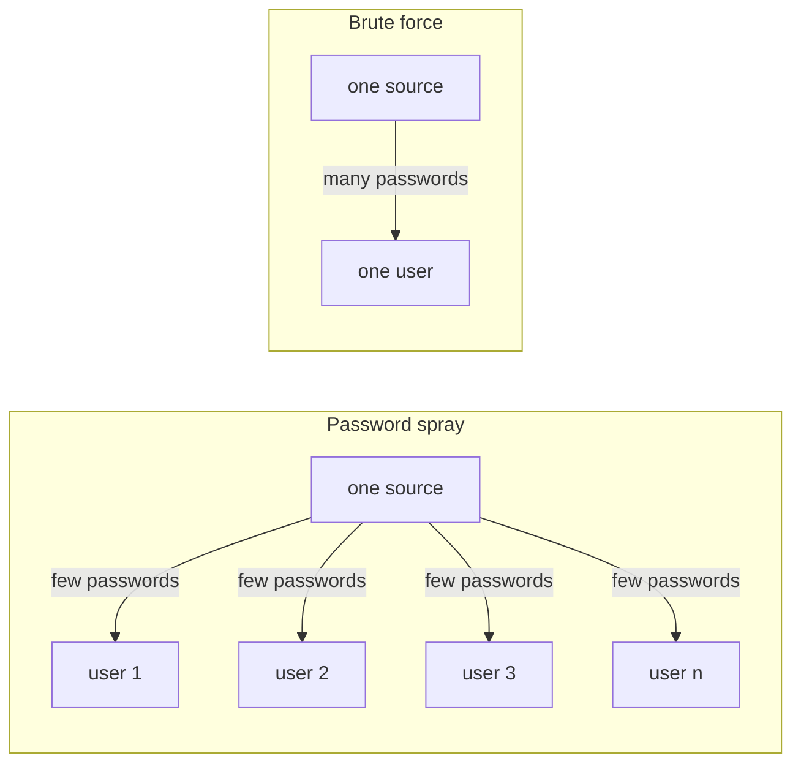

# Day 55: Reading Windows and Linux authentication logs

Phase 4, digital forensics and incident investigation. Track goal: know which log events answer "who logged in, from where, how, and when", and turn a week of them into a heatmap that makes the abnormal hour obvious.

## Concept

Most intrusions pass through authentication, so authentication logs are where timelines usually start. You need a short list of event types by heart and the fields that matter in each.

Windows Security log (enable the right audit policy first; much of this is off by default on workstations):

| Event ID | Meaning | Fields to read |
|---|---|---|
| 4624 | Successful logon | `TargetUserName`, `LogonType`, `IpAddress`, `WorkstationName`, `LogonId` |
| 4625 | Failed logon | Same, plus `Status`/`SubStatus` (for example `0xC000006A` wrong password, `0xC0000064` no such user) |
| 4634 / 4647 | Logoff / user-initiated logoff | `LogonId` pairs with the 4624 |
| 4648 | Logon with explicit credentials (runas, some lateral movement) | Target account and server |
| 4672 | Special privileges assigned to new logon | Follows a 4624 for admin-equivalent accounts |
| 4688 | Process created (needs "Audit Process Creation"; command line needs a separate policy) | `NewProcessName`, `CommandLine`, `ParentProcessName` |
| 4720 / 4732 | Account created / added to a security-enabled local group | Who did it (`SubjectUserName`) |
| 7045 (System log) | Service installed | Service name and binary path |
| 1102 | Audit log cleared | Who cleared it |

Logon types in 4624/4625: 2 interactive (keyboard), 3 network (SMB, many remote tools), 4 batch, 5 service, 7 unlock, 10 RemoteInteractive (RDP), 11 cached credentials. A type 3 logon from another server at 03:00 means something different from a type 7 at 14:00.

Sysmon, if deployed, adds richer events: 1 process create with hashes, 3 network connection, 11 file create, 22 DNS query.

Linux `sshd` and PAM write to `/var/log/auth.log` (Debian/Ubuntu) or `/var/log/secure` (RHEL family), or only to the journal (`journalctl -u ssh` or `-u sshd`). The lines to know: `Failed password for <user>`, `Failed password for invalid user <user>` (the account does not exist), `Accepted password` or `Accepted publickey`, and `session opened/closed` from `pam_unix`. Classic syslog lines carry no year and no time zone. You must establish both from the host's configuration.

How the Windows events for one logon hang together. The `LogonId` in the 4624 is the key that ties the privilege and logoff events to it:



The two guessing shapes you need to tell apart in an auth log:



A heatmap of logons by day and hour is one of the fastest ways to show a reader what "normal" looks like for an account or host and where the exception sits.

## Resources

- Microsoft: [4624 event reference](https://learn.microsoft.com/en-us/previous-versions/windows/it-pro/windows-10/security/threat-protection/auditing/event-4624) and the rest of the "Advanced security audit" event pages.
- [Sysmon](https://learn.microsoft.com/en-us/sysinternals/downloads/sysmon) documentation (event ID list).
- [Hayabusa](https://github.com/Yamato-Security/hayabusa) and [Chainsaw](https://github.com/WithSecureLabs/chainsaw): fast EVTX triage with Sigma rules.
- [EVTX-ATTACK-SAMPLES](https://github.com/sbousseaden/EVTX-ATTACK-SAMPLES): public EVTX files recorded in a lab while simulating attack techniques, for practising Hayabusa or Chainsaw on real EVTX.

## Practical: grep/awk on auth.log, then a pandas heatmap of WS-FIN-07 logons

Data: [`resources/case-lab-p4/logs/bastion01-auth.log`](resources/case-lab-p4/logs/bastion01-auth.log) (synthetic Linux, UTC) and [`resources/case-lab-p4/windows/ws-fin-07-security.csv`](resources/case-lab-p4/windows/ws-fin-07-security.csv) (synthetic Windows 4624/4625/4672 events exported to CSV, UTC). Work on your hashed copies from day 49.

1. Profile the Linux failures.

   ```bash
   L=~/lab-p4/work/EVID-001/bastion01-auth.log
   grep -c 'Failed password' "$L"
   grep 'Failed password' "$L" | awk '{for(i=1;i<=NF;i++) if($i=="from") print $(i+1)}' | sort | uniq -c
   grep -oE 'Failed password for (invalid user )?[^ ]+' "$L" | awk '{print $NF}' | sort | uniq -c | sort -rn
   grep 'Failed password' "$L" | sed -n '1p;$p' | cut -c1-15
   grep -E 'Accepted (password|publickey)' "$L"
   ```

   Expected: 112 failures, all from 203.0.113.45, spread evenly across eight usernames (14 each), first at `Mar 14 02:51:03`, last at `Mar 14 03:13:36`, followed by `Accepted password for svc_backup from 203.0.113.45 port 50122` at 03:14:07. Many usernames, few attempts each, from one source: that is the shape of a password spray, as opposed to brute force (many passwords against one account). The earlier `Accepted publickey` lines for `ops.admin` from 10.10.50.12 are the normal baseline.

2. Note what the success line tells you and what it does not. It shows a password login for an account that normally uses keys (check: does `svc_backup` appear in any earlier `Accepted` line?). It does not show how the password was known.

3. Build the heatmap for WS-FIN-07. Install `pip install pandas matplotlib` in a virtual environment, save this as `heatmap.py`, and run `python heatmap.py ws-fin-07-security.csv`:

   ```python
   import sys
   import pandas as pd
   import matplotlib
   matplotlib.use("Agg")
   import matplotlib.pyplot as plt

   df = pd.read_csv(sys.argv[1], parse_dates=["TimeCreatedUtc"])
   df = df[df["EventID"].isin([4624, 4625]) & (df["TargetUserName"] != "SYSTEM")]
   df["day"] = df["TimeCreatedUtc"].dt.strftime("%Y-%m-%d %a")
   df["hour"] = df["TimeCreatedUtc"].dt.hour

   for eid, title in [(4624, "Successful logons (4624)"), (4625, "Failed logons (4625)")]:
       grid = (df[df["EventID"] == eid]
               .pivot_table(index="day", columns="hour", values="EventID", aggfunc="count", fill_value=0)
               .reindex(columns=range(24), fill_value=0))
       fig, ax = plt.subplots(figsize=(12, 3.5))
       im = ax.imshow(grid.values, aspect="auto", cmap="Reds")
       ax.set_xticks(range(24)); ax.set_yticks(range(len(grid.index))); ax.set_yticklabels(grid.index)
       ax.set_xlabel("Hour of day (UTC)"); ax.set_title(f"WS-FIN-07 {title}, synthetic case LAB-P4")
       for (r, c), v in pd.DataFrame(grid.values).stack().items():
           if v:
               ax.text(c, r, int(v), ha="center", va="center", fontsize=8)
       fig.colorbar(im, ax=ax); fig.tight_layout()
       fig.savefig(f"ws-fin-07-heatmap-{eid}.png", dpi=150)
       print(title); print(grid.loc[:, (grid != 0).any()].to_string())
   ```

   The printed grid for failures should show single failures scattered in office hours Monday to Friday, and 23 failures in hour 02 on Saturday 14 March. The success grid shows office-hours activity (13:00 to 21:00 UTC, which is 09:00 to 17:00 in New York during daylight time) and one success in hour 03 on the 14th.

4. Drill into the two outliers.

   ```bash
   C=~/lab-p4/work/EVID-002/ws-fin-07-security.csv
   awk -F, '$1 >= "2026-03-14T02" && $1 < "2026-03-14T04"' "$C"
   ```

   You will see network (type 3) failures from 10.10.20.5, which is `bastion01`, against `administrator`, `acct.clerk01` and `svc_backup` between 02:10 and 02:16, and at 03:27:41 a type 3 success for `svc_backup` from 10.10.30.17 (`fs01`) followed by 4672 (special privileges). Add these to your case notes with the exact rows.

   Your case notes should now hold this sequence. Both sources on it write UTC, so no correction is involved yet.

   ```mermaid
   sequenceDiagram
       participant X as 203.0.113.45
       participant B as bastion01 10.10.20.5
       participant F as fs01 10.10.30.17
       participant W as WS-FIN-07 10.10.40.57
       B->>W: 23 failed type 3 logons, 02:10:00 to 02:16:14<br/>administrator, acct.clerk01, svc_backup
       Note over B,W: Open question: earlier than the spray, and from an internal host
       X->>B: 112 failed passwords, 8 usernames x 14<br/>02:51:03 to 03:13:36
       X->>B: Accepted password for svc_backup, 03:14:07
       F->>W: svc_backup type 3 logon, then 4672<br/>03:27:41
   ```

5. Annotate both PNGs (any image editor, or a text box in the plot) with arrows to the outlier cells and one line each: what the cell contains, and the source rows.

6. Add an open-question entry to your case notes for the failed logons against WS-FIN-07 from `bastion01` at 02:10. In one sentence, say why they are odd given the spray against `bastion01` started at 02:51 (they happen first, from an internal host). Do not explain them yet; flag them for day 56.

Artifact: two heatmap PNGs for WS-FIN-07 (4624 and 4625) with annotated outliers, and a short list of the bastion01 spray facts with counts and first/last times.

## Checkpoint

- Your spray summary gives the source IP.
- Your spray summary gives the failure count.
- Your spray summary gives the number of distinct usernames.
- Your spray summary gives the first failure, last failure and success times.
- Every value in your spray summary matches the file.
- Your 4625 heatmap shows scattered failures in office hours.
- Your 4625 heatmap shows one hot cell.
- Your annotation on the hot cell names the source host as `bastion01`, not only by IP.
- Your case notes have an open-question entry for the 02:10 failures against WS-FIN-07 from `bastion01`.
- That entry says the failures came before the 02:51 spray and from an internal host.
- That entry offers no explanation for them.
- You can list, from memory, the logon type numbers for RDP, network and unlock.
