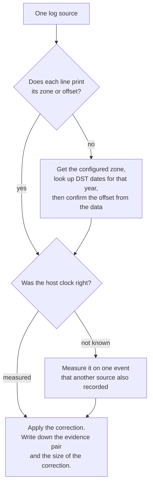
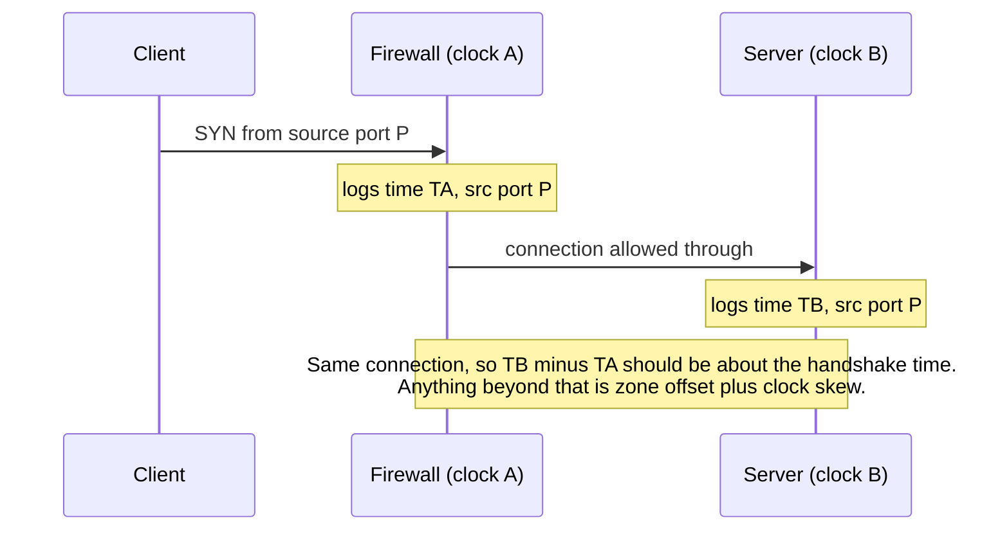
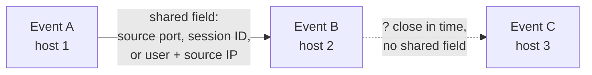

# Day 56: Normalising time and correlating logs across hosts

Phase 4, digital forensics and incident investigation. Track goal: merge logs from four sources into one UTC timeline, prove the time corrections you applied, and draw the causal chain as a graph whose every edge names the field that links two events.

## Concept

A merged timeline is only as good as its clocks. Before you sort anything, answer three questions for each source: what time zone it writes in, whether it prints that zone, and whether the host clock was right.

Zones cause the biggest errors. Syslog without a zone, a firewall set to local time, a FAT volume (day 51), an application that logs in the server's locale: all common. Daylight saving time makes it worse, because the offset changes on a date you have to look up. In 2026 the United States moved clocks forward on 8 March, so New York is UTC-4 from then until 1 November and UTC-5 before.

Skew is the second error. A host whose NTP sync failed can drift by seconds or minutes. You measure it rather than guess it: find one event that two sources both recorded, where you know the true order and roughly the gap, and compute the difference. Network logs are good for this because a TCP connection has a source port that both ends record. A firewall line and an `sshd` line with the same source IP and source port describe the same connection.

Correlation is the third step. Two rows that are close in time are adjacent, not linked. A link needs a shared field that could not match by chance (a source port, a session ID, a username plus source IP, a file name plus size) and an order that makes sense. When you draw the timeline as a graph, each edge carries that field as its label. An edge you cannot label is a guess and stays off the graph, or goes on as a dotted line with a question mark.

The three questions as a procedure you run once per source:



How one TCP connection measures two clocks at once. Nothing here is LAB-P4 data; you do that in the practical.



Adjacent is not linked. Only the first edge below may go on your graph as solid:



## Resources

- [IANA time zone database](https://www.iana.org/time-zones); on Linux, `zdump -v America/New_York | grep 2026` prints the exact 2026 transitions.
- Python [`zoneinfo`](https://docs.python.org/3/library/zoneinfo.html) documentation (standard library since Python 3.9).
- [Graphviz](https://graphviz.org/) and its [attribute reference](https://graphviz.org/doc/info/attrs.html).
- Rob Lee and others, SANS FOR508 "super timeline" papers, for the discipline of source-tagging every row.

## Practical: a Python merge with measured corrections, then a Graphviz timeline graph

Data: the four synthetic files in your EVID-001 working copy (`bastion01-auth.log`, `fs01-auth.log`, `docportal-app.jsonl`, `firewall.log`). Assume nothing about their clocks; the case notes only tell you the firewall's configured zone is `America/New_York` and the year is 2026.

1. Confirm the firewall offset from the data, not from the config note. The spray's first attempt used source port 49208.

   ```bash
   cd ~/lab-p4/work/EVID-001
   grep ':49208 ' firewall.log
   grep 'port 49208 ' bastion01-auth.log
   ```

   ```text
   2026-03-13 22:51:02 fw01 ACCEPT TCP 203.0.113.45:49208 -> 10.10.20.5:22 rule=allow-ssh-bastion bytes=4120
   Mar 14 02:51:03 bastion01 sshd[21815]: Failed password for invalid user admin from 203.0.113.45 port 49208 ssh2
   ```

   Same connection, 4 hours and 1 second apart. So either the firewall is UTC-4 and `bastion01` is right, or both are off. Check a second pair (pick any other spray port) to rule out a one-off. Then check `zdump` for 2026 to confirm UTC-4 is what New York daylight time predicts on 14 March. Now you have two independent reasons for the correction.

2. Measure `fs01` skew. The hop from `bastion01` to `fs01` used source port 41766.

   ```bash
   grep ':41766 ' firewall.log
   grep 'port 41766 ' fs01-auth.log
   ```

   The firewall shows 23:19:21 local (03:19:21 UTC). `fs01` logs the accepted key at 03:20:45. Subtract about one second for the handshake and `fs01` runs about 83 seconds fast. `docportal-app.jsonl` is written on `fs01`, so the same correction applies; write that as an assumption in your notes, because you have not measured it on the app's own events.

3. Merge. Save as `merge_timeline.py`:

   ```python
   import csv, json, sys
   from datetime import datetime, timedelta, timezone
   from pathlib import Path
   from zoneinfo import ZoneInfo

   D = Path(sys.argv[1])                                  # folder with the four logs
   FS01_SKEW = timedelta(seconds=int(sys.argv[2]))        # measured in step 2
   FW_TZ = ZoneInfo("America/New_York")
   YEAR = 2026                                            # syslog has no year
   rows = []

   def syslog(path, host, skew=timedelta(0)):
       for n, line in enumerate(open(path), 1):
           ts = datetime.strptime(f"{YEAR} {line[:15]}", "%Y %b %d %H:%M:%S").replace(tzinfo=timezone.utc)
           rows.append((ts - skew, host, line[16:].strip(), f"{path.name}:{n}"))

   syslog(D / "bastion01-auth.log", "bastion01")
   syslog(D / "fs01-auth.log", "fs01", FS01_SKEW)
   for n, line in enumerate(open(D / "docportal-app.jsonl"), 1):
       r = json.loads(line)
       ts = datetime.strptime(r["ts"], "%Y-%m-%dT%H:%M:%SZ").replace(tzinfo=timezone.utc) - FS01_SKEW
       rows.append((ts, "fs01/docportal", f'{r["event"]} user={r["user"]} count={r.get("count")}', f"docportal-app.jsonl:{n}"))
   for n, line in enumerate(open(D / "firewall.log"), 1):
       local = datetime.strptime(line[:19], "%Y-%m-%d %H:%M:%S").replace(tzinfo=FW_TZ)
       rows.append((local.astimezone(timezone.utc), "fw01", line[20:].strip(), f"firewall.log:{n}"))

   rows.sort(key=lambda r: r[0])
   w = csv.writer(sys.stdout)
   w.writerow(["utc", "host", "event", "evidence_ref"])
   for ts, host, ev, ref in rows:
       w.writerow([ts.strftime("%Y-%m-%dT%H:%M:%SZ"), host, ev, ref])
   ```

   ```bash
   python3 merge_timeline.py ~/lab-p4/work/EVID-001 83 > ~/lab-p4/work/lab-p4-merged.csv
   wc -l ~/lab-p4/work/lab-p4-merged.csv        # 297 lines including the header
   ```

   The `evidence_ref` column (file and line number) is what lets anyone check a row against the original. `ZoneInfo` applies the correct offset for each date, so it also handles the 8 March switch if you ever feed it older firewall lines.

4. Pull out the material events and read them in order:

   ```bash
   grep -E 'Accepted password|:41766|port 41766|docportal|tar -czf|198\.51\.100\.23' ~/lab-p4/work/lab-p4-merged.csv \
     | grep -v document.view
   ```

   Corrected, the sequence reads: 03:14:07 password login as `svc_backup` on `bastion01` from 203.0.113.45; 03:19:21 firewall allows `bastion01` to `fs01` SSH from port 41766; 03:19:22 `fs01` accepts `svc_backup` by key from that port; 03:23:10 to 03:24:02 the document portal logs `svc_backup` logging in locally and bulk-exporting 412 files; 03:31:40 `svc_backup` runs `tar -czf /var/tmp/.q1.tgz` over the finance folder with `sudo`; 03:41:02 the firewall allows 48,213,904 bytes from `fs01` to 198.51.100.23:443.

   Without the corrections, the firewall's exfiltration line would sit at 23:41 on 13 March, before the attacker ever logged in, and the export would appear to happen 83 seconds later than it did.

   The same events on a chart, as each source printed them and after your two corrections. The red rows are the ones the corrections move. On the raw side the firewall puts its events, including the outbound transfer, on the evening of the 13th, hours before the `bastion01` login they depend on.

   ```mermaid
   gantt
       title LAB-P4 material events, raw clocks vs corrected UTC
       dateFormat YYYY-MM-DD HH:mm:ss
       axisFormat %d %H:%M
       todayMarker off
       section As printed
       fw01 SSH from 203.0.113.45         :crit, r1, 2026-03-13 22:51:02, 2026-03-13 23:14:06
       fw01 bastion01 to fs01 port 41766  :crit, milestone, r2, 2026-03-13 23:19:21, 0d
       fw01 48 MB to 198.51.100.23        :crit, milestone, r3, 2026-03-13 23:41:02, 0d
       bastion01 spray failures           :r4, 2026-03-14 02:51:03, 2026-03-14 03:13:36
       bastion01 svc_backup login         :milestone, r5, 2026-03-14 03:14:07, 0d
       fs01 accepts svc_backup key        :crit, milestone, r6, 2026-03-14 03:20:45, 0d
       docportal bulk export              :crit, milestone, r7, 2026-03-14 03:25:11, 0d
       fs01 sudo tar                      :crit, milestone, r8, 2026-03-14 03:33:03, 0d
       section Corrected UTC
       fw01 SSH from 203.0.113.45         :c0, 2026-03-14 02:51:02, 2026-03-14 03:14:06
       bastion01 spray failures           :c1, 2026-03-14 02:51:03, 2026-03-14 03:13:36
       svc_backup login on bastion01      :milestone, c2, 2026-03-14 03:14:07, 0d
       fw01 bastion01 to fs01 port 41766  :milestone, c3, 2026-03-14 03:19:21, 0d
       fs01 accepts svc_backup key        :milestone, c4, 2026-03-14 03:19:22, 0d
       docportal bulk export              :milestone, c5, 2026-03-14 03:23:48, 0d
       fs01 sudo tar                      :milestone, c6, 2026-03-14 03:31:40, 0d
       fw01 48 MB to 198.51.100.23        :milestone, c7, 2026-03-14 03:41:02, 0d
   ```

   The `fs01` skew is too small to see at that scale. Zoomed in, each bar is the 83 seconds between the time `fs01` printed and the corrected time, with the firewall's view of the hop as the fixed reference:

   ```mermaid
   gantt
       title fs01 skew, 03:19 to 03:33 UTC on 14 March 2026
       dateFormat YYYY-MM-DD HH:mm:ss
       axisFormat %H:%M
       todayMarker off
       section Reference
       fw01 hop, port 41766           :milestone, f1, 2026-03-14 03:19:21, 0d
       section fs01 skew
       sshd accept, 83 s              :crit, s1, 2026-03-14 03:19:22, 2026-03-14 03:20:45
       docportal bulk export, 83 s    :crit, s2, 2026-03-14 03:23:48, 2026-03-14 03:25:11
       sudo tar, 83 s                 :crit, s3, 2026-03-14 03:31:40, 2026-03-14 03:33:03
   ```

5. Draw the timeline graph. Nodes are events in time order (left to right), with UTC time, host and evidence reference. Edges are causal links labelled with the linking field.

   ```dot
   digraph lab_p4 {
     rankdir=LR; node [shape=box, fontsize=10];
     a [label="03:14:07Z bastion01\nAccepted password svc_backup\nfrom 203.0.113.45\nbastion01-auth.log:117"];
     b [label="03:19:21Z fw01\nbastion01:41766 -> fs01:22\nfirewall.log:147"];
     c [label="03:19:22Z fs01 (skew -83s)\nAccepted publickey svc_backup\nfs01-auth.log:2"];
     d [label="03:23:48Z docportal (skew -83s)\nbulk_export 412 files\ndocportal-app.jsonl:16"];
     e [label="03:31:40Z fs01\nsudo tar -czf /var/tmp/.q1.tgz\nfs01-auth.log:4"];
     f [label="03:41:02Z fw01\nfs01 -> 198.51.100.23:443\n48,213,904 bytes\nfirewall.log:150"];
     a -> b [label="source 10.10.20.5 = bastion01;\nsvc_backup session open 03:14:08-03:52:44"];
     b -> c [label="src port 41766"];
     c -> d [label="user svc_backup,\nsession open on fs01"];
     d -> e [label="path finance/2026-Q1"];
     e -> f [label="size ~ 48 MB export\n(inferred, not matched)", style=dashed];
   }
   ```

   ```bash
   dot -Tpng lab-p4-timeline.dot -o lab-p4-timeline.png
   ```

   The last edge is dashed on purpose. The export was 48,006,112 bytes and the transfer was 48,213,904 bytes. The sizes are close, which fits a compressed archive plus TLS and HTTP overhead, but the firewall cannot see the content. That link is inferred.

Artifact: `lab-p4-merged.csv` (all sources, UTC, with evidence references), `lab-p4-timeline.png`, and a "time corrections" note listing each correction, the evidence pair used to measure it, and its size.

## Checkpoint

- Your corrections note cites two firewall/bastion port pairs for the UTC-4 offset and the port 41766 pair for the `fs01` skew.
- Every edge on your graph has a label, and at least one edge is marked as inferred with the reason.
- You can say which one event would move the most if someone assumed the firewall was UTC-5, and to what time.
- The open question from day 55 (WS-FIN-07 failures from `bastion01` at 02:10) is still listed as open in your notes. Nothing in these four logs answers it.
