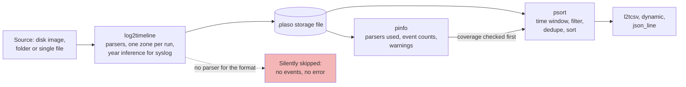

# Day 57: Super-timelines with Plaso (log2timeline, pinfo, psort)

Phase 4, digital forensics and incident investigation. Track goal: run Plaso over a disk image and a log folder, check which sources it actually parsed, and export a filtered super-timeline you can defend.

## Concept

Yesterday you merged four logs with a script you wrote. Real cases have hundreds of artifact types: file system times, registry keys, browser history, event logs, prefetch, shortcut files, syslog. Plaso ("Plaso Langar Að Safna Öllu") extracts timestamps from all the formats it knows into one store, so you can sort and filter everything together. That combined output is called a super-timeline.

Plaso is a set of tools:

| Tool | Job |
|---|---|
| `log2timeline` | Walks a source (disk image, mounted folder, single file), runs parsers, writes events to a `.plaso` storage file (SQLite) |
| `pinfo` | Reports what is in a storage file: tool version, command line, parsers used, event counts per parser, warnings |
| `psort` | Filters, sorts, de-duplicates and writes events out in a chosen format |
| `psteal` | `log2timeline` and `psort` in one step, for quick runs |

Three things decide whether a Plaso run is trustworthy. First, parser coverage: Plaso silently skips files it has no parser for. A custom firewall format or an in-house JSON app log produces zero events and no error. `pinfo` is where you find out. Second, time zone: for sources that store local time with no zone indicator, Plaso needs to be told the zone (`log2timeline -z ZONE`, also spelled `--zone` or `--timezone`; `-z list` prints the accepted names; without it Plaso uses a zone from the source data where it can and otherwise defaults to UTC), and it applies one zone to the whole run. Third, year: classic syslog lines have no year, so Plaso has to infer it (from the file's modification time and other hints). If you copied the log in a later year than it was written, the inferred year can be wrong.

The tools as a pipeline. The dotted edge is the failure that produces no error message:



Plaso's own output is also volume-heavy. One Windows workstation image typically yields millions of events. You filter by time window first, then by source, then search.

## Resources

- [Plaso documentation](https://plaso.readthedocs.io/): "Using log2timeline", "Using psort", "Using pinfo", and "Installing with Docker".
- [Plaso on GitHub](https://github.com/log2timeline/plaso) and the [supported formats list](https://plaso.readthedocs.io/en/latest/sources/user/Parsers-and-plugins.html).
- Docker image `log2timeline/plaso` on Docker Hub (avoids a Python dependency install).

## Practical: log2timeline over EVID-001 and EVID-004, pinfo coverage check, psort window export

Everything runs through Docker so the tool version is pinned and recorded. `~/lab-p4` is mounted at `/data` inside the container.

1. Record the version you are using.

   ```bash
   docker pull log2timeline/plaso
   docker run --rm log2timeline/plaso log2timeline --version
   ```

   Write the version in your method notes. Plaso's command-line options have changed between releases, so if a flag below is rejected, run `log2timeline --help` or `psort --help` in the same image and use what it lists.

2. List what parsers exist, and the presets that group them.

   ```bash
   docker run --rm log2timeline/plaso log2timeline --info | less
   ```

   Look for `syslog`, `filestat` and the presets (`linux`, `win7`, `webhist` and others). Note that nothing there parses an arbitrary firewall format.

3. Extract the log bundle.

   ```bash
   docker run --rm -v ~/lab-p4:/data log2timeline/plaso log2timeline \
     --storage-file /data/work/lab-p4-logs.plaso /data/work/EVID-001
   ```

4. Check coverage before you trust anything.

   ```bash
   docker run --rm -v ~/lab-p4:/data log2timeline/plaso pinfo /data/work/lab-p4-logs.plaso
   ```

   Find the section listing events generated per parser. Expect the syslog parser to account for the two `*-auth.log` files, and `filestat` for one file-system timestamp set per file. Expect no parsed events from the contents of `firewall.log` or `docportal-app.jsonl`. Write a coverage table:

   | Source file | Parser that handled it | Event count | Problem |
   |---|---|---|---|
   | bastion01-auth.log | syslog | ? | Year inferred |
   | fs01-auth.log | syslog | ? | Clock 83 s fast, uncorrected |
   | firewall.log | none (filestat only) | ? | Custom format; local time |
   | docportal-app.jsonl | none (filestat only) | ? | Custom JSON format |

   Fill the counts from your `pinfo` output. This table goes in the day 64 report's method section, because it tells a reader what the super-timeline cannot show.

   The expected routing as a picture. It is what the table above predicts, so check it against your own `pinfo` output rather than copying it:

   ```mermaid
   flowchart LR
       B["bastion01-auth.log"] --> SY["syslog parser"]
       F["fs01-auth.log"] --> SY
       B --> FST["filestat<br/>file times only"]
       F --> FST
       FW["firewall.log"] --> FST
       DP["docportal-app.jsonl"] --> FST
       SY --> EV[("lab-p4-logs.plaso<br/>year inferred,<br/>fs01 still 83 s fast")]
       FST --> EV
       FW -.->|"content not parsed"| GAP["Missing from the super-timeline:<br/>every firewall and portal event"]
       DP -.->|"content not parsed"| GAP
       style GAP fill:#f4b6b6
   ```

5. Check the inferred year. The `filestat` times on your working copy are the time you copied the files, and `git` sets file modification times to checkout time. Export a few syslog rows and look at the year:

   ```bash
   docker run --rm -v ~/lab-p4:/data log2timeline/plaso psort -o dynamic \
     -w /data/work/check-year.csv /data/work/lab-p4-logs.plaso
   grep -m3 'Accepted' ~/lab-p4/work/check-year.csv
   ```

   If the rows do not say 2026, re-run step 3 with the year stated explicitly (`--preferred_year 2026`, present in Plaso release 20260720) into a new storage file, and record why.

6. Extract the disk image into its own storage file.

   ```bash
   docker run --rm -v ~/lab-p4:/data log2timeline/plaso log2timeline \
     --storage-file /data/work/evid-004.plaso /data/work/evid-004.raw
   docker run --rm -v ~/lab-p4:/data log2timeline/plaso pinfo /data/work/evid-004.plaso
   ```

   Plaso opens the raw image itself through its dfVFS layer; there is no need to mount it. Compare its file entries with your day 51 `mactime` timeline. Both should list the deleted `VENDORS.CSV`.

7. Export the incident window only. The psort filter takes an expression; dates in quotes are compared as UTC.

   ```bash
   docker run --rm -v ~/lab-p4:/data log2timeline/plaso psort -o l2tcsv \
     -w /data/work/lab-p4-window.csv /data/work/lab-p4-logs.plaso \
     "date > '2026-03-14 02:45:00' AND date < '2026-03-14 04:00:00'"
   ```

   And a five-minute slice either side of the first successful login:

   ```bash
   docker run --rm -v ~/lab-p4:/data log2timeline/plaso psort -o dynamic \
     -w /data/work/lab-p4-slice.csv --slice "2026-03-14T03:14:07" /data/work/lab-p4-logs.plaso
   ```

   `-o l2tcsv` writes the classic 17-column log2timeline CSV (date, time, timezone, MACB, source, sourcetype, type, user, host, short, desc, version, filename, inode, notes, format, extra). `-o dynamic` writes a shorter, configurable set. `-o json_line` is the easiest to post-process with `jq`.

8. Compare against day 56. Open `lab-p4-window.csv` and your `lab-p4-merged.csv` side by side. List what Plaso has that your script lacked (file system times) and what your script has that Plaso lacks (the firewall and app events, and the `fs01` correction).

Artifact: `lab-p4-window.csv`, the parser coverage table, and a list of differences between the Plaso window and your hand-built timeline.

## Checkpoint

- Your coverage table names every source file, the parser that handled it, and a count taken from `pinfo`, with the gaps stated.
- You confirmed the year in the syslog-derived events and wrote down how.
- `lab-p4-window.csv` starts no earlier than 02:45 and ends no later than 04:00 UTC on 14 March 2026.
- You can explain why the `fs01` events in the Plaso output are 83 seconds later than in your day 56 timeline, and which one you would put in a report.

## Note

Plaso option names and the `pinfo` layout change between releases, and the expected parser counts above have not been produced by a recorded run against this data. If your version prints something different, trust your output and record it.
