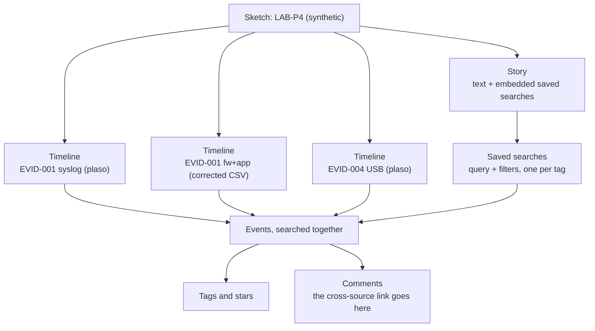

# Day 58: From Plaso storage to a Timesketch investigation story

Phase 4, digital forensics and incident investigation. Track goal: load every LAB-P4 source into one Timesketch sketch, including the ones Plaso could not parse, and write a story that links events across sources with the evidence for each link.

## Concept

A CSV of 300 rows is readable. A super-timeline of three million rows is not, and several people often need to work it at once. Timesketch is an open-source web application for that: you upload timelines (Plaso storage files, CSV or JSON lines) into a sketch, search across all of them together, and record your reasoning in the same place as the evidence.

The features you will use every day:

- Search uses OpenSearch query-string syntax: `message:"Accepted password"`, `198.51.100.23`, boolean `AND`/`OR`/`NOT`, and a date range as a filter chip or `datetime:[2026-03-14T03:00:00 TO 2026-03-14T04:00:00]`.
- Tags and stars mark events. Tags are free text; agree a short list with your team (for example `initial-access`, `lateral`, `staging`, `exfil`, `open-question`) so searches on tags work.
- Comments sit on individual events. This is where the link to another source goes: "same source port 41766 as fw01 row at 03:19:21Z".
- Saved searches keep a query and its filters with a name.
- Stories are written narratives that embed saved searches and event lists, so a reader can click from a sentence to the rows behind it.

How those pieces relate inside one sketch, using today's three timelines:



Timesketch will show whatever times you give it. It does not fix a firewall that logged local time or a server with a fast clock. You correct time before import (you did this on day 56) and write the correction into the sketch so the next analyst knows.

Required fields for CSV and JSONL import are `message`, `datetime` (ISO 8601, for example `2026-03-14T03:41:02+00:00`) and `timestamp_desc` (what the time means, such as `Connection Allowed` or `Event Recorded`). Any other columns become searchable attributes.

## Resources

- [Timesketch](https://timesketch.org/) documentation: "Install", "Upload data", "Import from JSON or CSV", "Search query guide".
- [Timesketch on GitHub](https://github.com/google/timesketch), including `contrib/deploy_timesketch.sh`.
- [Plaso psort output modules](https://plaso.readthedocs.io/en/latest/sources/user/Using-psort.html), which include OpenSearch outputs for large pipelines.

## Practical: Timesketch sketch "LAB-P4" with three timelines and a written story

You need a Linux VM with Docker, at least 8 GB RAM and 4 cores, because Timesketch runs OpenSearch, PostgreSQL, Redis and several workers.

1. Deploy (single-host lab install, from the Timesketch docs):

   ```bash
   curl -s -O https://raw.githubusercontent.com/google/timesketch/master/contrib/deploy_timesketch.sh
   chmod 755 deploy_timesketch.sh
   sudo ./deploy_timesketch.sh
   cd timesketch && sudo docker compose up -d
   sudo docker compose exec timesketch-web tsctl create-user analyst
   ```

   Read the script before running it; it writes configuration and generated secrets under `./timesketch`. Browse to `http://<vm-ip>` and log in. This lab install has no TLS and is for an isolated VM only.

2. Prepare the sources Plaso could not parse. Convert your day 56 merged timeline (already corrected to UTC) to Timesketch CSV, keeping only the firewall and document portal rows:

   ```bash
   python3 - <<'EOF'
   import csv, os
   W = os.path.expanduser("~/lab-p4/work/")
   src = csv.DictReader(open(W + "lab-p4-merged.csv"))
   out = csv.writer(open(W + "lab-p4-fw-app.ts.csv", "w", newline=""))
   out.writerow(["message", "datetime", "timestamp_desc", "host", "evidence_ref", "time_correction"])
   for r in src:
       if r["host"] == "fw01":
           desc, corr = "Connection Allowed" if "ACCEPT" in r["event"] else "Connection Dropped", "America/New_York to UTC (UTC-4, measured on port pairs)"
       elif r["host"] == "fs01/docportal":
           desc, corr = "Event Recorded", "fs01 clock -83 s (measured on port 41766)"
       else:
           continue
       out.writerow([r["event"], r["utc"].replace("Z", "+00:00"), desc, r["host"], r["evidence_ref"], corr])
   EOF
   head -3 ~/lab-p4/work/lab-p4-fw-app.ts.csv
   ```

   The `time_correction` column puts your correction on every row, where no one can miss it.

3. Create a sketch named `LAB-P4 (synthetic)` and upload three timelines through the web UI (Upload timeline) or the importer client (`pip install timesketch-import-client`, then `timesketch_importer`):

   | Timeline name | File | Contains |
   |---|---|---|
   | `EVID-001 syslog (plaso)` | `lab-p4-logs.plaso` from day 57 | `bastion01` and `fs01` auth logs, uncorrected `fs01` skew |
   | `EVID-001 fw+app (corrected CSV)` | `lab-p4-fw-app.ts.csv` | firewall and document portal, UTC |
   | `EVID-004 USB (plaso)` | `evid-004.plaso` from day 57 | file system times from the USB image |

   Wait for each timeline's status to show it is ready before searching.

4. Handle the `fs01` skew in the Plaso timeline. You cannot edit timestamps in Timesketch, so add a sketch-level note (a story section titled "Time corrections") stating that `fs01` events in `EVID-001 syslog (plaso)` are 83 seconds fast, and comment on each `fs01` event you cite with its corrected time.

5. Search and tag. Run each query, open the matching events, and tag them:

   | Query | Tag |
   |---|---|
   | `message:"Failed password" AND message:"203.0.113.45"` | `initial-access` (tag the first and last only; star the first) |
   | `message:"Accepted password for svc_backup"` | `initial-access` |
   | `"41766"` | `lateral` |
   | `message:"bulk_export" OR message:"tar -czf"` | `staging` |
   | `"198.51.100.23"` | `exfil` |

   Save each query as a saved search with the same name as its tag.

6. Comment the links. On each tagged event, add a comment naming the event in another timeline it links to and the linking field. For example, on the `fs01` "Accepted publickey" event: "Same connection as fw01 ACCEPT 10.10.20.5:41766 -> 10.10.30.17:22 at 03:19:21Z (EVID-001 fw+app, firewall.log:147). Corrected time 03:19:22Z." Aim for at least four cross-timeline comments.

7. Write the story. Create a story called `LAB-P4 intrusion path`. Sections, each with a sentence or two and the embedded saved search:

   1. Time corrections applied, with the evidence for each.
   2. Password spray against `bastion01`, 02:51:03 to 03:13:36, 112 failures, eight usernames, one source.
   3. Password login as `svc_backup` at 03:14:07.
   4. SSH from `bastion01` to `fs01`, 03:19:21 to 03:19:22, linked by source port.
   5. Export and archive of `finance/2026-Q1` on `fs01`, 03:23:48 and 03:31:40.
   6. 48,213,904 bytes to 198.51.100.23:443 at 03:41:02, and the same IP seen from WS-FIN-07 in memory (day 54). Mark the size link and the cross-host link as inferred.
   7. Open questions: how the `svc_backup` password was known; the 02:10 failures against WS-FIN-07 from `bastion01`; whether the USB image (EVID-004) has any link to this sequence.

   The story as a sequence. Numbers are message order, all times are corrected UTC, solid arrows are links on a shared field, and dashed arrows are the two links you must mark as inferred:

   ```mermaid
   sequenceDiagram
       autonumber
       participant X as 203.0.113.45
       participant B as bastion01 10.10.20.5
       participant FW as fw01
       participant F as fs01 10.10.30.17
       participant Y as 198.51.100.23
       participant W as WS-FIN-07 10.10.40.57
       Note over X,W: Section 1. Time corrections: fw01 local time to UTC, fs01 minus 83 s
       X->>B: spray, 112 failures, 8 usernames<br/>02:51:03 to 03:13:36
       X->>B: Accepted password<br/>for svc_backup, 03:14:07
       B->>FW: SSH to fs01<br/>src port 41766, 03:19:21
       FW->>F: same src port 41766<br/>Accepted publickey, 03:19:22
       F->>F: bulk_export 412 files 03:23:48<br/>sudo tar .q1.tgz 03:31:40
       F-->>Y: 48,213,904 bytes, 03:41:02<br/>(content match inferred from size)
       W-->>Y: synchelper.exe in memory<br/>(same IP only, inferred)
       Note over X,W: Section 7. Open: how the password was known, the 02:10 failures on WS-FIN-07 from bastion01, any link to EVID-004
   ```

8. Export the story (the story view has an export option in recent versions; otherwise print to PDF) and export each saved search to CSV.

Artifact: a Timesketch sketch with three timelines, five saved searches, at least four cross-timeline comments, and the exported story `LAB-P4 intrusion path`.

## Checkpoint

- Every event cited in the story is tagged.
- Every cross-source statement in the story names the shared field (port, username, IP, path).
- The "Time corrections" section lists the same corrections as your day 56 corrections note.
- Section 7 lists at least three open questions. If your story has none, you have concluded more than the data shows.
- The saved search `lateral` returns both the fw01 event for source port 41766 and the `fs01` "Accepted publickey" event.
- The `fs01` "Accepted publickey" event has a comment naming the fw01 event it links to and the shared source port 41766.
- Without notes, you can say why the `fs01` skew is handled with a story note and comments rather than by changing the timestamps in Timesketch.

## Note

The `deploy_timesketch.sh` path, the `tsctl create-user` command and the importer client name match the Timesketch install guide and the `timesketch-import-client` PyPI package as checked in September 2026. They have changed before; check the current install guide if a command fails.
