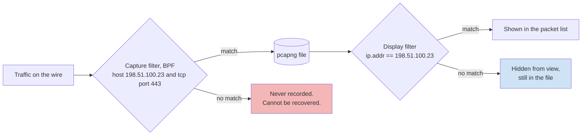

# Day 59: Network forensics with Wireshark and tshark

Phase 4, digital forensics and incident investigation. Track goal: filter a capture down to the conversations that matter, measure them, and present traffic as a graph instead of a scrollback.

## Concept

Network evidence comes in two grades. Full packet capture (pcap or pcapng) holds every byte, so you can rebuild sessions and extract transferred files, but it is rarely kept for more than hours or days. Flow and firewall records (NetFlow, IPFIX, Zeek `conn.log`, firewall logs like LAB-P4's) keep only who talked to whom, when, on which ports, and how many bytes, but they are kept much longer. Most real investigations have flow records for the whole period and packets for a small part of it, if any.

Wireshark has two filter languages, and mixing them up is the most common beginner error. Capture filters use BPF syntax and decide what gets recorded (`host 198.51.100.23 and tcp port 443`); anything they exclude is gone. Display filters use Wireshark's own field syntax and only hide packets from view (`ip.addr == 198.51.100.23 && tcp.port == 443`). In investigations you almost always capture broadly and filter on display.

Where each filter acts, and what you lose with each:



Display filters you will use constantly:

| Filter | Shows |
|---|---|
| `ip.addr == 198.51.100.23` | Any packet to or from that address |
| `ip.src == 10.10.30.17 && tcp.dstport == 443` | Outbound HTTPS from one host |
| `ip.addr == 10.10.0.0/16` | A whole subnet (CIDR works) |
| `tcp.flags.syn == 1 && tcp.flags.ack == 0` | Connection attempts only |
| `dns.qry.name contains "example"` | DNS queries with a substring |
| `dns.flags.rcode == 3` | NXDOMAIN answers (common with domain-generation malware) |
| `http.request.method == "POST"` | Uploads over clear HTTP |
| `tls.handshake.type == 1` | TLS Client Hello; add column `tls.handshake.extensions_server_name` for the SNI |
| `frame.time >= "2026-03-14 03:40:00"` | Packets after a time (in the time zone Wireshark is displaying) |
| `tcp.analysis.retransmission` | Retransmissions, a sign of loss or a struggling link |
| `!(arp || dns || icmp)` | Hide common noise |

Encrypted traffic (TLS) hides content but not metadata: endpoints, timing, sizes, the server name in the Client Hello, and certificate details for TLS 1.2. Regular, evenly spaced small connections to one destination (beaconing) and one large outbound transfer are both visible without decryption.

Two statistics views turn packets into pictures. Statistics, Conversations lists every pair of endpoints with packets, bytes and duration, sortable. Statistics, I/O Graphs plots packets or bytes per interval; spikes and regular pulses stand out immediately.

## Resources

- [Wireshark User's Guide](https://www.wireshark.org/docs/wsug_html_chunked/), chapters "Filtering Packets While Viewing" and "Statistics".
- [`wireshark-filter` man page](https://www.wireshark.org/docs/man-pages/wireshark-filter.html) and the [display filter reference](https://www.wireshark.org/docs/dfref/).
- [`tshark` man page](https://www.wireshark.org/docs/man-pages/tshark.html), especially `-z` statistics and `--export-objects`.
- [Wireshark SampleCaptures](https://wiki.wireshark.org/SampleCaptures), small public captures of ordinary protocols.
- [Gephi](https://gephi.org/) for the conversation graph from flow data.

## Practical: tshark and Wireshark on your own lab capture, plus a Gephi graph of LAB-P4 firewall flows

LAB-P4 has no packet capture (see Note). You will practise the filters and graphs on a capture you make of your own lab VM's traffic, which you are authorised to record, and build the case graph from the synthetic firewall log.

Part A, your own capture.

1. On your lab VM, start a capture and generate known traffic, so you can check every result against what you did.

   ```bash
   sudo tshark -i any -w ~/lab-p4/work/own-lab.pcapng -a duration:300 &
   for i in 1 2 3 4 5; do curl -s -o /dev/null http://example.com/; sleep 30; done
   curl -s -o /dev/null https://example.org/
   dig example.net; dig nonexistent-lab-name.example
   head -c 200000 /dev/urandom > ~/lab-p4/work/blob.bin
   curl -s -o /dev/null -X POST --data-binary @$HOME/lab-p4/work/blob.bin http://example.com/ || true
   wait
   sha256sum ~/lab-p4/work/own-lab.pcapng
   ```

   You made a five-request, 30-second "beacon" to example.com, a TLS connection, DNS lookups including one NXDOMAIN, and a large POST. The server will reject the POST; the upload still crosses the wire, which is what you are measuring.

   The traffic you just made, in order. Use it as the answer key when you label the I/O graph in step 4. Expect DNS lookups for each name before its connection, and background OS traffic you did not generate; label that as unexplained, not as yours.

   ```mermaid
   sequenceDiagram
       participant VM as Lab VM
       participant R as DNS resolver
       participant C as example.com
       participant O as example.org
       loop 5 times, about 30 s apart
           VM->>C: HTTP GET / (the beacon)
       end
       VM->>O: TLS Client Hello, SNI example.org
       VM->>R: query example.net
       VM->>R: query nonexistent-lab-name.example
       R-->>VM: NXDOMAIN
       VM->>C: HTTP POST, 200,000-byte body
       C-->>VM: error response, body already sent
   ```

2. Summarise with tshark before opening the GUI.

   ```bash
   P=~/lab-p4/work/own-lab.pcapng
   tshark -r $P -q -z conv,tcp          # TCP conversations, bytes each way, duration
   tshark -r $P -q -z endpoints,ip
   tshark -r $P -q -z io,stat,10         # packets and bytes per 10 s bucket
   tshark -r $P -Y 'dns.flags.response == 0' -T fields -e frame.time_utc -e dns.qry.name
   tshark -r $P -Y 'dns.flags.rcode == 3' -T fields -e dns.qry.name
   tshark -r $P -Y 'tls.handshake.type == 1' -T fields -e ip.dst -e tls.handshake.extensions_server_name
   tshark -r $P -Y 'http.request.method == "POST"' -T fields -e frame.time_utc -e ip.dst -e http.content_length
   ```

3. Measure the beacon interval. Pull the start time of each HTTP request to example.com and difference them:

   ```bash
   tshark -r $P -Y 'http.request && http.host == "example.com"' -T fields -e frame.time_epoch \
     | awk 'NR>1 {printf "%.1f s\n", $1-prev} {prev=$1}'
   ```

   You should see four gaps of roughly 30 seconds plus the time `curl` takes. Real beacons often add random jitter; you would look at the spread of the gaps, not only the mean.

4. In Wireshark, open the capture and produce two screenshots: Statistics, I/O Graphs with a 1-second interval (add a second graph line with display filter `http.request.method == "POST"` so the upload stands out), and Statistics, Conversations, IPv4 tab, sorted by bytes. Label on each screenshot which spike or row corresponds to which command from step 1.

5. Recover the upload. Right-click the POST request, Follow, TCP Stream, and check the byte count for the client side. Then try File, Export Objects, HTTP (or `tshark -r $P --export-objects http,./objects`); depending on your Wireshark version the list may include request bodies as well as responses. If the body is exported, hash it and compare with `sha256sum ~/lab-p4/work/blob.bin`.

Part B, LAB-P4 flows as a graph.

6. Convert the synthetic firewall log to a Gephi edge list, summing bytes per source, destination and action:

   ```bash
   F=~/lab-p4/work/EVID-001/firewall.log
   { echo "Source,Target,Action,Weight,Connections"
     awk '{split($6,s,":"); split($8,d,":"); sub("bytes=","",$10);
           k=s[1]","d[1]","$4; b[k]+=$10; c[k]++}
          END {for (k in b) print k","b[k]","c[k]}' "$F" | sort -t, -k4 -nr
   } > ~/lab-p4/work/fw-edges.csv
   head -4 ~/lab-p4/work/fw-edges.csv
   ```

   ```text
   Source,Target,Action,Weight,Connections
   10.10.30.17,198.51.100.23,ACCEPT,48213904,1
   203.0.113.45,10.10.20.5,ACCEPT,465560,113
   10.10.40.61,192.0.2.29,ACCEPT,85848,1
   ```

7. In Gephi: File, Import spreadsheet, choose `fw-edges.csv` as an edges table, directed. Run a ForceAtlas 2 layout, size edges by Weight, colour nodes by subnet (internal 10.10.x.x vs RFC 5737 documentation ranges), and label nodes with host names you know (`bastion01`, `fs01`, `WS-FIN-07`). The 48 MB edge from `fs01` and the 113-connection fan-in to `bastion01` should dominate. Export as PNG.

   A sketch of the shape your Gephi graph should reach, drawn from the same edge list. Thick edges are the two that should dominate. The routine HTTPS from three internal hosts to 192.0.2.x (29 edges, none over 90,000 bytes) is collapsed into one edge here, and the single `fs01` to 10.10.0.2 edge (92 bytes) is left off; your graph should show them all.

   ```mermaid
   flowchart LR
       X["203.0.113.45"] ==>|"ACCEPT, 113 connections<br/>465,560 bytes"| B["bastion01<br/>10.10.20.5"]
       D["198.51.100.68, .71, .81,<br/>.86, .90"] -.->|"DROP, 6 connections"| B
       B -->|"ACCEPT, 1 connection<br/>18,844 bytes"| F["fs01<br/>10.10.30.17"]
       F ==>|"ACCEPT, 1 connection<br/>48,213,904 bytes"| Y["198.51.100.23"]
       I["WS-FIN-07 10.10.40.57,<br/>10.10.40.61, 10.10.50.12"] -->|"ACCEPT, many small HTTPS"| N["192.0.2.x<br/>documentation range"]
       style Y fill:#f4b6b6
       style X fill:#f4b6b6
   ```

8. Finish your Part A notes:
   - For any spike on your I/O graph that no command from step 1 explains, label it "unexplained" on the screenshot and list the traffic it contains.
   - Write down the client-side byte count of the POST from step 5. If it is not 200,000 bytes, write the reason for the difference.

Artifact: from Part A, two annotated Wireshark screenshots and your beacon-interval output; from Part B, `lab-p4-flows.png` from Gephi with edge weights by bytes and labelled hosts.

## Checkpoint

- Every spike on your I/O graph carries a label.
- Each spike label names a command from step 1 or says "unexplained".
- Each "unexplained" label lists the traffic that spike contains.
- Your tshark output lists the NXDOMAIN name you generated.
- Your tshark output lists the SNI of your TLS connection.
- Your notes record the client-side byte count of the POST body.
- That count is 200,000 bytes, or your notes give the reason for the difference.
- If you exported the body, its SHA-256 matches `blob.bin`.
- On your Gephi PNG, the `fs01` to 198.51.100.23 edge is the thickest edge.
- On your Gephi PNG, the `bastion01` node, which received the most inbound connections, is labelled by name.
- Without notes, you can say why you would look at the spread of beacon gaps, not only the mean.

## Note

A synthetic pcap for LAB-P4 (the `fs01` to 198.51.100.23 transfer and the 5-minute pattern seen from WS-FIN-07) is still needed and is not in `resources/`. Until one is added, Part A uses your own capture and Part B uses the firewall log.
