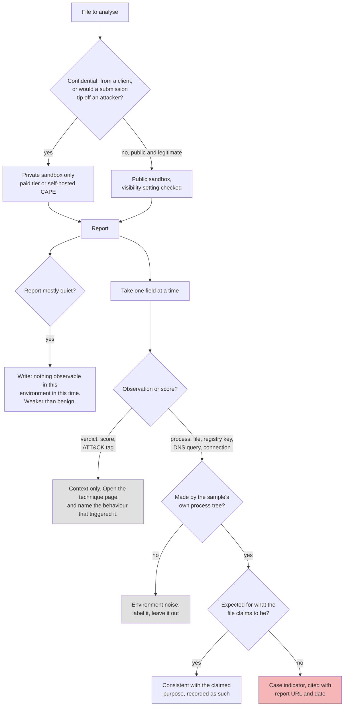

# Day 62: Reading sandbox reports without fooling yourself

Phase 4, digital forensics and incident investigation. Track goal: use a public sandbox safely, read its report field by field, and separate what the sandbox observed from the verdict it printed.

## Concept

A malware sandbox runs a file in an instrumented virtual machine for a few minutes and records what happens: processes started, files and registry keys written, DNS lookups and network connections, and sometimes screenshots and memory dumps. It then scores the behaviour and maps parts of it to MITRE ATT&CK techniques.

The report is useful and easy to over-read. Keep three limits in mind.

Visibility. Free and community tiers of Any.Run, Hybrid Analysis and Triage make submissions public: anyone can search for and download your file and its report. That rules out anything confidential, anything from a client, and anything whose submission would tell an attacker they have been noticed. Paid tiers and self-hosted sandboxes (CAPE, for example) keep submissions private. Always check the visibility setting before you press submit.

Coverage. The sandbox sees one run, on one OS image, for a limited time, often without the user interaction, domain membership, locale or command-line arguments the sample expects. Malware commonly checks for virtual machines or waits before acting. A quiet report means "did nothing observable in this environment in this time", which is weaker than "benign".

Scoring. Behaviour tags and ATT&CK mappings are generated by rules. Legitimate installers write to `Program Files`, create scheduled tasks for updaters, and query system information, and sandboxes tag those actions with the same technique IDs they use for malware. A tag is an observation that matched a rule; you decide whether it matters.

What you take from a report into a case: the observed indicators (hashes of dropped files, domains, IPs, URLs, mutexes, file paths), the process tree, and the timeline of actions, each cited to the report URL and date. The verdict score goes in as context, never as a finding.

The judgment process for reading a report, from the submit decision to what enters the case file:



## Resources

- [ANY.RUN](https://any.run/) (interactive; free community plan with public submissions; sign-up rules change, and some services refuse free webmail addresses).
- [Hybrid Analysis](https://www.hybrid-analysis.com/) (CrowdStrike Falcon Sandbox, free community submissions with an account).
- [Triage](https://tria.ge/) by Recorded Future (free researcher accounts on application).
- [CAPE Sandbox](https://github.com/kevoreilly/CAPEv2), self-hosted and private.
- MITRE ATT&CK [technique pages](https://attack.mitre.org/techniques/enterprise/), to check what a mapped ID actually means.

## Practical: two sandbox reports on the same known-good installer, scored against what you already know

You will submit a file that is public and legitimate, so submission leaks nothing: the official 7-Zip installer for Windows (download it from 7-zip.org). Its behaviour is known in advance, which lets you grade the sandbox instead of trusting it.

1. Prepare the sample and its card.

   ```bash
   cd ~/lab-p4/triage
   # after downloading 7z<version>-x64.exe from https://www.7-zip.org/ into this folder
   file 7z*-x64.exe
   sha256sum 7z*-x64.exe
   ```

   Search the hash on VirusTotal first (day 61). If a sandbox has already analysed this exact file, you can read that public report instead of submitting a new one; note which you did.

2. Submit or retrieve on two services. On ANY.RUN, create a new task, set privacy to public (this is a public installer), and during the run click through the installer so it actually installs; interactive sandboxes exist for exactly this. On Hybrid Analysis or Triage, submit the same file and accept the default environment. Save each report URL and the report date.

3. Fill in a worksheet with one row per report field. For each, write what the sandbox recorded and whether it matches what a 7-Zip install should do (write files under `C:\Program Files\7-Zip`, register a shell extension and file associations under `HKLM\SOFTWARE\Classes` or similar, create an uninstall entry under `...\CurrentVersion\Uninstall\7-Zip`).

   | Field | Sandbox A | Sandbox B | Expected for a 7-Zip install? |
   |---|---|---|---|
   | Verdict / score | | | Benign |
   | Process tree | | | Installer process, possibly `regsvr32` or explorer interaction |
   | Files written (top 5 paths) | | | Program Files\7-Zip\... |
   | Registry keys written (top 5) | | | Classes, shell extension, Uninstall |
   | DNS / network | | | Usually none, or OS background noise |
   | ATT&CK techniques tagged | | | Some benign actions may be tagged |
   | Signatures / behaviour tags | | | |
   | Dropped files with hashes | | | 7-Zip's own binaries |

4. Separate the environment's noise from the sample. Sandboxes record background OS traffic (Windows Update, certificate revocation checks, telemetry). Mark every network row as "sample" or "environment", and say how you decided (the process that made the connection is usually the answer).

5. Grade the ATT&CK tags. For each technique ID the report lists, open its MITRE page and write one line: the behaviour that triggered it, and whether that behaviour is malicious here. A registry write to add an uninstall entry, for example, may be tagged under "Modify Registry" (T1112), which is accurate as a description and meaningless as an accusation.

6. Compare to the static view. From day 61, what did you predict from strings and type alone, and what did the sandbox add? Write two sentences.

7. Transfer the lesson to LAB-P4. Using the `synchelper.exe` card from day 61, write the plan you would follow if you obtained the file: private sandbox only, which OS image (WS-FIN-07 is Windows; use a matching build), what user interaction to provide, how long to run, and which case indicators you would look for in the report (connections to 198.51.100.23, a child `rundll32.exe` with no arguments, writes under `AppData\Roaming\SyncHelper`).

Artifact: the completed two-sandbox worksheet with report URLs and dates, the ATT&CK grading list, and the private-sandbox plan for `synchelper.exe`.

## Checkpoint

- Every worksheet cell is filled from a report or marked "not shown by this sandbox".
- At least one ATT&CK tag is graded as "accurate description, not malicious in context", with the reason.
- Every network row is labelled sample or environment.
- Your `synchelper.exe` plan names a private analysis option and states why a public submission would be wrong for a file from a client's workstation.
