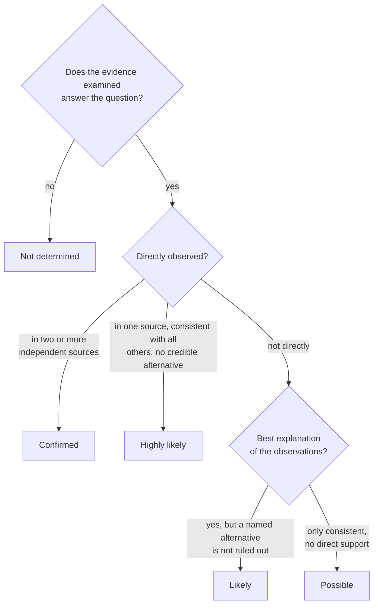
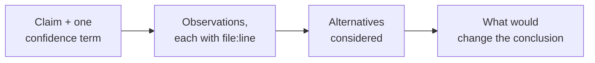
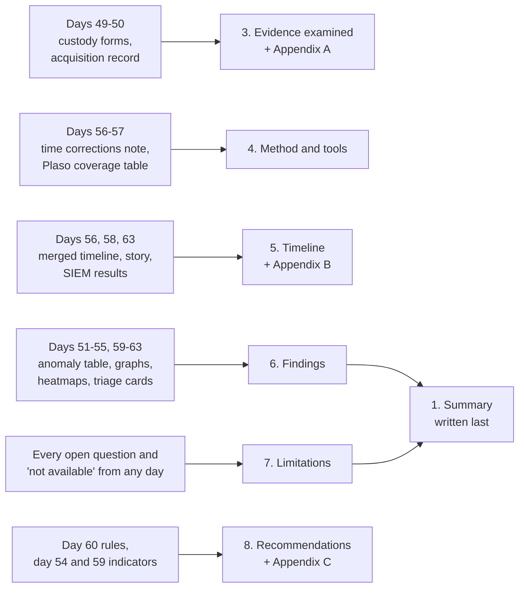

# Day 64: Writing the forensic findings report

Phase 4, digital forensics and incident investigation. Track goal: turn sixteen days of LAB-P4 notes into a report a decision maker can act on and a skeptical examiner can check line by line.

## Concept

The report is the only part of an investigation most people will ever see. Legal counsel, a manager deciding whether to notify customers, an insurer, or a court read it without your notes, your tools or you in the room. Two readers matter at once: the one who needs to act and wants the answer in the first paragraph, and the one who wants to break your conclusions and will check every cited line.

Structure serves both. The summary leads with what happened, when, what was affected, how sure you are, and what is still unknown. Findings follow, each built the same way: the claim with its confidence level, the observations with evidence references, the alternatives you considered, and what would change your mind. Method and evidence sections let another examiner repeat your work: tool versions, commands, hashes, time corrections.

Calibrated language is the core skill. Every factual sentence either reports an observation ("the firewall log records ...") or states an inference with its strength ("this is likely because ..."). The words that get reports torn apart are the ones that claim more than the evidence: "proves", "clearly", "the attacker" when you mean "the account", "stole" when the log shows bytes leaving but not their content, "all" when you checked a sample. Pick a small confidence scale, define it in the report, and use only those words.

Choosing the confidence term for a finding, using the definitions from the template below:



Every finding has the same four parts, in this order:



Limitations are findings about your own evidence. A gap you name costs you nothing; a gap opposing counsel names first costs you the report.

## Resources

- NIST SP 800-86, section 3.4 "Reporting".
- [ODNI Intelligence Community Directive 203, Analytic Standards](https://www.dni.gov/files/documents/ICD/ICD-203.pdf): the source for many teams' probability language and the requirement to separate intelligence from assumptions.
- Sherman Kent, "Words of Estimative Probability" (CIA Studies in Intelligence, 1964), on why confidence words need defined meanings.
- SWGDE "Requirements for Report Writing in Digital and Multimedia Forensics" (on the SWGDE documents page).

## Practical: the LAB-P4 findings report

Use the template below. Everything you cite comes from your own artifacts: the custody forms (day 49), acquisition record (50), timelines (51, 56, 57), anomaly table (52), process and network graphs (53, 54), heatmaps (55), Timesketch story (58), flow graph and rules (59, 60), triage cards (61, 62) and dashboard (63).

Where each day's artifact lands in the report:



1. Draft the findings first, the summary last. Start from these five questions and write one finding for each:

   1. How was access to `bastion01` obtained?
   2. What did the actor do on `fs01`?
   3. Did finance data leave the network?
   4. How does WS-FIN-07 relate to the rest?
   5. How was the `svc_backup` password obtained?

2. Calibrate each finding. Here is question 3 written badly and then acceptably.

   Badly: "The attacker stole the Q1 finance files by uploading them to their C2 server at 198.51.100.23."

   That sentence claims an identity ("the attacker"), a content match ("the Q1 finance files"), and a purpose ("C2 server"), none of which any log shows.

   Acceptably: "It is likely that an archive of the `finance/2026-Q1` folder left the network at 03:41:02 UTC on 14 March 2026. The document portal on `fs01` recorded a bulk export of 412 files (48,006,112 bytes) by the `svc_backup` account at 03:23:48 (docportal-app.jsonl:16, corrected for an 83-second clock offset); `svc_backup` ran `tar -czf /var/tmp/.q1.tgz` over that folder at 03:31:40 (fs01-auth.log:4); and the firewall allowed a single 48,213,904-byte connection from `fs01` to 198.51.100.23:443 at 03:41:02 (firewall.log:150, converted from UTC-4). The firewall does not record content, so the match between the archive and the transfer rests on size and sequence. A packet capture, proxy log, or the archive's size on disk (`/var/tmp/.q1.tgz`, if still present) would confirm or refute it."

   Question 5 has one honest answer from this data: "Not determined. None of the evidence examined shows how the password was obtained." Do not fill the gap with the WS-FIN-07 activity just because it is suspicious and nearby in time; you can list it as a lead to investigate, with that label.

3. Build the timeline section from `lab-p4-merged.csv` and the SIEM results. Keep only material events, each with UTC time, host, description and evidence reference, and state every time correction once, with how you measured it.

4. Write the limitations section. At minimum: no packet capture; no raw memory image or copy of `synchelper.exe`; `fs01` clock skew measured on one connection; firewall and app formats not parsed by Plaso; the unexplained failed logons against WS-FIN-07 from `bastion01` at 02:10 to 02:16; the USB image (EVID-004) showing no observed link to the intrusion.

   Compare the case map from day 49 with what the evidence now supports. Solid edges are links on a shared field you can cite; dashed edges are inferred or unexplained. Deciding the confidence term for each one is your job in step 2.

   ```mermaid
   flowchart LR
       X["203.0.113.45"] -->|"spray, then password login<br/>bastion01-auth.log:117"| B["bastion01"]
       B -->|"src port 41766<br/>firewall.log:147, fs01-auth.log:2"| F["fs01"]
       F -->|"export, then tar<br/>docportal-app.jsonl:16, fs01-auth.log:4"| F
       F -.->|"48,213,904 bytes, content not seen<br/>firewall.log:150"| Y["198.51.100.23"]
       F -->|"svc_backup type 3 logon<br/>ws-fin-07-security.csv:119"| W["WS-FIN-07"]
       W -.->|"same remote IP in memory<br/>windows.netscan.txt"| Y
       Q1["Not determined:<br/>how the svc_backup<br/>password was known"] -.- B
       Q2["Unexplained: 23 failures<br/>from bastion01, 02:10-02:16"] -.- W
       style Q1 fill:#fbe3b0
       style Q2 fill:#fbe3b0
   ```

5. Write the summary last, in three to six sentences, with no tool names and no unexplained acronyms.

6. Attach the custody forms, the timeline export, an indicator list (type, value, first seen, last seen, source, all IPs from the documentation ranges and marked synthetic), and the commands appendix with output file hashes.

7. Check your citations with a script before a reviewer does. This pulls every `file:line` reference out of the report, finds the file in your working copies, and prints the cited line, so you can read each claim against its source:

   ```bash
   cd ~/lab-p4
   grep -oE '[A-Za-z0-9._-]+\.(log|jsonl|csv|txt):[0-9]+' LAB-P4-findings.md | sort -u |
   while IFS=: read -r f n; do
     p=$(find work -name "$f" -print -quit)
     if [ -z "$p" ]; then echo "$f:$n  FILE NOT FOUND"; continue; fi
     line=$(sed -n "${n}p" "$p")
     echo "$f:$n  ${line:-LINE DOES NOT EXIST}"
   done
   grep -nowiE 'proves?|clearly|obviously|stole|hacker|attacker' LAB-P4-findings.md
   ```

   For `firewall.log:150` the first part prints the 48,213,904-byte line. Any `FILE NOT FOUND` or `LINE DOES NOT EXIST` is a broken citation to fix. The second `grep` lists every overclaiming word with its line number; each one either goes, or stays with evidence that meets it.

### Report template

Copy this into `~/lab-p4/LAB-P4-findings.md` and fill every section.

```markdown
# Forensic findings: LAB-P4 (synthetic training case)

## 1. Summary
Three to six sentences: what happened, when (UTC), what was affected, how confident,
what remains unknown. No tool names.

## 2. Scope and authority
Who requested the work, under what authority (LAB-P4-EL, fictional), the questions asked,
what was out of scope, and any limits on time or access.

## 3. Evidence examined
| Item | Description | Acquired by / date (UTC) | SHA-256 | Verified on receipt? |
|---|---|---|---|---|

## 4. Method and tools
Each tool with exact version and what it was used for. Time corrections applied.

## 5. Timeline
Material events only, UTC, each with host, description and evidence reference.

## 6. Findings
### Finding 1: <one sentence, with confidence term>
Observations (with evidence references):
Alternatives considered:
What would change this conclusion:

(repeat per finding)

Confidence terms used in this report:
| Term | Meaning |
|---|---|
| Confirmed | Directly observed in two or more independent sources |
| Highly likely | Directly observed in one source, consistent with all others, no credible alternative |
| Likely | Best explanation of the observations; a named alternative is not ruled out |
| Possible | Consistent with the observations, not supported by direct evidence |
| Not determined | The evidence examined does not answer the question |

## 7. Limitations

## 8. Recommendations
Each tied to a finding number.

## Appendices
A. Chain-of-custody forms  B. Full timeline  C. Indicators  D. Commands run, in order, with output hashes
```

Artifact: `LAB-P4-findings.md` (or PDF), complete, with five findings, a timeline, limitations, and all four appendices.

## Checkpoint

Swap reports with another learner, or leave yours for a day and review it cold, using this checklist. Every item that does not hold is a revision.

- The report has five findings, one for each question in step 1.
- Section 1 (Summary) states what happened.
- Section 1 states when it happened, in UTC.
- Section 1 states how sure you are.
- Section 1 contains no tool names.
- Section 1 contains no unexplained acronyms.
- Every finding uses exactly one term from the confidence table.
- Every finding rated "Confirmed" cites two or more independent sources.
- Every finding rated "Highly likely" cites a direct observation in at least one source.
- Every finding rated "Likely" names an alternative that is not ruled out.
- Three factual sentences picked at random each carry a cited file and line.
- You find each of those three cited lines within a minute.
- Each of those three cited lines contains the time, count, address or name its sentence states.
- The step 7 citation check prints no `FILE NOT FOUND` line.
- The step 7 citation check prints no `LINE DOES NOT EXIST` line.
- The words "proves", "clearly", "obviously", "stole" and "the hacker" are absent, except where the same sentence cites evidence that meets them.
- The finding for question 5 is "not determined".
- The 02:10 failures are listed as unexplained.
- Each time correction is stated once.
- Each time correction states the measurement behind it.
- Every recommendation names the finding or limitation it comes from (for example: disable password authentication for SSH on `bastion01`, because of finding 1; restrict `svc_backup`'s sudo rights on `fs01`, because of finding 2; fix NTP on `fs01`, because of the limitation it caused).
- Without notes, you can state the difference between "Likely" and "Highly likely" in the confidence table.
