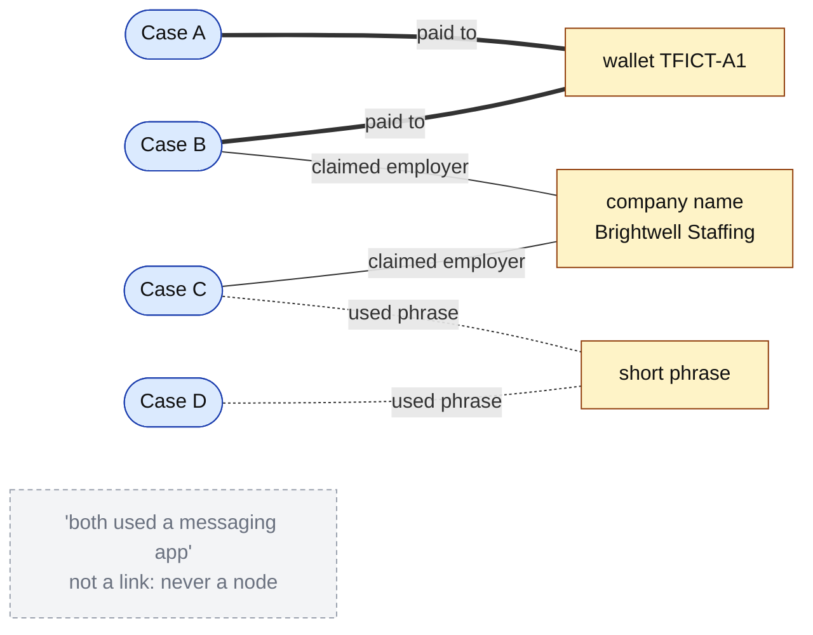
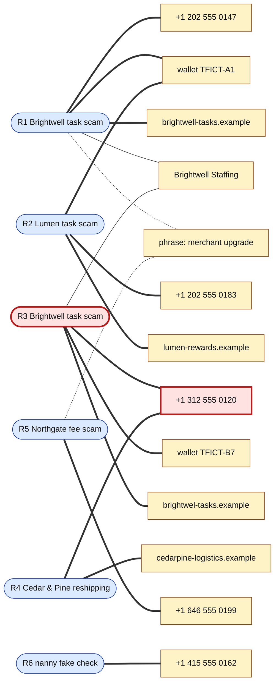

# Day 68: Mapping a fraud ring, a relationship graph built from shared indicators

Phase: 5. Fraud, scam, and social-engineering investigation · Track goal: Turn separate recruitment-fraud reports into a graph whose every edge is an exact shared value, then say which cases belong to one operation, which do not, and how sure you are.

## Concept
One scam report is a case. Several reports that share a phone number, a cryptocurrency wallet, or a payment handle are probably one operation, and that changes what you can do with them. A platform can remove every account in the cluster at once, a bank can freeze a mule account that shows up in five reports, and a law enforcement referral that says "these eleven complaints share two wallets and a phone number" is far easier to act on than eleven separate complaints.

The work is in deciding what counts as a link. Indicators differ a lot in how much they prove when two cases share them.

| Strength | Examples | Why |
|---|---|---|
| Strong | Same cryptocurrency deposit address, bank account, payment-app handle, phone number, or registered domain | One party controls each of these at a time. Two victims paying the same wallet paid the same operator, or a mule the operator directs. |
| Medium | Same "company" name, lookalike domains registered close together, identical unusual wording across long passages | Suggests shared tooling or a shared script. Scripts and kits are sold and copied, so separate groups can share them. |
| Weak | Same job title, same platform of first contact, same general tactic, short common phrases | Thousands of unrelated scams share these. They describe the pattern, which you already captured in the Day 67 scorecard. |
| Not a link | "Both used a messaging app", "both asked for crypto", both hosted on the same large cloud provider | Shared by nearly every case; an edge built on these makes everything look connected. |

A graph for this work has two kinds of nodes: cases (one per report) and indicators (one per exact value). A case connects to each indicator found in it. An indicator node that connects to two or more cases is where the finding is. Edges carry the relationship ("paid to", "texted from", "registered domain"), and indicator nodes carry the exact value, never a paraphrase like "similar number".

In the sketch below, rounded nodes are cases and square nodes are indicators. Line weight follows the strength table: thick for strong, plain for medium, dotted for weak. Only the thick path justifies calling Case A and Case B one operation. The dotted path would connect almost any two scams, and the "not a link" row never becomes a node at all.



## Resources
- [Gephi](https://gephi.org/): free, open-source graph analysis. Imports node and edge CSVs, runs layouts, and computes centrality.
- [draw.io (diagrams.net)](https://app.diagrams.net/): free diagramming if you prefer to place nodes by hand. It has no analytics, so it suits small graphs.
- [Maltego Community Edition](https://www.maltego.com/): free registration required. Useful if you already set it up on Day 22.
- [FTC: Job scams](https://consumer.ftc.gov/articles/job-scams) and [IC3](https://www.ic3.gov/): public case descriptions for the real-case part of the lab.

## Practical: Gephi, a case-indicator graph for six fictional reports plus your own

### Part 1: the training dataset (fictional)
Every report, name, number, domain, and wallet below is invented for this lab. Phone numbers use the 555-01xx range reserved for fiction, domains use `.example`, and wallet values are placeholders that are not real addresses.

- R1: "Brightwell Staffing" task scam. Victim texted from +1 202 555 0147. Deposits paid to wallet `TFICT-A1`. App at `brightwell-tasks.example`. Used the phrase "merchant upgrade".
- R2: "Lumen Talent Group" task scam. Texted from +1 202 555 0183. Deposits paid to wallet `TFICT-A1`. App at `lumen-rewards.example`.
- R3: "Brightwell Staffing" task scam. Texted from +1 312 555 0120. Deposits paid to wallet `TFICT-B7`. App at `brightwel-tasks.example` (one "l").
- R4: "Cedar & Pine Logistics" reshipping job. Recruiter phone +1 312 555 0120. Contact `hr@cedarpine-logistics.example`.
- R5: "Northgate Remote" data-entry job with a $150 "software license" fee paid by gift card. Phone +1 646 555 0199. The recruiter used the phrase "merchant upgrade" once.
- R6: Nanny job with a fake check. Contacted through a messaging app. Phone +1 415 555 0162.

Save these two files.

`nodes.csv`
```
Id,Label,Type
R1,R1 Brightwell task scam,case
R2,R2 Lumen task scam,case
R3,R3 Brightwell task scam,case
R4,R4 Cedar & Pine reshipping,case
R5,R5 Northgate fee scam,case
R6,R6 nanny fake check,case
P0147,+1 202 555 0147,phone
P0183,+1 202 555 0183,phone
P0120,+1 312 555 0120,phone
P0199,+1 646 555 0199,phone
P0162,+1 415 555 0162,phone
WA1,wallet TFICT-A1,wallet
WB7,wallet TFICT-B7,wallet
D1,brightwell-tasks.example,domain
D2,lumen-rewards.example,domain
D3,brightwel-tasks.example,domain
D4,cedarpine-logistics.example,domain
N1,"Brightwell Staffing",company_name
PH1,"phrase: merchant upgrade",phrase
```

`edges.csv`
```
Source,Target,Type,Label,Weight
R1,P0147,Undirected,texted from,3
R1,WA1,Undirected,paid to,3
R1,D1,Undirected,app domain,3
R1,N1,Undirected,claimed employer,2
R1,PH1,Undirected,used phrase,1
R2,P0183,Undirected,texted from,3
R2,WA1,Undirected,paid to,3
R2,D2,Undirected,app domain,3
R3,P0120,Undirected,texted from,3
R3,WB7,Undirected,paid to,3
R3,D3,Undirected,app domain,3
R3,N1,Undirected,claimed employer,2
R4,P0120,Undirected,recruiter phone,3
R4,D4,Undirected,email domain,3
R5,P0199,Undirected,recruiter phone,3
R5,PH1,Undirected,used phrase,1
R6,P0162,Undirected,texted from,3
```

Weight follows the strength table: 3 for strong, 2 for medium, 1 for weak. "Contacted through a messaging app" (R6) and "paid in crypto" appear nowhere as nodes, because they fall in the "not a link" row.

### Part 2: build and read the graph
1. Open Gephi, create a new project, and open the Data Laboratory tab. Use "Import Spreadsheet" to load `nodes.csv` as a nodes table, then `edges.csv` as an edges table, appending both to the same workspace.
2. In the Overview tab, run the ForceAtlas 2 layout until it settles. Color nodes by the `Type` attribute (Appearance panel, Nodes, Partition) and set edge thickness by `Weight`.
3. Run Statistics, Network Diameter. This computes betweenness centrality. Size nodes by betweenness.
4. Write down what you see, then compare with this reading:
   - R1 and R2 share wallet `TFICT-A1`, a strong link: the same operator, or a mule it controls, received money from both victims, even though the company names and domains differ.
   - R1 and R3 share the company name and near-identical domains. That is medium strength alone, but it fits a group rotating domains after takedowns.
   - R3 and R4 share phone +1 312 555 0120, a strong link between a task scam and a reshipping job. R3 is the bridge node: remove it and the reshipping case falls out of the cluster. Betweenness centrality should put R3 and the phone node P0120 near the top.
   - R5 connects to R1 only through a two-word phrase. Record it as weak and keep R5 outside the cluster until a strong indicator turns up.
   - R6 connects to nothing. That is a normal result.
5. Draft the finding as you would hand it over: "R1, R2, R3 and R4 are likely one operation (strong links: shared wallet R1 and R2, shared phone R3 and R4; medium link: shared company name and lookalike domain R1 and R3). R5 has only a weak phrase match. R6 is unconnected."

Your Gephi layout will place nodes differently, but its structure should match this drawing of the same `edges.csv`. Thick lines are weight 3, plain lines weight 2, dotted lines weight 1. Edge labels are left off so the drawing stays readable; the relationship for each edge is in the `Label` column of `edges.csv`. R3 is the bridge node and P0120 is the indicator it crosses through, both outlined in red. Delete either one and R4 drops out of the cluster.



Indicators that touch only one case (P0183, D2, D4, and the rest) stay in the graph. They link nothing today, but they are what a future report will match against.

### Part 3: your real cases
Import the indicator columns from your Day 67 scorecard (`day67-scorecard.csv`) as new case and indicator nodes, using the same Id and weight scheme. Look for any exact match with the fictional set (there should be none, which confirms your import did not merge values by mistake) and among your three real cases. Three unrelated public reports with no shared indicator is a common and legitimate result. Report it as "no link found", not as a weak link you talked yourself into.

### The artifact
A Gephi project file (`.gephi`) and an exported image (File, Export, SVG/PDF/PNG) of the graph with node types colored and edges labeled, plus a written finding of four to six sentences in the form of step 5, covering both the fictional and real cases, with each link named by its strength.

## Checkpoint
- Every edge in your graph leads to an indicator node that holds an exact value.
- No node reads "similar phone", "same group", or any other paraphrase. Delete any that does.
- Your written finding names the bridge node in the fictional set.
- Your written finding explains what would happen to the cluster without that bridge node.
- Every indicator value in your real-case nodes appears in the published source it came from.

Revisit your Day 1 answer to "what would make me stop, even if I could". Did anything in this lab tempt you to look up a real phone number, wallet, or name from your real cases beyond what the published source contained? If so, write down the temptation and confirm you did not act on it. Researching indicators in a sanctioned case is a later, authorized step; curiosity about the people behind them is where the line sits.
