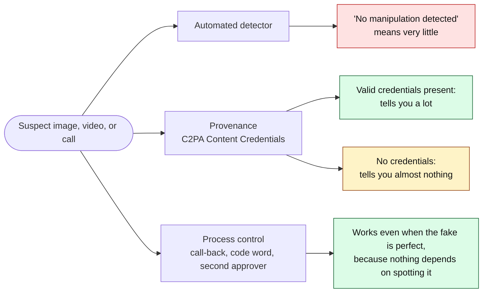
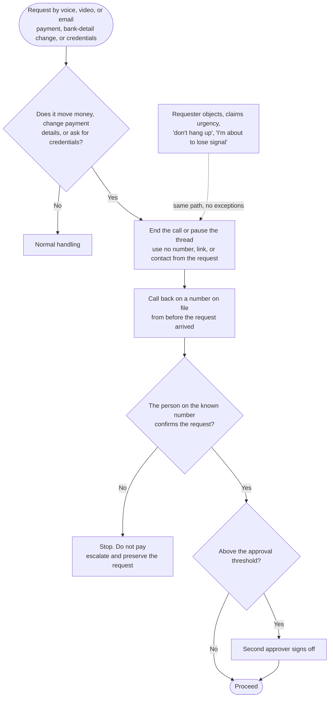

# Day 71: Deepfake voice, video, and images in fraud

Phase: 5. Fraud, scam, and social-engineering investigation · Track goal: Check a suspect image or video with free provenance and forensic tools, record what each check can and cannot establish, and write a verification procedure that still works when the fake is good enough to fool you.

## Concept
Synthetic media shows up in fraud in a few repeatable ways. A cloned voice calls a parent or grandparent claiming to be a relative in trouble. A face-swapped "executive" joins a video call and approves a payment. A deepfake celebrity endorses an investment platform in a social media ad. A fake applicant interviews for a remote job to get network access. A fabricated ID photo passes an onboarding check at a bank. IC3's 2025 report received more than 22,000 complaints mentioning AI, with adjusted losses over $893 million. It describes AI-assisted distress scams using voice cloning (more than $5 million reported), and job interviews where lip movement does not match the audio and a cough or sneeze is heard without being seen. In early 2024, Hong Kong police described a case in which a finance employee transferred about US$25 million after a video conference in which, according to police, every other participant was a deepfake of a real colleague.

Automated deepfake detectors exist, but they lose ground every time the generators improve, and a "no manipulation detected" result means very little. Two other approaches hold up better.

Provenance asks where the file came from. Content Credentials (the C2PA standard) attach signed information about how a file was created and edited. When credentials are present and valid, they tell you a lot. When they are absent, they tell you almost nothing, since most cameras and platforms still strip or never add them.

Process controls do not depend on spotting the fake at all. The FBI's December 2024 public service announcement recommends a secret word or phrase agreed with family, and hanging up and calling back on a number you already know. FinCEN's November 2024 alert (FIN-2024-Alert004) tells banks to watch for customers who avoid live verification by citing "technical issues" or who appear to use software that presents pre-recorded video. For a payment request, a call-back to a number already on file defeats a perfect voice clone.

The three approaches, and what each kind of result is worth:

### Red-flag checklist
1. An urgent request for money or credentials arriving by voice or video, from someone who usually uses another channel.
2. The caller resists a call-back ("I'm about to lose signal", "don't hang up").
3. The video participant avoids unplanned movement: will not turn fully sideways, pass a hand in front of their face, or stand up.
4. Lip movement drifts from the audio; sounds (coughs, laughs) do not match what is on screen.
5. Visual imperfections the FBI PSA lists: distorted hands or feet, unrealistic teeth or eyes, indistinct or irregular faces, unrealistic glasses or jewelry, inaccurate shadows, lag, and unrealistic movement.
6. Audio that is flat, oddly clean, or lacks breathing and room sound.
7. On the platform side: an ID photo inconsistent with the rest of the application, or repeated "camera errors" during a liveness check.
8. An endorsement video from a public figure promoting a specific investment platform or giveaway.

## Resources
- [FBI IC3 PSA: Criminals use generative AI to facilitate financial fraud (Dec 2024)](https://www.ic3.gov/PSA/2024/PSA241203): examples by media type and the protective steps quoted above.
- [FinCEN Alert FIN-2024-Alert004 on deepfake media (PDF)](https://www.fincen.gov/sites/default/files/shared/FinCEN-Alert-DeepFakes-Alert508FINAL.pdf): red flags from bank onboarding and account activity.
- [FBI IC3 2025 Internet Crime Report (PDF)](https://www.ic3.gov/AnnualReport/Reports/2025_IC3Report.pdf): the "How AI could be used in frauds/scams" section.
- [Content Credentials Verify](https://contentcredentials.org/verify): upload an image or video to read any C2PA credentials it carries.
- [InVID-WeVerify verification plugin](https://www.invid-project.eu/tools-and-services/invid-verification-plugin/): free browser extension for journalists. It extracts keyframes from a video for reverse search, magnifies frames, reads metadata, and links to forensic filters.
- [ExifTool](https://exiftool.org/): reads file metadata from the command line.
- Published fact-checks with worked explanations: [AFP Fact Check](https://factcheck.afp.com/) and [Reuters Fact Check](https://www.reuters.com/fact-check/). Search either for "AI-generated" or "deepfake".

## Practical: InVID-WeVerify and Content Credentials, a media verification log and a call-back procedure

### Part 1: verify three published items
Choose three images or videos that AFP or Reuters has already fact-checked as AI-generated or manipulated, preferably ones used in scams (fake celebrity investment ads are common). Working from debunked items means you can compare your findings with a known answer. Do not use media of private individuals, and do not use intimate or sexual imagery of anyone, real or synthetic.

For each item, record the following in a log:

1. Source and date: where the fact-check found it and the fact-check URL.
2. Provenance: result from Content Credentials Verify. Write "no credentials" if none, and do not treat that as evidence either way.
3. Metadata: run `exiftool <file>` on your downloaded copy. Note the creation software, dates, and whether metadata was stripped (common after social media upload).
4. Reverse search: for images, TinEye and Google Lens; for video, extract keyframes with InVID-WeVerify and reverse-search those. Record the earliest version you can find and whether it differs from the circulating one.
5. Visual inspection: use the plugin's magnifier on hands, teeth, ears, jewelry, text in the background, and the edge of the face. Record each artifact with a timestamp or crop reference.
6. Your conclusion, the fact-check's conclusion, and where they differ.

Worked example row (fictional item, for format only):

| Check | Result |
|---|---|
| Item | 38-second video, "finance minister" recommending `quantum-yield.example` |
| Provenance | No credentials |
| Metadata | Stripped; re-encoded by the platform |
| Reverse search | Keyframe 3 matches a 2023 televised interview with the same background and different audio |
| Visual | Lip sync drifts from 0:12; teeth blur on "guaranteed"; no blink between 0:05 and 0:19 |
| Conclusion | Original footage with synthetic audio and lip re-animation. Strongest evidence: keyframe match to an unrelated original. Visual artifacts are supporting only |

### Part 2: a call-back procedure
Write a one-page procedure for a small business's finance team covering any payment or bank-detail change requested by voice, video, or email. It must specify the trigger (what kind of request invokes it), the call-back rule (to a number already on file before the request arrived, never one supplied in the request), who else must approve and above what amount, and what to do if the requester objects or claims urgency. Add a short section for staff on a family code word, using the FBI PSA's wording.

A skeleton to build from. Your procedure fills in the amounts, the names of the approvers, and where the on-file numbers are kept. Notice that no step asks anyone to judge whether the voice or face was real.

### The artifact
A verification log covering three published items, six checks each, and the one-page call-back procedure.

## Checkpoint
For each item, identify which single check carried the most weight in your conclusion. It should almost never be a detector score or "it looked fake". It should be something like a reverse-search match, a provenance record, or a contradiction with a verifiable original. Test your procedure against the Hong Kong case: at which step would it have stopped the transfer, given that the video call itself was convincing? If the answer depends on someone noticing the deepfake, rewrite the procedure so that it does not.
