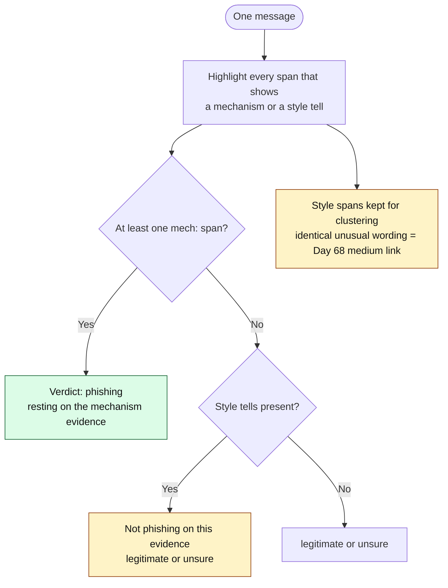
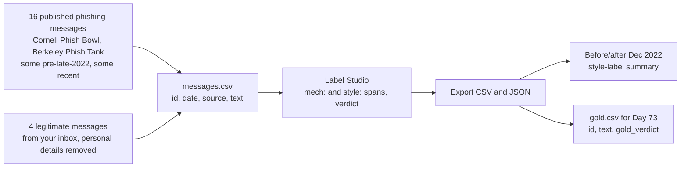

# Day 72: AI-written phishing and scam text

Phase: 5. Fraud, scam, and social-engineering investigation · Track goal: Annotate a set of real, published phishing messages for both fraud mechanisms and machine-writing tells, and learn which of the two kinds of label can carry a finding.

## Concept
For years the standard phishing advice was "look for spelling mistakes and bad grammar". Large language models removed most of those errors at no cost to the sender. The IC3 2025 report describes chat generators producing "official-sounding" executive emails for BEC, and investment scammers using AI to generate thousands of conversations that each read differently. Grammar is no longer a useful filter, and a well-written message is no evidence of a legitimate sender.

Machine-written text is sometimes recognizable, but that matters less than it seems. OpenAI withdrew its own AI-text classifier in July 2023, six months after launch. By OpenAI's own figures, it identified only 26% of AI-written text correctly and mislabeled 9% of human text as AI-written. Other published research has found that some detectors flag non-native English writing as AI-generated more often. Legitimate companies also use AI to write email. So "this looks AI-written" never answers the question an investigator is asked, which is whether the message is fraudulent.

Style tells still earn a place in the investigation in three ways:

1. Persona mismatch. A "deployed soldier" or a "retired widow" who writes in polished corporate paragraphs with bolded headings is worth a note. So is a sudden change of voice partway through a conversation, which can mean a new operator or a switch to a model.
2. Template clustering. The same unusual phrasing across many messages supports the medium-strength "identical wording" link from Day 68, whether a person or a model wrote it.
3. Leftovers. Unedited chatbot residue ("Certainly! Here is a revised version of the email:", "As an AI language model, I can't...") pasted into a scam message shows the sender used a model and did not read the output. News reports in 2024 found online product listings titled with chatbot refusal messages.

The tells to look for come from Wikipedia's "Signs of AI writing" page, maintained by editors who remove machine-generated text from the encyclopedia. The same catalog is what "humanizer" editing tools use to strip those tells out of AI drafts, so a careful sender can remove them too, and their absence tells you nothing. The groups that show up most in scam text:

| Tell group | How it looks in a scam message |
|---|---|
| Inflated significance | "This is a pivotal opportunity that could transform your financial future" |
| Sales language | "an exclusive, world-class investment platform renowned for its innovative approach" |
| Forced triads | "secure, seamless, and rewarding"; three benefits per paragraph, every paragraph |
| Bold labels and emoji headings | `**Next Steps:**` or `✅ Guaranteed returns` in what claims to be a personal message |
| Staged openers | "Let's dive into how you can start earning today" |
| Chatbot residue | "I hope this helps!", "Feel free to let me know", "Here is a...", refusal text |
| Uniform em dashes and curly quotes | Typographic punctuation in text supposedly typed on a phone |

Every one of these can appear in human writing. Treat them as weak signals that need company, never as a mechanism.

The two kinds of label go to different places. Mechanism labels decide the verdict. Style labels never do; at most they help cluster messages that may share an author or a template.



## Resources
- [Wikipedia: Signs of AI writing](https://en.wikipedia.org/wiki/Wikipedia:Signs_of_AI_writing): the catalog of tells, with examples, from WikiProject AI Cleanup.
- [FBI IC3 2025 Internet Crime Report (PDF)](https://www.ic3.gov/AnnualReport/Reports/2025_IC3Report.pdf): "How AI could be used in frauds/scams".
- [OpenAI: New AI classifier for indicating AI-written text](https://openai.com/index/new-ai-classifier-for-indicating-ai-written-text/): the announcement, with the July 2023 note that the classifier was withdrawn for low accuracy.
- [Cornell IT Phish Bowl](https://it.cornell.edu/phish-bowl) and [UC Berkeley Phish Tank](https://security.berkeley.edu/resources/phish-tank): sanitized phishing emails published by university security offices, going back years. Do not interact with any address or link in them.
- [Label Studio](https://labelstud.io/): free, open-source data labeling tool. Install with `pip install label-studio` and start with `label-studio start`.

## Practical: Label Studio, a labeled set of 20 published phishing messages

This set becomes the test data for Day 73, so label carefully.



### Collect
Copy the text of 20 messages: 16 from the Cornell and Berkeley archives (take some from before late 2022 and some from the last two years, and record the date of each) and 4 legitimate messages from your own inbox with personal details removed (a shipping notice, a password-reset email you requested, a newsletter, a real job-board alert). Save them as a CSV with columns `id`, `date`, `source`, `text`. Do not generate phishing text with a chatbot to fill the set. You need real messages for the test to mean anything, and producing ready-to-send scam text is not a skill this roadmap teaches.

### Set up the labeling project
In Label Studio, create a project, import the CSV, and use this labeling configuration:

```xml
<View>
  <Text name="text" value="$text"/>
  <Labels name="span" toName="text">
    <Label value="mech:credential_request"/>
    <Label value="mech:payment_request"/>
    <Label value="mech:urgency_deadline"/>
    <Label value="mech:link_or_attachment"/>
    <Label value="mech:impersonated_sender"/>
    <Label value="mech:off_platform_move"/>
    <Label value="style:inflated_or_sales"/>
    <Label value="style:triad"/>
    <Label value="style:bold_or_emoji_heading"/>
    <Label value="style:chatbot_residue"/>
    <Label value="style:generic_greeting"/>
  </Labels>
  <Choices name="verdict" toName="text" choice="single">
    <Choice value="phishing"/>
    <Choice value="legitimate"/>
    <Choice value="unsure"/>
  </Choices>
</View>
```

### Label
For each message, highlight the exact span that shows each mechanism or tell, and choose a verdict. Your verdict must rest on `mech:` labels. If a message has style tells but no mechanism, it is not phishing on that evidence alone.

Worked example (fictional):

> Dear Valued Employee, We are excited to inform you about a pivotal update to our payroll platform that will transform how you receive payments, making it faster, safer, and more rewarding. To avoid any interruption, please re-verify your direct deposit details within 24 hours here: [link]. I hope this helps!

Labels: `style:generic_greeting` on "Dear Valued Employee"; `style:inflated_or_sales` on "pivotal update ... will transform"; `style:triad` on "faster, safer, and more rewarding"; `mech:urgency_deadline` on "within 24 hours"; `mech:credential_request` and `mech:link_or_attachment` on "re-verify your direct deposit details ... here: [link]"; `style:chatbot_residue` on "I hope this helps!". Verdict: phishing, on the strength of the mechanism labels. The style labels suggest machine drafting and would support clustering this message with others.

### Export
Export the annotations as CSV and JSON. Then make a small summary table: for messages dated before December 2022 vs. after, count how many carry at least one `style:` label. Write two sentences on what changed, if anything, and one sentence on why the answer cannot tell you which messages were AI-written.

Finally, count the `style:` labels on each of your four legitimate messages and record the counts next to the summary table. If a legitimate newsletter scores as many style tells as a phishing email, you have seen first-hand why these tells cannot decide a case alone.

### The artifact
The Label Studio project export (CSV and JSON) with 20 labeled messages, every verdict backed by at least one `mech:` span or explicitly marked legitimate or unsure, plus the before/after summary table and your three sentences.

## Checkpoint
- Filter your export for messages labeled phishing: every one has at least one `mech:` span.
- Any message whose phishing verdict rested only on `style:` labels has been changed to unsure.
- Each verdict changed to unsure has a written reason.
- The `style:` label count for each of your four legitimate messages is recorded next to the summary table.
- Without notes, can you explain why style tells cannot decide a case alone?
