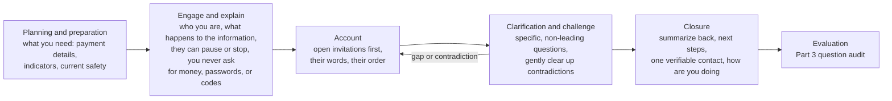
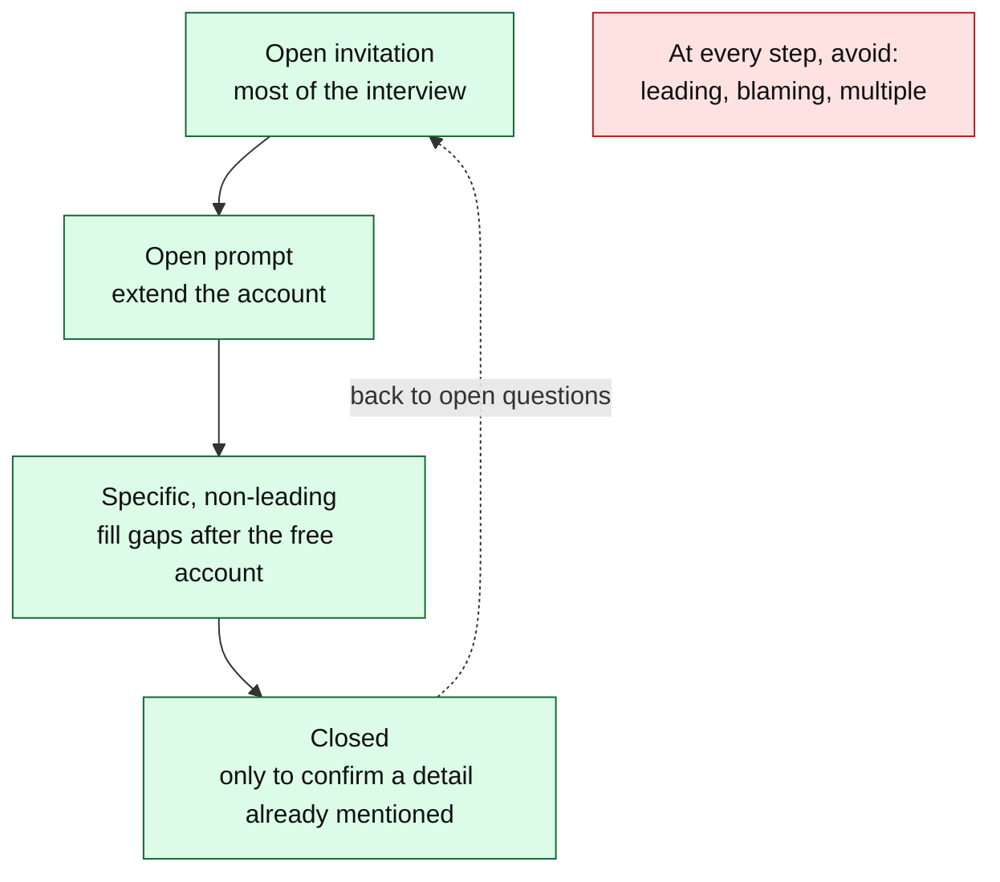

# Day 74: Interviewing fraud victims without re-harming them

Phase: 5. Fraud, scam, and social-engineering investigation · Track goal: Plan and run a practice interview with an adult fraud victim (played by a partner, using a fictional scenario) that gets an accurate account without blame, leading questions, or promises you cannot keep.

## Concept
Most of what you learn about a fraud comes from the person it happened to, and that person is often ashamed, angry at themselves, worried about their family finding out, and afraid of losing more. The way you ask shapes what you hear. A victim who feels judged leaves out the embarrassing parts, and the embarrassing parts (the second payment, the loan taken out, the secret kept from a spouse) are often where the evidence is.

Two frameworks give you a structure.

The PEACE model, used for investigative interviewing in England and Wales and taught by the College of Policing, has five phases: Planning and preparation, Engage and explain, Account (with clarification and challenge), Closure, and Evaluation. For a victim, "challenge" means gently clearing up contradictions, which often come from stress and not from dishonesty.

The phases mapped to this day's practice interview. The loop between Account and clarification is normal: you go back to open questions whenever a gap or contradiction turns up.

The U.S. Substance Abuse and Mental Health Services Administration (SAMHSA) sets out six principles of a trauma-informed approach: safety; trustworthiness and transparency; peer support; collaboration and mutuality; empowerment, voice, and choice; and cultural, historical, and gender issues. In an interview, these become concrete habits: explain what you will do with the information, let the person choose where to start and when to pause, and do not decide for them what they meant.

The International Association of Chiefs of Police (IACP) guide to trauma-informed victim interviewing was written for sexual assault investigations, but its advice on question wording applies to any victim. It recommends reframing questions that start with "why", directives like "explain to me...", and demands for a strict chronological account. Stress affects how memory is stored, so a victim pushed for exact order and timing may produce a confident estimate that later looks like a lie.

Fraud adds a risk of its own. Victims are often targeted again by "recovery" scammers posing as investigators, lawyers, or agencies (FinCEN's 2026 scam-center alert describes this). A legitimate interviewer must look and act nothing like one: never ask for money, fees, account passwords, one-time codes, or remote access to a device, and give the person a way to verify you through an official number they look up themselves.

### Question types
| Type | Example | Use |
|---|---|---|
| Open invitation | "Where would you like to start?" / "Tell me about how you first came into contact with them." | Most of the interview |
| Open prompt | "What happened after that?" / "What are you able to tell me about the platform?" | To extend the account |
| Specific, non-leading | "What name did the person use?" / "How did you send the first payment?" | To fill gaps after the free account |
| Closed | "Was it by bank transfer?" | Only to confirm a detail already mentioned |
| Leading (avoid) | "He asked you to keep it secret, didn't he?" | Plants details; the answer is worthless as evidence |
| Blaming (avoid) | "Why didn't you check the website first?" / "Didn't you think it was too good to be true?" | Shuts the person down |
| Multiple (avoid) | "When did you pay, how much, and who to?" | Gets one partial answer |

The usable types form a ladder. Start at the top and step down only as far as you need to fill a gap, then climb back up.

### Language checklist
1. Use the person's own words for what happened. If they say "I got scammed", do not correct them to "you were defrauded".
2. Say "the scammer" or "the person using the name Marcus", never "your boyfriend".
3. Avoid "pig butchering"; use "relationship-investment scam". INTERPOL asked for the older term to be dropped because it demeans victims.
4. Do not promise money back. Say what really happens next (a report, a referral, a bank recall request) and who decides.
5. Avoid "you should have", "why didn't you", "obviously", and "everyone knows".
6. Ask "Is anyone still contacting you about this?" and "Has anyone threatened you or asked for more money?" Ongoing contact changes what the person needs first.

This day covers adults. Interviewing children is a specialist forensic skill with its own protocols and legal requirements; if a child discloses harm, listen, do not question further, and follow the Day 70 routing card.

## Resources
- [College of Policing: Investigative interviewing (APP)](https://www.college.police.uk/app/investigation/investigative-interviewing/investigative-interviewing): the PEACE framework as taught to UK police.
- [SAMHSA's concept of trauma and guidance for a trauma-informed approach](https://library.samhsa.gov/product/samhsas-concept-trauma-and-guidance-trauma-informed-approach/sma14-4884): source of the six principles.
- [IACP: Successful trauma-informed victim interviewing (PDF)](https://www.theiacp.org/sites/default/files/2020-06/Final%20Design%20Successful%20Trauma%20Informed%20Victim%20Interviewing.pdf): a table of questions to avoid with reframed alternatives and the reason for each.
- [FinCEN Alert FIN-2026-Alert005 (PDF)](https://www.fincen.gov/system/files/2026-08/FinCEN-Alert-Scam-Centers.pdf): recovery scams targeting prior victims.
- [OpenAI Whisper](https://github.com/openai/whisper): open-source speech-to-text that runs locally. `pip install -U openai-whisper` (needs `ffmpeg`), then `whisper roleplay.m4a --model small --language en`.

## Practical: Whisper, a practice interview transcript with a question audit

### Part 1: rewrite 15 bad questions
Rewrite each of these into a question that gets the same information without blame or leading. Keep the originals and your rewrites side by side.

1. Why did you send money to someone you'd never met?
2. Start from the beginning and tell me exactly what happened, in order.
3. He told you the returns were guaranteed, right?
4. Didn't your bank warn you?
5. How much did you lose in total?
6. Why didn't you report this sooner?
7. You realize this was a scam, don't you?
8. Did you really believe a stranger would make you rich?
9. What time exactly did the first call happen?
10. Why did you download the app they sent?
11. So you gave them your password?
12. Did you tell your husband?
13. When did you pay, how much, and to which account?
14. You weren't suspicious at all?
15. Why did you keep paying after the first withdrawal failed?

Worked example: number 1 becomes "What was going on for you around the time you sent the first payment?" or "Can you tell me about the first time money came up?" Number 5 is not blaming but is hard to answer from memory under stress; a better version is "Could we go through the payments one at a time? Any records you have will help, and it's fine if you're not sure of some."

### Part 2: the practice interview
Work with a partner who agrees to play the victim. Give them the fictional case below and let them add details as they like. Do not use a real person's real experience, including your partner's own, for this exercise.

> Fictional scenario for the role-player: You are 58. Eight months ago a friendly stranger started chatting with you after a "wrong number" text. Over time they introduced you to a gold-trading app. You deposited $19,000 across five payments, some from savings and one from a personal loan your partner does not know about. When you tried to withdraw, the app asked for a 15% "tax". Last week someone claiming to be a "blockchain recovery firm" called offering to get your money back for a fee. You feel foolish and are worried about your partner finding out.

1. Plan (PEACE: Planning and preparation). Write a one-page plan: what you need to learn (payment details for a bank recall, indicators for the graph, current safety), your opening explanation, and what you will not ask until later.
2. Record the interview with your partner's explicit consent, for 15 to 20 minutes. Use the Engage and explain phase to state who you are, why you are asking, what happens to the information, that they can pause or stop, and that you will never ask for money or passwords.
3. Close properly: summarize back what you heard, give next steps and one verifiable contact route, and ask how they are doing.
4. Transcribe the recording locally with Whisper. Delete the audio file when the audit is done, and tell your partner you have.
5. Ask your partner one question afterward: "Was there a moment you felt judged?" Record the answer as it was given.

### Part 3: the question audit
Go through the transcript and tag every question you asked as open invitation, open prompt, specific, closed, leading, blaming, or multiple. Count each type. Mark the places where your partner gave the most useful detail and note which question came just before. If you find any leading or blaming question, find the moment you slipped and write the question you should have asked.

### The artifact
The 15-question rewrite table, the interview plan, the transcript with every question tagged, and a count table of question types with two or three sentences on what you would change.

## Checkpoint
- In your transcript, at least half of your questions before the Closure phase are open invitations or open prompts.
- Your transcript has no leading questions.
- Your transcript has no blaming questions.
- If either of the two items above fails, every leading or blaming question has the question you should have asked written next to it.
- Your Engage and explain phase told the person that you will never ask for money, fees, passwords, or codes. The recovery-scam call in the scenario is the reason.
- Your partner's answer to "Was there a moment you felt judged?" is recorded as it was given.
