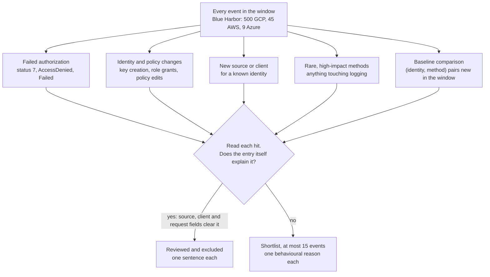
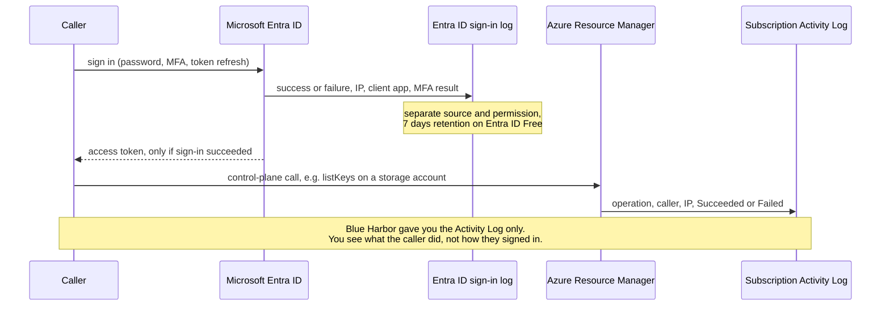

# Day 78: Filtering cloud logs to the signal, plus Azure

Phase: 6. Cloud and AI-system investigation. Track goal: Write filters that cut hundreds of routine Blue Harbor events down to the short list that matters, measure how much each filter removed, and read the Azure control plane with the same questions.

## Concept

Yesterday you knew the suspect address before you started, so a single pivot produced the timeline. Most investigations start with less: a budget alert, a customer complaint, a vague "something changed in the account". You then face every event the account produced, and a real account produces tens of thousands a day, almost all of them automation. Reading them in order does not work. You filter first and read second, and the filters worth writing describe what an attacker does.

Four filters earn their place in almost every cloud investigation.

Failed authorization. In GCP a refused call carries `protoPayload.status.code` 7 (`PERMISSION_DENIED`); in CloudTrail it carries an `errorCode` such as `AccessDenied`; in the Azure Activity Log the status is `Failed`. Automation that works does not fail repeatedly, so a burst of denials from one identity usually means someone is probing what they can reach.

Identity and policy changes. Service account key creation, access key creation, role grants and policy edits are how a foothold becomes persistence. They are rare in a healthy account, which makes them cheap to review one by one.

A new source or client for a known identity. An identity that has always called from one address with a browser, and suddenly calls from a new address with a scripting library at 01:47 on a Saturday, deserves a look even if every call succeeded.

Rare, high-impact methods, and anything that touches logging. Deleting a log sink, stopping a trail or changing a bucket policy each change what the account can see or who can read its data. Tampering with the audit trail is a classic anti-forensic move, so even a failed `DeleteSink` or `StopLogging` is loud.

A fifth technique turns these into a baseline comparison: list every (identity, method) pair seen before the window, then show only the pairs that are new inside it. It needs no knowledge of which methods are dangerous, which makes it a good second opinion on your hand-picked filters.

Together the filters work as a funnel. Each one runs over the whole haystack independently, a hit from any of them gets read by a person, and reading is where an entry is either cleared on its own evidence or kept.



Azure asks the same questions through different logs. Control-plane operations (creating resources, assigning roles, listing storage keys) go to the subscription's Activity Log. Sign-ins, including failed ones, go to the Microsoft Entra ID sign-in log, which is a separate source with separate permissions and retention. A failed sign-in never appears in the Activity Log, so write down which of the two you actually had.



## Resources

- [GCP Logging query language](https://cloud.google.com/logging/docs/view/logging-query-language): comparison operators, `AND`/`OR`, substring `:` versus exact `=`.
- [gRPC status codes](https://grpc.io/docs/guides/status-codes/): what the numeric `status.code` values mean.
- [CloudTrail record contents](https://docs.aws.amazon.com/awscloudtrail/latest/userguide/cloudtrail-event-reference-record-contents.html): `errorCode`, `readOnly`, `userIdentity` and the rest.
- [`az monitor activity-log list`](https://learn.microsoft.com/en-us/cli/azure/monitor/activity-log): Azure control-plane events from the CLI.
- Free tier: Azure offers a free account with a spending credit, and your own resource changes populate its Activity Log with no extra setup.

## Practical: jq filters over the Blue Harbor logs, a "suspicious events only" shortlist

Artifact: `~/lab-p6/notes/day-78-shortlist.md`, at most fifteen events across the three clouds, each with a one-line reason it made the cut, and a table of the filters you ran with before and after counts.

Pretend for this exercise that you do not know yesterday's answer: you have the budget alert and the logs, nothing else. Work from your verified copy.

```bash
cd ~/lab-p6/work && C=resources/case-blueharbor
(cd resources && shasum -a 256 -c ~/lab-p6/notes/receipt.sha256) | grep -v ': OK$'   # prints nothing if intact
```

### 1. Measure the haystack

```bash
jq -s 'add | length' $C/gcp/audit-activity.json $C/gcp/audit-data-access.json
jq '.Events | length' $C/aws/cloudtrail-lookup-events.json
jq length $C/azure/activity-log.json
```

500 GCP audit entries, 45 AWS management events and 9 Azure events over three days. Start your filter table with those three numbers.

### 2. Denied calls

The live GCP query for everything one identity tried and was refused:

```
gcloud logging read \
  'logName:"cloudaudit.googleapis.com" AND
   protoPayload.authenticationInfo.principalEmail="suspect@example.com" AND
   protoPayload.status.code!=0' \
  --project=YOUR_PROJECT --freshness=7d --order=asc \
  --format='table(timestamp,
     protoPayload.methodName,
     protoPayload.status.code,
     protoPayload.status.message,
     protoPayload.resourceName)'
```

Offline, drop the identity condition so the filter finds the suspect for you:

```bash
jq -s -r 'add | sort_by(.timestamp) | .[] | select((.protoPayload.status.code // 0) != 0)
  | [.timestamp[0:19], .protoPayload.authenticationInfo.principalEmail,
     .protoPayload.methodName, .protoPayload.requestMetadata.callerIp] | @tsv' \
  $C/gcp/audit-activity.json $C/gcp/audit-data-access.json
```

Seven entries. Six are `sam.reyes@vendor-example.com` between 01:47:03 and 01:51:02, one each against Cloud Storage, Compute Engine, Cloud KMS, the project IAM policy, the service account list and the IAM policy of one service account. The seventh is `reporting-sa` failing to delete the log sink `audit-to-bq` at 03:06:15. Six refusals across five services in four minutes looks like a person mapping the account; a misconfigured app retrying fails the same call over and over.

### 3. Identity, policy and logging changes

The live query for the high-impact method names, any identity:

```
gcloud logging read \
  'logName:"cloudaudit.googleapis.com" AND
   (protoPayload.methodName:"SetIamPolicy" OR
    protoPayload.methodName:"CreateServiceAccountKey" OR
    protoPayload.methodName:"sinks.delete" OR
    protoPayload.methodName:"CreateServiceAccount")' \
  --project=YOUR_PROJECT --freshness=7d --order=asc \
  --format='table(timestamp,
     protoPayload.authenticationInfo.principalEmail,
     protoPayload.methodName,
     protoPayload.resourceName)'
```

Before you trust a method-name filter, check the exact method names in your own logs. In this case the sink deletion is logged as `google.logging.v2.ConfigServiceV2.DeleteSink`, so match on what the file actually contains:

```bash
jq -s -r 'add | sort_by(.timestamp) | .[]
  | select(.protoPayload.methodName | test("SetIamPolicy|CreateServiceAccountKey|DeleteSink|setMetadata|instances\\.(start|stop)$"))
  | [.timestamp[0:19], .protoPayload.authenticationInfo.principalEmail,
     .protoPayload.methodName, .protoPayload.requestMetadata.callerIp] | @tsv' \
  $C/gcp/audit-activity.json $C/gcp/audit-data-access.json
```

Thirteen entries, and this filter needs judgement. Dana Okafor's `SetIamPolicy` at 15:42 on 10 September came from the office address with a browser and added `lee.chen` to `roles/bigquery.dataViewer`; read the `request` field and you can clear it. The six start and stop calls by `scheduler-sa` at 00:28 and 01:12 each night are the report job. What remains is the key creation at 01:58:31 and five calls by `reporting-sa` from 198.51.100.23, including a second start of the report VM at 02:03, long after the scheduler had stopped it.

### 4. New source or client per identity

```bash
jq -s -r 'add | .[] | [.protoPayload.authenticationInfo.principalEmail,
     .protoPayload.requestMetadata.callerIp,
     (.protoPayload.requestMetadata.callerSuppliedUserAgent | split(" ")[0])] | @tsv' \
  $C/gcp/audit-activity.json $C/gcp/audit-data-access.json | sort | uniq -c
```

Nine lines summarise 500 events. Two of them should stop you: `sam.reyes@vendor-example.com` appears from 192.0.2.44 with a browser (22 events) and from 198.51.100.23 with `google-api-python-client` (8 events), and `reporting-sa` appears only from 198.51.100.23. A service account that normally runs on a VM inside the project has no reason to call the API from an outside address.

### 5. New (identity, method) pairs

```bash
jq -s -r 'add | sort_by(.timestamp)
  | (map(select(.timestamp < "2026-09-12")
       | .protoPayload.authenticationInfo.principalEmail + " " + .protoPayload.methodName) | unique) as $seen
  | .[] | select(.timestamp >= "2026-09-12")
  | select((.protoPayload.authenticationInfo.principalEmail + " " + .protoPayload.methodName) as $k
           | $seen | index($k) | not)
  | [.timestamp[0:19], .protoPayload.authenticationInfo.principalEmail,
     .protoPayload.methodName, (.protoPayload.status.code // 0)] | @tsv' \
  $C/gcp/audit-activity.json $C/gcp/audit-data-access.json
```

Of the 18 GCP events on 12 September, 13 are pairs never seen on the two days before. All 13 come from 198.51.100.23. The five that drop out are the scheduler's nightly routine. With a two-day baseline this filter is crude (a quiet week would flag legitimate rare jobs), but here it agrees with filters 2 to 4 without being told what to look for.

### 6. AWS: errors and writes

```bash
jq -r '.Events[].CloudTrailEvent | fromjson | select(.readOnly == false or .errorCode != null)
  | [.eventTime, .userIdentity.arn, .eventName, (.errorCode // "ok"), .sourceIPAddress] | @tsv' \
  $C/aws/cloudtrail-lookup-events.json | sort
```

Eight of 45. Three nightly `AssumeRoleWithWebIdentity` calls from Blue Harbor's GCP NAT address (192.0.2.150) and two console logins by `dana-admin` from the office are baseline. The other three are `vendor-sam` denied on `ListBuckets`, `vendor-sam` creating an access key for `svc-reporting`, and `svc-reporting` denied on `StopLogging` for the account's only trail. The last one is an attempt to switch off the evidence you are reading.

### 7. Azure

The live query for Activity Log events in a window:

```
az monitor activity-log list \
  --start-time 2026-09-10T00:00:00Z \
  --end-time   2026-09-13T00:00:00Z \
  --query "[].{time:eventTimestamp,
              caller:caller,
              operation:operationName.value,
              resource:resourceId,
              status:status.value,
              ip:httpRequest.clientIpAddress}" \
  --output table
```

The case file is that command's JSON output, newest first. Filter it for anything that did not succeed:

```bash
jq -r '.[] | select(.status.value != "Succeeded")
  | [.eventTimestamp, .caller, .operationName.value, .status.value,
     .httpRequest.clientIpAddress] | @tsv' $C/azure/activity-log.json
```

One event: `sam.reyes@vendor-example.com` tried `Microsoft.Storage/storageAccounts/listKeys/action` on the marketing site's storage account at 02:44:10 from 198.51.100.23 and failed. Listing storage account keys is the Azure equivalent of minting a service account key, so the actor tried the same move in the third cloud and was stopped.

For sign-ins, which you do not have for this case, you would query Entra ID. The request is `GET https://graph.microsoft.com/v1.0/auditLogs/signIns`, filtered on `createdDateTime` to keep it from timing out. Per the Microsoft Graph reference (checked September 2026), it needs the `AuditLog.Read.All` permission, and for delegated access the signed-in user must also hold one of these Entra roles: Global Reader, Reports Reader, Security Reader, Security Operator, or Security Administrator. Whether the token `az rest` obtains with your own login carries `AuditLog.Read.All` depends on tenant consent; if the call returns 403, use an app registration granted that permission. Entra ID Free keeps sign-in logs for seven days (30 days on P1/P2), so on a real case this source expires first and should be exported on day one.

### 8. Write the shortlist

Pick at most fifteen events for an incident lead who has five minutes. Give each one line of reason written about behaviour ("denied, new source, scripting client", "key minted for a more powerful identity", "attempt to stop the trail"), and a filter table:

| Filter | Before | After |
|---|---|---|
| GCP denied calls | 500 | 7 |
| GCP new (identity, method) pairs on 12 Sep | 18 | 13 |
| AWS writes or errors | 45 | 8 |
| Azure non-succeeded | 9 | 1 |

Fill in the rows for filters 3 and 4 yourself. Leave out anything you cleared, and add one sentence per cleared item to a "reviewed and excluded" list below the shortlist, so a reviewer can see you looked at Dana's policy change and decided. Clear each item on evidence in the entry itself: for Dana's `SetIamPolicy`, the source address, the user agent, and the role and member in the request.

### 9. Record the missing source

Below the "reviewed and excluded" list, write that the Entra ID sign-in log was not part of the evidence, and one thing it might have shown (for example, how `sam.reyes@vendor-example.com` signed in at 02:44).

## Checkpoint

- The shortlist has at most fifteen events.
- The shortlist includes at least one event from each of GCP, AWS and Azure.
- Every shortlisted event has a one-line reason.
- Every reason describes behaviour (denied, off-hours, new source, new client, high-impact method), and none of them is only a severity label copied from the log.
- The filter table has a row for every filter you ran, including filters 3 and 4.
- Every before and after count in the table matches the count your command printed.
- You can name, from the table, the filter with the largest drop from before to after.
- The "reviewed and excluded" list has an entry for Dana's `SetIamPolicy`.
- That entry names the source address, the user agent, and the role and member in the request.
- Your notes state that the Entra ID sign-in log was not part of the evidence.
- Your notes name one thing the sign-in log might have shown.
- Without notes, you can explain why six refusals across five services in four minutes points to a person mapping the account rather than a misconfigured app.
