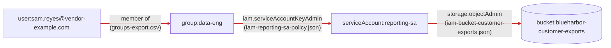
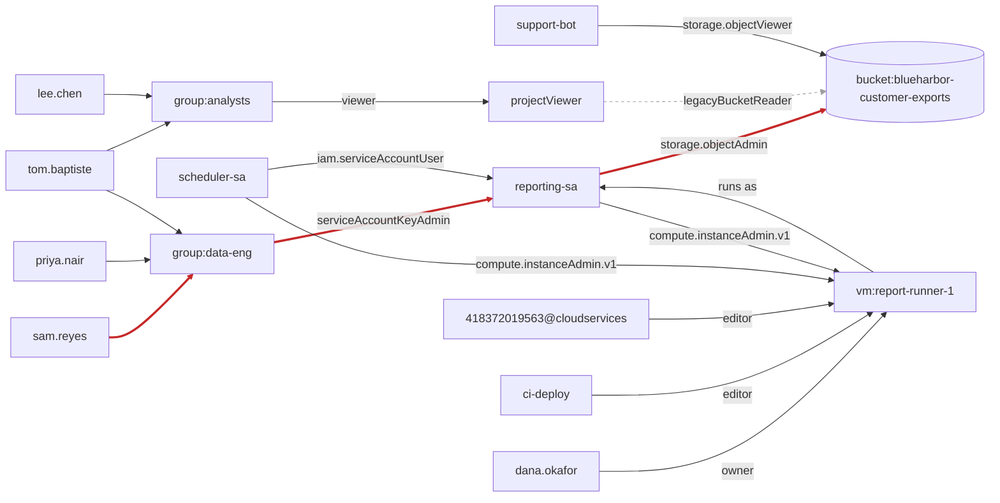
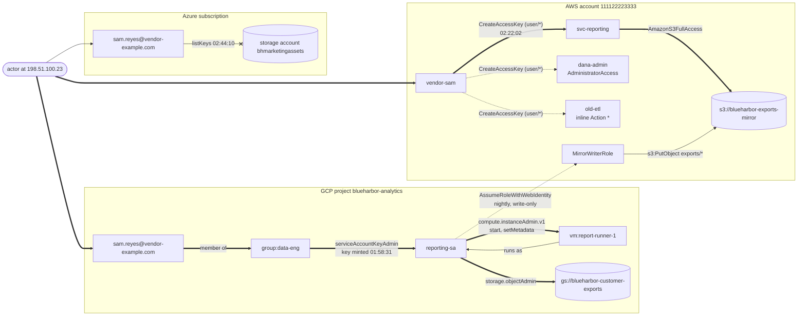

# Day 80: Building a "who can reach what" access graph

Phase: 6. Cloud and AI-system investigation. Track goal: Turn yesterday's Blue Harbor IAM inventory into a directed graph, find the path the actor used, find the worse paths they did not use, and name the one edge to cut.

## Concept

A table of IAM grants hides chains. In Blue Harbor's GCP project, no binding gives `sam.reyes@vendor-example.com` anything on the customer exports bucket. Sam is a member of `data-eng`, `data-eng` can administer keys for `reporting-sa`, and `reporting-sa` can read and write every object in the bucket. Each of those three rows looks ordinary in yesterday's CSV, and you only see the problem when you follow them in order. A table makes you hold the chain in your head; a graph draws it.



Each edge comes from a different export, and none of the three files names both Sam and the bucket.

Model IAM as a directed graph. Nodes are identities (users, groups, service accounts, AWS users and roles) and resources (buckets, VMs, projects). An edge means "can get to": is a member of, holds a role on, can mint credentials for, runs as. Once IAM is a graph, the escalation question becomes a path question: is there a route from an identity an attacker could plausibly obtain (a contractor, a low-privilege user, a leaked CI token) to a resource that matters? Attackers ask exactly this. BloodHound made the technique famous for Active Directory, and open-source tools such as Cartography and awspx build the same kind of graph for cloud accounts. You are building the defender's copy of the attacker's map.

Two cautions keep the graph honest. First, edges have different strengths. `roles/storage.legacyBucketReader` lets you list object names; `roles/storage.objectViewer` lets you read their contents. If the graph treats both as "can reach the bucket", it will report every project viewer as a data-exfiltration risk and bury the real paths. Decide which roles count as reaching the thing you care about, write that decision into the script, and check it against the roles reference. Second, the graph is only as complete as the exports behind it. Blue Harbor gave you no folder or organization policy, so any path that starts above the project is missing.

The output an investigator wants is an action. "IAM looks too permissive" gives nobody anything to do. "Remove the `serviceAccountKeyAdmin` binding for `data-eng` on `reporting-sa`" does, and a graph lets you show that this single change breaks the path the actor used.

## Resources

- [Graphviz DOT language](https://graphviz.org/doc/info/lang.html): the simplest text-to-graph format; `dot -Tpng` renders it.
- [Graphviz download page](https://graphviz.org/download/): `brew install graphviz` on macOS, `apt install graphviz` on Debian and Ubuntu.
- [Neo4j Cypher basics](https://neo4j.com/docs/getting-started/cypher/): for real path queries (`shortestPath`) on larger graphs.
- [Cartography](https://github.com/cartography-cncf/cartography) and [awspx](https://github.com/ReversecLabs/awspx): open-source tools that build cloud asset graphs; worth knowing even though today you build the graph yourself.
- [Rhino Security Labs, AWS IAM privilege escalation methods](https://rhinosecuritylabs.com/aws/aws-privilege-escalation-methods-mitigation/): the catalogue that includes creating access keys for other users.

## Practical: Python and Graphviz, a directed access graph with the escalation path highlighted

Artifact: `~/lab-p6/notes/day-80-access-graph.png` and its `.dot` source for GCP, a hand-written DOT graph for AWS, and `~/lab-p6/notes/day-80-finding.md` naming the edge to cut in each cloud and why.

```bash
cd ~/lab-p6/work && C=resources/case-blueharbor
```

### 1. Build the GCP graph from the exports

Save this as `~/lab-p6/notes/gcp_graph.py`. It reads the same four GCP files as yesterday, adds one edge per grant, and adds the few project-level edges this case needs by hand.

```python
import csv, json, sys
from collections import deque

G = "resources/case-blueharbor/gcp/"
PROJECT = "blueharbor-analytics"
REPORT_SA = "serviceAccount:reporting-sa@blueharbor-analytics.iam.gserviceaccount.com"
OUT = sys.argv[2] if len(sys.argv) > 2 else "day-80-access-graph.dot"
edges = []

# 1. group membership
for row in csv.DictReader(open(G + "groups-export.csv")):
    edges.append((f"user:{row['member']}", f"group:{row['group_email']}", "member of"))

# 2. role bindings on the project, the service account and the bucket
def bind(path, target):
    for b in json.load(open(G + path))["bindings"]:
        for m in b["members"]:
            edges.append((m, target, b["role"].removeprefix("roles/")))

bind("iam-project-policy.json", f"project:{PROJECT}")
bind("iam-reporting-sa-policy.json", REPORT_SA)
bind("iam-bucket-customer-exports.json", "bucket:blueharbor-customer-exports")

# 3. project-level grants that reach specific resources in this case
for src, dst, role in list(edges):
    if dst == f"project:{PROJECT}":
        if role in ("owner", "editor", "viewer"):
            edges.append((src, f"project{role.capitalize()}:{PROJECT}", f"is project {role}"))
        if role in ("owner", "editor", "compute.instanceAdmin.v1"):
            edges.append((src, "vm:report-runner-1", role))
edges.append(("vm:report-runner-1", REPORT_SA, "runs as"))

# Only these bucket roles read object contents (check this against the IAM roles reference).
READS = {"storage.objectAdmin", "storage.objectViewer"}
def usable(s, d, label):
    return not d.startswith("bucket:") or label in READS

def path(start, goal):
    prev, q = {start: None}, deque([start])
    while q:
        n = q.popleft()
        if n == goal:
            out = []
            while n:
                out.append(n); n = prev[n]
            return out[::-1]
        for s, d, lab in edges:
            if s == n and d not in prev and usable(s, d, lab):
                prev[d] = n; q.append(d)

def reachers(goal):
    seen, q = {goal}, deque([goal])
    while q:
        n = q.popleft()
        for s, d, lab in edges:
            if d == n and s not in seen and usable(s, d, lab):
                seen.add(s); q.append(s)
    return sorted(x for x in seen if x.startswith(("user:", "group:", "serviceAccount:")))

start = sys.argv[1] if len(sys.argv) > 1 else "user:sam.reyes@vendor-example.com"
goal = "bucket:blueharbor-customer-exports"
p = path(start, goal)
print("PATH:", " -> ".join(p) if p else "none")
print("CAN READ OBJECTS IN THE BUCKET:")
for r in reachers(goal):
    print("  ", r)

hot = set(zip(p, p[1:])) if p else set()
with open(OUT, "w") as f:
    f.write('digraph access {\n  rankdir=LR;\n  node [fontname="Helvetica"];\n')
    for s, d, label in edges:
        style = ", color=red, penwidth=2" if (s, d) in hot else ""
        if not usable(s, d, label):
            style = ", style=dashed, color=gray"
        f.write(f'  "{s}" -> "{d}" [label="{label}"{style}];\n')
    f.write("}\n")
print(f"wrote {OUT} with {len(edges)} edges")
```

Run it for Sam and write the graph into your notes folder:

```bash
python3 ~/lab-p6/notes/gcp_graph.py user:sam.reyes@vendor-example.com ~/lab-p6/notes/day-80-access-graph.dot
```

```
PATH: user:sam.reyes@vendor-example.com -> group:data-eng@blueharbor.example -> serviceAccount:reporting-sa@blueharbor-analytics.iam.gserviceaccount.com -> bucket:blueharbor-customer-exports
CAN READ OBJECTS IN THE BUCKET:
   group:data-eng@blueharbor.example
   serviceAccount:418372019563@cloudservices.gserviceaccount.com
   serviceAccount:ci-deploy@blueharbor-analytics.iam.gserviceaccount.com
   serviceAccount:reporting-sa@blueharbor-analytics.iam.gserviceaccount.com
   serviceAccount:scheduler-sa@blueharbor-analytics.iam.gserviceaccount.com
   serviceAccount:support-bot@blueharbor-analytics.iam.gserviceaccount.com
   user:dana.okafor@blueharbor.example
   user:priya.nair@blueharbor.example
   user:sam.reyes@vendor-example.com
   user:tom.baptiste@blueharbor.example
wrote /Users/you/lab-p6/notes/day-80-access-graph.dot with 36 edges
```

The shortest path is three hops, and none of them is a grant on the bucket to Sam. Ten identities can reach object contents. Some are expected (`reporting-sa` exists to write exports, and Dana owns the project). The ones to question are the three `data-eng` members, who reach the bucket only through a key-administration grant nobody uses, and `ci-deploy`, which reaches it through `roles/editor` and the VM.

The day 77 timeline shows the actor did more than the shortest path needs. After minting the key they used `reporting-sa`'s `compute.instanceAdmin.v1` role to start `report-runner-1` and add an SSH key to it, which put them on a VM running as the same service account. The graph explains how they got the identity, and day 82's flow logs show what they did with the VM. Keep both in the finding.

Rerun with `user:lee.chen@blueharbor.example`. The answer is `none`, even though Lee is a project viewer through `analysts`, because the viewer path ends in `legacyBucketReader`, which the script does not count. Change `READS` to include `storage.legacyBucketReader`, rerun, and see Lee appear. That is the size of the decision you wrote into the script.

### 2. Render and highlight

```bash
dot -Tpng ~/lab-p6/notes/day-80-access-graph.dot -o ~/lab-p6/notes/day-80-access-graph.png
```

The script already drew the three path edges red and the non-reading bucket edges dashed grey. With 36 edges the picture is busy; if you want a cleaner figure for the report, copy the `.dot` file, delete the edges that do not touch the path or the bucket, and render the copy as well. Keep the full version as the evidence.

The trimmed figure should carry roughly what the diagram below shows. The red edges are the path the actor used. Every identity that the script lists reaches the bucket through a solid edge. The grey dashed edge is `legacyBucketReader`, which lists object names without reading them, so Lee Chen, whose only route runs through `analysts`, stops there. The `legacyBucketOwner` edges from project editors and owners are left out to keep it readable; they are dashed grey in your full render for the same reason.



### 3. Draw the AWS graph by hand

The AWS side is small enough to write directly. The one expansion that needs care is `user/*`: list what it covers from the export.

```bash
jq -r '.UserDetailList[].UserName' $C/aws/iam-authorization-details.json
```

Four users, so `vendor-sam` has four `CreateAccessKey` edges, one of them to itself. Save as `~/lab-p6/notes/day-80-aws.dot`:

```
digraph aws {
  rankdir=LR;
  node [fontname="Helvetica"];
  "user:vendor-sam"    -> "user:svc-reporting" [label="iam:CreateAccessKey (user/*)", color=red, penwidth=2];
  "user:vendor-sam"    -> "user:dana-admin"    [label="iam:CreateAccessKey (user/*)"];
  "user:vendor-sam"    -> "user:old-etl"       [label="iam:CreateAccessKey (user/*)"];
  "user:svc-reporting" -> "s3:blueharbor-exports-mirror" [label="AmazonS3FullAccess", color=red, penwidth=2];
  "user:dana-admin"    -> "aws:everything"     [label="AdministratorAccess"];
  "user:old-etl"       -> "aws:everything"     [label="inline Action *"];
  "role:MirrorWriterRole" -> "s3:blueharbor-exports-mirror" [label="s3:PutObject exports/*"];
  "gcp:reporting-sa"   -> "role:MirrorWriterRole" [label="AssumeRoleWithWebIdentity"];
}
```

Two things stand out once it is drawn. The actor took `svc-reporting`, but `dana-admin` was one hop away and would have given full control of the account. The lookup-events file holds exactly one `CreateAccessKey` in the window, which is your evidence the admin path was not used; say so in the finding, because it sets the scope of the clean-up. The last edge crosses clouds: `reporting-sa` in GCP assumes an AWS role every night (the three `AssumeRoleWithWebIdentity` events at about 00:58 in the lookup-events file). The role can only write, so the actor holding `reporting-sa` could have planted or overwritten files in the mirror. Nothing in the data shows that they did.

Put the two graphs on one page and add the Azure attempt from day 78, and you have the Blue Harbor attack path across all three clouds. Thick edges were used. Dotted edges were available and, on the evidence, not used. The crossed edge was tried and refused.



### 4. Optional: the same question in Neo4j

If you load the edges into Neo4j (one `:Identity` or `:Resource` node per name, one relationship per edge), the path query is:

```
MATCH p = shortestPath(
  (a:Identity {name:"user:sam.reyes@vendor-example.com"})-[*]->(r:Resource {name:"bucket:blueharbor-customer-exports"})
)
RETURN p
```

On a graph this size the Python script is enough. On a real organization with thousands of identities, a graph database is how you keep the question answerable.

### 5. Test each candidate cut before you recommend it

A proposed fix is a claim about the graph, so test it on the graph. Copy the script, and in the copy add one line directly above the `# Only these bucket roles` comment that deletes the edge you want to cut:

```bash
cp ~/lab-p6/notes/gcp_graph.py ~/lab-p6/notes/gcp_graph_cut.py
```

Candidate A, remove `data-eng`'s key-admin binding on `reporting-sa`:

```python
edges = [e for e in edges if not (e[0] == "group:data-eng@blueharbor.example" and e[1] == REPORT_SA)]
```

Candidate B, remove Sam from `data-eng`:

```python
edges = [e for e in edges if not (e[0] == "user:sam.reyes@vendor-example.com" and e[1] == "group:data-eng@blueharbor.example")]
```

Put in one line at a time and run the copy for Sam, then for Priya:

```bash
python3 ~/lab-p6/notes/gcp_graph_cut.py user:sam.reyes@vendor-example.com /dev/null
python3 ~/lab-p6/notes/gcp_graph_cut.py user:priya.nair@blueharbor.example /dev/null | head -1
```

With candidate A, Sam's path is `none`, Priya's path is `none`, and the list of identities that can read the bucket shrinks from ten to six: the group and its three members all drop out. With candidate B, Sam's path is also `none`, but the list only shrinks to nine, and Priya still reaches the bucket along the same three hops. Both stop the actor. Only A closes the path for the next contractor added to `data-eng`. Record both results as a small table in the finding, with the reader count before and after each cut.

Do the same for AWS on paper: count the `CreateAccessKey` edges in your AWS graph that each candidate removes.

### 6. Write the finding

In `day-80-finding.md`, name one edge per cloud and defend it. For GCP, compare at least two candidates: removing Sam from `data-eng`, and removing `data-eng`'s `roles/iam.serviceAccountKeyAdmin` binding on `reporting-sa`. `service-accounts.csv` records zero user-managed keys on `reporting-sa` before 12 September, so nothing legitimate depended on that binding. For AWS, the candidates are deleting `svc-reporting` and rescoping `RotateOwnKeys` to `user/${aws:username}`. Say which change breaks the most paths, and which also closes the paths the actor did not take. Close the finding with the evidence gap: name the exports that were missing (the folder and organization policies), and say what kind of path that could hide (any path that starts above the project).

## Checkpoint

- `~/lab-p6/notes/day-80-access-graph.png` exists and opens.
- In the GCP graph, the three-edge path from Sam to the bucket is red.
- Your script, run for Sam, prints ten identities that can read objects in the bucket.
- Your rerun for `user:lee.chen@blueharbor.example` printed `PATH: none`.
- With `storage.legacyBucketReader` added to `READS`, Lee appears in the reader list.
- The AWS graph shows four `CreateAccessKey` edges from `vendor-sam`.
- The used `CreateAccessKey` edge (to `svc-reporting`) is highlighted.
- The finding has a table of the GCP candidate cuts, with the reader count before and after each (ten to six for candidate A, ten to nine for candidate B).
- The finding names one edge to cut in GCP.
- The finding names one edge to cut in AWS.
- For each cloud, the finding explains why the chosen edge beats the alternative you compared it with.
- For each cloud, the finding states which unused paths the chosen cut also closes.
- The finding names the missing exports (folder and organization policies).
- The finding says what kind of path that gap could hide.
- Without notes, you can explain in two sentences why Lee Chen does not appear in the list of identities that can read the bucket, and what change to the script would make Lee appear.
