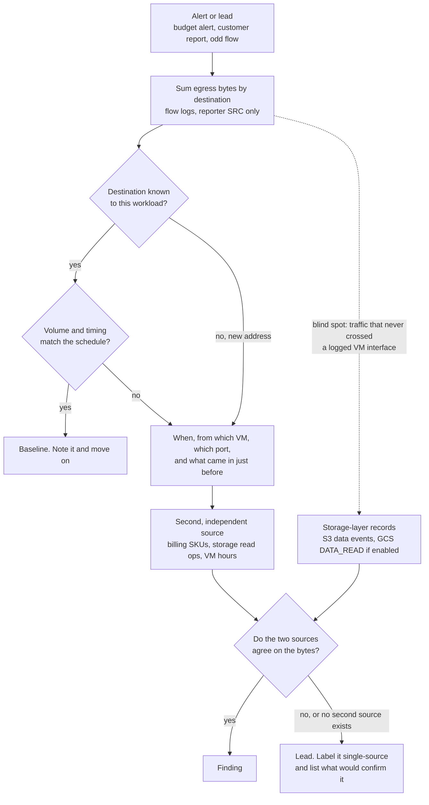
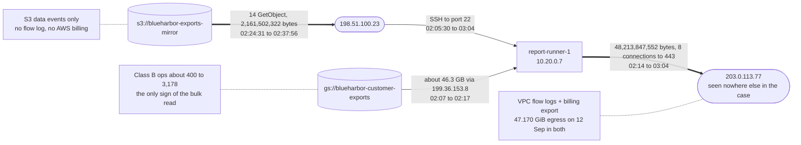
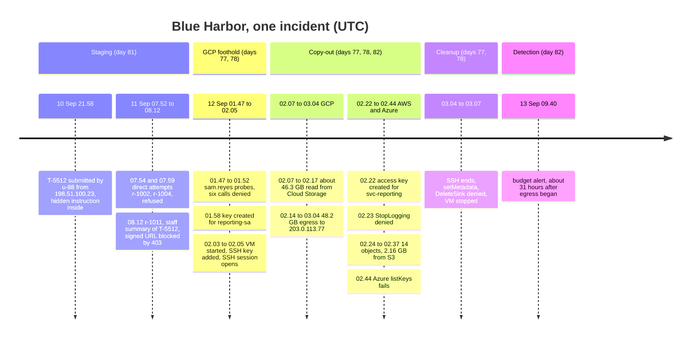

# Day 82: Data exfiltration signals, and closing the Blue Harbor case

Phase: 6. Cloud and AI-system investigation. Track goal: Confirm the Blue Harbor exfiltration from two independent sources (flow logs and billing), then merge every file from days 77 to 81 into one timeline and one incident report.

## Concept

Exfiltration turns access into loss, and it is often the noisiest step of an intrusion if you know where to listen. Data leaving a cloud account has to move bytes. Moving bytes shows up in network logs, and on most clouds moving bytes to the internet costs money, so a copy-out leaves traces in two places the attacker handles very differently. An attacker with the right permission can delete logs, but the charge for the transfer stays on the bill.

A few patterns are worth knowing cold.

Volume and direction. Egress (data leaving) that jumps while ingress stays flat is the shape of a copy-out. GCP and AWS VPC Flow Logs record bytes per connection and which side reported them. At the storage layer the same signal appears as a jump in object reads.

Destination. Egress to an address the workload has never talked to, to a region you do not operate in, or to storage in someone else's account. Exfiltration to attacker-controlled cloud storage often looks like an ordinary cloud-to-cloud transfer, so the destination's history in your own logs usually tells you more than the protocol does.

Timing. Transfers outside the workload's normal schedule, or a steady trickle sized to stay under a daily alert threshold. Both take planning, so both are worth recording as evidence of intent.

Billing and usage. A jump in network egress cost, in storage read operations, or in VM hours is exfiltration showing up on the invoice. Billing data arrives hours after the event, but the attacker does not control it, which makes it the best corroboration you can get for a flow-log finding. It only helps if the billing export was switched on before the incident: it cannot be backfilled.

Each source has blind spots. Flow logs cover only the subnets where they were enabled, and only traffic that crossed a VM's network interface; a download straight from Cloud Storage to the internet never touches a VPC. Billing is daily and aggregated. A claim resting on one of them is a lead. When two independent sources agree on the same bytes, you can call it a finding.

The investigation runs in the same order every time. Start from whatever raised the alarm, find the outlier destination, pin down when and from where, then look for a second source the attacker could not touch.



Blue Harbor's budget alert fired at 09:40 UTC on Sunday 13 September. Today you prove what it was alerting on, and then you write the case up.

## Resources

- [GCP VPC Flow Logs](https://cloud.google.com/vpc/docs/flow-logs): record fields, including `bytes_sent`, `reporter` and connection details.
- [AWS VPC Flow Logs](https://docs.aws.amazon.com/vpc/latest/userguide/flow-logs.html): `bytes`, `srcaddr`, `dstaddr`, `action`.
- [GCP billing export to BigQuery](https://cloud.google.com/billing/docs/how-to/export-data-bigquery): how to query cost by SKU and day, which is where egress spikes surface.
- [NIST SP 800-61 Rev. 3, Incident Response Recommendations and Considerations for Cybersecurity Risk Management](https://csrc.nist.gov/pubs/sp/800/61/r3/final): for the structure of the report you write today.
- Free tier: the whole exercise runs on the synthetic files. Nothing here needs a live account, and nothing here should be pointed at one you do not own.

## Practical part 1: jq and awk, the exfiltration evidence

Artifact: a section of the day 82 report headed "Exfiltration", with the destination, byte count, time window and the billing rows that corroborate it.

```bash
cd ~/lab-p6/work && C=resources/case-blueharbor
```

### 1. Egress by destination

When flow logs are exported to a queryable sink, egress by destination over a window is the query that matters. In GCP, reading flow logs straight from Cloud Logging and summing `bytes_sent` by destination IP surfaces the outlier (on a large project, route the logs to BigQuery and do the same sum in SQL). `bytes_sent` is an int64, which the JSON output carries as a string, hence `tonumber`; `reporter` is `SRC`, `DEST`, `SRC_GATEWAY` or `DEST_GATEWAY`, and keeping only `SRC` avoids counting a flow twice when both ends log it:

```
gcloud logging read \
  'logName:"compute.googleapis.com%2Fvpc_flows"' \
  --project=YOUR_PROJECT --freshness=1d --format=json \
| jq -r '.[].jsonPayload
    | select(.reporter=="SRC")
    | [.connection.dest_ip, (.bytes_sent|tonumber)] | @tsv' \
| awk -F'\t' '{sum[$1]+=$2} END {for (ip in sum) print sum[ip], ip}' \
| sort -rn | head
```

`gcp/vpc-flows.json` is that `gcloud` output for three days, so run the rest of the pipeline on the file:

```bash
jq -r '.[].jsonPayload | select(.reporter=="SRC")
  | [.connection.dest_ip, (.bytes_sent|tonumber)] | @tsv' $C/gcp/vpc-flows.json \
| awk -F'\t' '{sum[$1]+=$2} END {for (ip in sum) print sum[ip], ip}' \
| sort -rn | head
```

```
48213847552 203.0.113.77
7198877898 198.51.100.200
61401950 192.0.2.10
412988 198.51.100.23
```

Read each line against what Blue Harbor says the VM does. 198.51.100.200 is the stand-in address for the S3 endpoint the nightly mirror uploads to, about 2.4 GB a night for three nights. 192.0.2.10 is the OS package mirror, and 61 MB of its total fell at 02:06 on 12 September, when nothing scheduled was running (the actor installing tools is a reasonable reading; label it an inference). 412,988 bytes went back to 198.51.100.23, which is SSH traffic answering the actor. And 48,213,847,552 bytes, about 48.2 GB, went to 203.0.113.77, an address that appears nowhere else in the case.

### 2. When, and from where

```bash
jq -r '.[].jsonPayload | select(.connection.dest_ip == "203.0.113.77")
  | [.start_time, .end_time, .connection.src_port] | @tsv' $C/gcp/vpc-flows.json | sort | sed -n '1p;$p'
jq '[.[].jsonPayload | select(.connection.dest_ip == "203.0.113.77")] | length' $C/gcp/vpc-flows.json
jq -r '.[].jsonPayload | select(.reporter == "DEST") | select(.start_time | startswith("2026-09-12T0"))
  | [.start_time, .connection.src_ip, .connection.dest_port, .bytes_sent] | @tsv' $C/gcp/vpc-flows.json | sort
```

Eighty 5-minute records over eight parallel connections from `report-runner-1` (10.20.0.7) to 203.0.113.77 on port 443, from 02:14:00 to 03:04:00. The inbound records fill in the rest: SSH from 198.51.100.23 to port 22 starting at 02:05:30, about 46.3 GB arriving from 199.36.153.8 (the Private Google Access address, which carries the VM's Cloud Storage reads) between 02:07 and 02:17, and a last SSH record at 03:04. The nightly job's own pull, at 00:31, is 2.37 GB. The VM read about twenty times its normal volume from Cloud Storage and pushed it to a new destination.

The VM pushed out about 1.9 GB more than it pulled from Cloud Storage during the intrusion. Write that down as an open point and do not round it away. The flow logs do not show where the extra bytes came from.

### 3. The billing corroboration

```bash
awk -F, 'NR == 1 || $3 ~ /Egress|Class B|VM time/' $C/gcp/billing-daily.csv | column -s, -t | tail -12
jq -r '.[].jsonPayload | select(.reporter == "SRC") | [.start_time[0:10], (.bytes_sent|tonumber)] | @tsv' \
  $C/gcp/vpc-flows.json | awk -F'\t' '{s[$1] += $2} END {for (d in s) printf "%s %.3f GiB\n", d, s[d]/2^30}' | sort
```

Egress for 12 September is 47.170 GiB at a lab rate of $5.66, against 2.2 to 2.3 GiB ($0.26 to $0.28) on every other day in September. The flow-log total for the same day is also 47.170 GiB, so the two sources agree to the third decimal (in the lab; on a real bill, expect small differences from traffic outside the logged subnet and from rounding). Cloud Storage Class B operations, which include object reads, went from about 400 a day to 3,178, and VM time from about 0.75 hours to 1.82. With `DATA_READ` off, the Class B count is the only record you have that objects were read in bulk: it cannot name them, but it shows the read happened.

### 4. The AWS side

```bash
jq '[.Records[] | select(.sourceIPAddress == "198.51.100.23") | .additionalEventData.bytesTransferredOut] | add' \
  $C/aws/cloudtrail-s3-data-events.json
jq -r '.Records[] | select(.sourceIPAddress == "198.51.100.23") | .requestParameters.key' \
  $C/aws/cloudtrail-s3-data-events.json
```

14 objects and 2,161,502,322 bytes (about 2.16 GB) went straight from the mirror bucket to 198.51.100.23 between 02:24:31 and 02:37:56. Those downloads never crossed a Blue Harbor VPC, so no flow log would show them, and the case holds no AWS billing data to corroborate them. Here the S3 data events are the single source, which you state in the report.

Steps 1 to 4 as one picture. Thick edges are the copy-out; each dotted note names the evidence behind the edge next to it. Use it as the figure for the report's Exfiltration section, or redraw it with your own numbers if they differ.



The graph also shows the open point from step 2: about 46.3 GB went into the VM and about 48.2 GB came out.

## Practical part 2: the Blue Harbor incident report

Artifact: `~/lab-p6/notes/day-82-blueharbor-incident-report.md`, the complete write-up of the case.

### 5. Build the merged timeline

Start from the 37-event day 77 timeline and add what the other sources contribute: the ticket, the app requests, and the flow-log milestones.

```bash
IP=198.51.100.23
{
  tail -n +2 ~/lab-p6/notes/day-77-timeline.csv
  jq -r --arg ip "$IP" 'select(.client_ip == $ip)
    | [.created, "app", .portal_user, "ticket submitted", .ticket, "ok"] | @csv' $C/app/support-tickets.jsonl
  jq -r --arg ip "$IP" 'select(.client_ip == $ip or .req == "r-1011")
    | [.ts, "app", .user, .channel + " request", .req,
       (if .tool_calls then "tool call " + .tool_calls[0].status else "ok" end)] | @csv' \
    resources/day-81-app-log.jsonl
  jq -r '[.[] | select(.jsonPayload.connection.dest_ip == "203.0.113.77")] as $f
    | [($f | map(.jsonPayload.start_time) | min), "gcp-flow", "vm:report-runner-1", "egress start",
       "203.0.113.77:443", "ok"],
      [($f | map(.jsonPayload.end_time) | max), "gcp-flow", "vm:report-runner-1",
       "egress end, bytes=" + ($f | map(.jsonPayload.bytes_sent | tonumber) | add | tostring),
       "203.0.113.77:443", "ok"] | @csv' $C/gcp/vpc-flows.json
  jq -r --arg ip "$IP" '.[] | select(.jsonPayload.connection.src_ip == $ip and .jsonPayload.connection.dest_port == 22)
    | [.jsonPayload.start_time, "gcp-flow", $ip, "ssh to vm", "10.20.0.7:22", "ok"] | @csv' $C/gcp/vpc-flows.json
} | sort > ~/lab-p6/notes/day-82-merged-timeline.csv
wc -l < ~/lab-p6/notes/day-82-merged-timeline.csv
```

47 rows, from the ticket at 21:58:12 on 10 September to the VM stop at 03:07:02 on 12 September. The budget alert at 09:40 on 13 September goes in by hand as the last row. Two rows share 03:04:00 (the last SSH record and the end of the egress), and flow-log times are the edges of 5-minute windows, so say in the report that flow-log rows are accurate to five minutes.

Before writing, check your CSV against the shape of the incident. The timeline below groups the main milestones by phase and names the day each was found on. Your file has more rows, and each of them should belong to one of these phases. A row that fits none of them is either a mistake in your filter or something the case has not explained yet; find out which. Times are UTC, written `hh.mm` because the diagram syntax reserves the colon.



### 6. Write the report

Use this order, and keep the whole report on one timeline. It should read as one incident, not five day-reports stapled together; that integration is the skill Phase 6 exists to build.

1. Finding, in two or three sentences a busy reader can act on. For example: "Between 01:47 and 03:07 UTC on 12 September, an actor at 198.51.100.23 used contractor credentials to mint keys for `reporting-sa` in GCP and `svc-reporting` in AWS. They copied about 48.2 GB from the customer exports bucket to 203.0.113.77 through `report-runner-1`, and 14 objects (2.16 GB) from the S3 mirror directly. The flow logs and the billing export agree on the GCP volume."
2. Scope and evidence: the evidence items with their hashes from day 77, and what each log tier could and could not see.
3. The merged timeline from step 5, with the key IDs that tie the identity changes together.
4. How access was obtained: the day 80 graph paths for both clouds, including the ones not used.
5. The AI-assistant angle from day 81: the injection in T-5512, what the model did, and the link from `u-88` to 198.51.100.23. State plainly that it failed and played no part in the data loss, and that it shows the actor targeting the export from 10 September.
6. Exfiltration: part 1's evidence, with the two sources side by side.
7. What would have caught or stopped this earlier, each item a specific control. The day's evidence supports at least these: an organization policy blocking service account key creation (`constraints/iam.disableServiceAccountKeyCreation`), removing `data-eng`'s key admin role on `reporting-sa`, scoping `RotateOwnKeys` to `${aws:username}`, deleting the stale `svc-reporting` user, an alert on any `CreateServiceAccountKey` or `CreateAccessKey`, an alert on flow-log egress volume per destination (it would have fired within minutes of 02:14, while the budget alert fired about 31 hours later), and treating retrieved ticket text as data in the support assistant (strip HTML comments, and require human confirmation before any tool call that produces a link to customer data). Mark which of them would have broken the chain on its own.
8. Limitations and open questions: whether Sam Reyes acted or someone used Sam's credentials, with the evidence on each side; which Cloud Storage objects left (no `DATA_READ`); the 1.9 GB gap between pull and push; who controls 203.0.113.77; the absent Entra ID sign-in log, AWS billing, packet capture and VM disk image, with one line each on what they would have added.

## Checkpoint

- The report opens with the finding.
- The finding is at most three sentences long.
- The finding names the actor's address, 198.51.100.23.
- The finding names the identities the actor minted keys for, `reporting-sa` and `svc-reporting`.
- The finding names the destination 203.0.113.77.
- `day-82-merged-timeline.csv` has 48 rows: the 47 from step 5 plus the budget alert.
- The budget alert at 09:40 on 13 September is the last row.
- The rows are in one chronological sequence.
- The rows include entries from GCP, AWS, Azure, the support app and the flow logs.
- The report states that flow-log rows are accurate to five minutes.
- `r-1003` does not appear in the report's timeline.
- The Exfiltration section cites both sources for the GCP volume, flow logs and billing, each at 47.170 GiB.
- The Exfiltration section labels the AWS exfiltration as resting on one source.
- The limitations list the 1.9 GB gap between pull and push as an open point.
- The limitations list the attribution question (Sam Reyes or someone using Sam's credentials) as open.
- The attribution entry gives the evidence on each side.
- Every item in the "caught earlier" list names a specific control.
- At least one control is marked as one that would have broken the chain on its own.
- The report has one timeline, and its sections follow the eight parts of step 6 in order, not one section per day.
- Without notes, you can explain why the Cloud Storage Class B operation count is the only record that objects were read in bulk.
