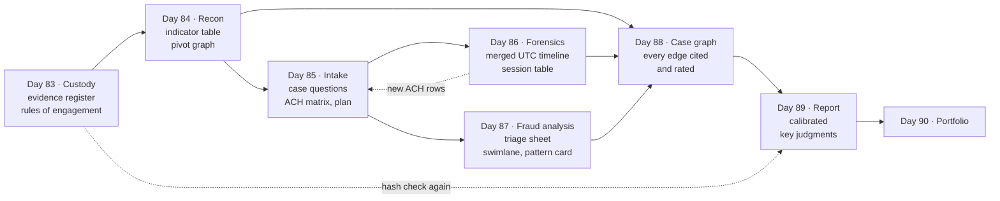
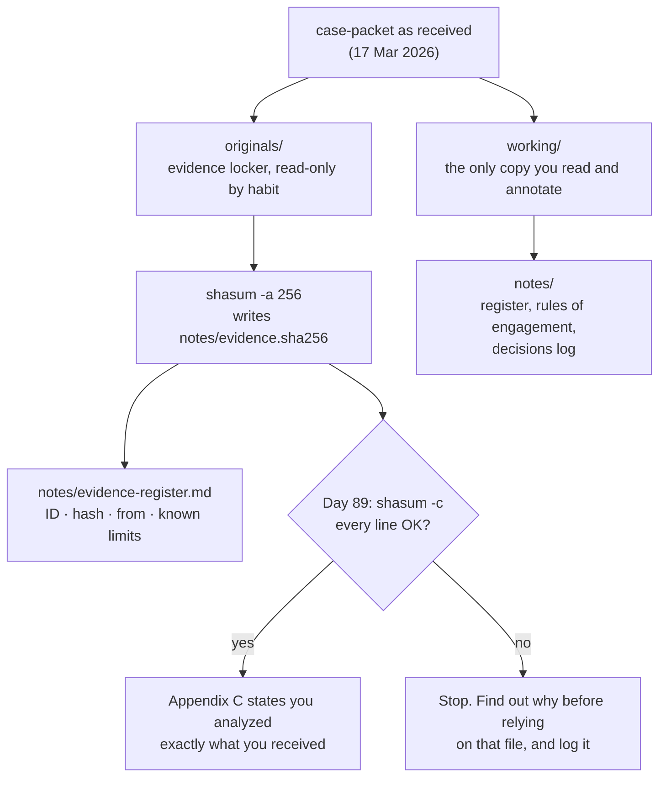
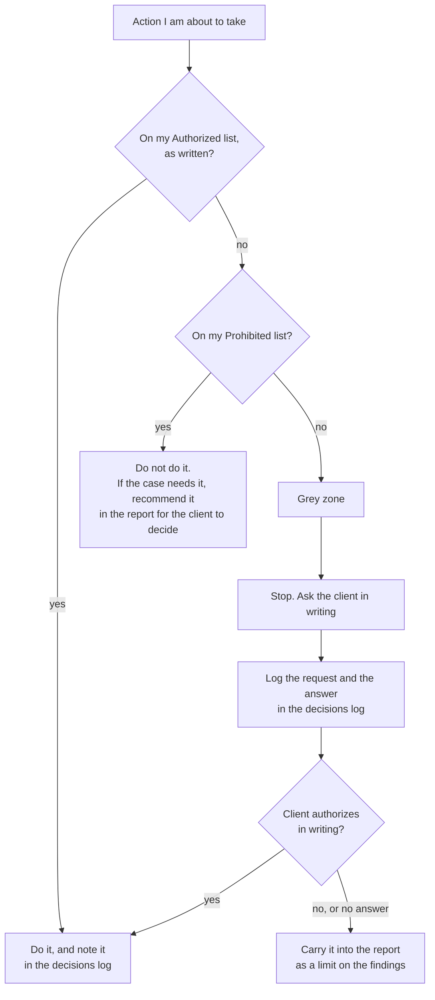

# Day 83: Capstone briefing and rules of engagement

Phase: 7. Capstone and career · Track goal: Take custody of the case evidence, write down exactly what you are and are not allowed to do, and set up the notebook that will carry the case through Day 89.

## Concept

Every earlier lab handed you a clean exercise: one skill, one dataset, one artifact. Days 83 to 89 are a single case. A small manufacturer has paid $48,612.50 to a criminal's bank account after an email that looked like it came from its lumber supplier. The client wants to know how it happened, whether its staff's email was taken over, where the attacker got the real invoice, whether anything else is aimed at it, and what to fix. The client's insurer will read your report, and the police may.

Each day's output is an input to a later day. The dotted lines are the two places where the case loops back: the forensics on Day 86 adds rows to the Day 85 hypothesis matrix, and the hashes you take today are checked again before the report goes out.



In a real engagement the first day of a case is administrative work that decides whether the rest holds up. You record what evidence you received, from whom, when, and in what state, so that later you can show it has not changed. You also agree the rules of engagement: which actions the client has authorized, which it has not, and what you will do when a situation falls between the two. Investigators who skip this step tend to cause one of two failures later. Either their evidence cannot be shown to be the evidence they were given, or they did something in the middle of the case that nobody authorized and that now taints everything after it.

The case packet is deliberately tempting. The phishing site is named in the email. The email is signed by a named person at the supplier. There is a phone number that the attacker presumably answers. Each of these invites a quick look that is outside your authorization. Deciding in advance where those lines sit is much easier than deciding under pressure on Day 86.

Hashing is the mechanical half of evidence custody. A SHA-256 hash is a 64-character fingerprint of a file's exact bytes. If you hash every file today and the hashes still match on Day 89, you can state that you analyzed exactly what you received. If a hash changes, you know to find out why before you rely on that file.

## Resources

- [NIST SP 800-86, Guide to Integrating Forensic Techniques into Incident Response](https://csrc.nist.gov/pubs/sp/800/86/final). Section 3 covers collection and preserving integrity; the hashing guidance is short and still current.
- [Berkeley Protocol on Digital Open Source Investigations](https://www.ohchr.org/en/publications/policy-and-methodological-publications/berkeley-protocol-digital-open-source) (UN OHCHR and UC Berkeley Human Rights Center). Read the chapters on legal framework and on preservation. It is the most widely cited public standard for documenting open-source investigative work.
- [GNU coreutils: sha2 utilities](https://www.gnu.org/software/coreutils/manual/html_node/sha2-utilities.html) for `sha256sum`, the Linux equivalent of the macOS `shasum -a 256` used below.
- The case packet: [`case-packet/README.md`](case-packet/README.md) and [`case-packet/01-engagement-letter.md`](case-packet/01-engagement-letter.md).

## Practical: shasum and a case notebook, building the evidence register and rules of engagement

You will finish today with three things in a case notebook (a folder of Markdown files, an Obsidian vault, or CherryTree all work): an evidence register with verified hashes, a rules-of-engagement sheet, and a case schedule.

The folder layout and the hash check work together like this. Nothing is ever edited in `originals/`, so a hash mismatch there always needs an explanation.



### Step 1: set up the case folder

Copy the packet so the original stays untouched:

```bash
mkdir -p ~/capstone/originals ~/capstone/working ~/capstone/notes
cp -R case-packet ~/capstone/originals/
cp -R case-packet ~/capstone/working/
```

From now on you read and annotate only the files in `working/`. `originals/` is your evidence locker.

### Step 2: hash the originals

On macOS:

```bash
cd ~/capstone/originals/case-packet
shasum -a 256 *.md *.eml logs/* > ~/capstone/notes/evidence.sha256
cat ~/capstone/notes/evidence.sha256
```

On Linux, replace `shasum -a 256` with `sha256sum`. On Windows PowerShell:

```powershell
Get-ChildItem -Recurse -File | Get-FileHash -Algorithm SHA256 | Export-Csv ~\capstone\notes\evidence.csv
```

Then prove the verification step works before you need it:

```bash
cd ~/capstone/originals/case-packet
shasum -a 256 -c ~/capstone/notes/evidence.sha256
```

Every line should end in `OK`. Now edit one character in a file under `working/`, hash that copy by hand, and compare it with the value for the original. The mismatch is what an altered file looks like. Undo the edit.

### Step 3: write the evidence register

Create `notes/evidence-register.md` with one row per file. Use the packet IDs from the README so every later note can cite them.

| ID | File | SHA-256 (first 16 characters) | Received | From | Description | Known limits |
|---|---|---|---|---|---|---|
| P1 | 01-engagement-letter.md | (from your hash file) | 17 Mar 2026 | Owen Tran, client | Engagement, scope, statements | Statements are summaries, not transcripts; Castellan's comments are hearsay |
| P8 | logs/mailbox-audit.csv | (from your hash file) | 17 Mar 2026 | Priya Anand, IT contractor | Sign-in and mailbox audit | Two users only; starts 9 Mar; exported after remediation |

Fill in every file. The "Known limits" column matters most. Write in it what each source cannot tell you, taken from the engagement letter's intake notes. For P9 that is at least "time zone not recorded, one workstation only, two days only." You will reread this column on Day 89 when you decide how confident each finding can be.

Leave `07-instructor-key.md` in the register and do not open it. It is part of the evidence locker for grading, not part of your analysis.

### Step 4: write the rules-of-engagement sheet

Create `notes/rules-of-engagement.md` with three sections.

Authorized: restate Part B of the engagement letter in your own words, as actions you will take. "Read and analyze P1 to P9" is fine. "Investigate the attackers" is too vague to check yourself against.

Prohibited: list every out-of-scope item from the letter, again as specific actions. "Do not load any URL on `cstl-docshare.example`, including through a scanner I control" is checkable. "Stay in scope" is not.

Grey zone: write at least three situations you can foresee that the letter does not clearly settle, with the decision and the reason. Two worked examples:

> Situation: the phishing page may still be live and the P6 scan is from 17 March. Could I scan it again from a sandbox to see whether it has changed?
> Decision: no. The letter forbids any interaction with attacker infrastructure, and a scan is an interaction the attacker's server can log. If the case needs a newer capture, I ask the client, in writing, to have its IT contractor take one, and I record the request and the answer in the decisions log.

> Situation: I could report `cstl-docshare.example` to the registrar's abuse contact to get it taken down.
> Decision: not on my own authority. A takedown changes the evidence and may matter to the police. I recommend it in the report and let the client decide, with the police if they are involved.

End the sheet with a one-line rule for anything not covered, such as "If I cannot find an action in the Authorized list, I stop and ask the client before doing it."

Drawn as a decision, the sheet you just wrote works like this. Run every action you are about to take through it, including ones that feel harmless, such as a "quick" scan or a reverse phone lookup.



### Step 5: start the decisions log and the schedule

Create `notes/decisions-log.md`. Every time you choose not to do something, change your plan, or make an assumption, add a dated line. Start it with today's entry: "Day 83: hashed packet, 11 files, all OK. Did not open P10."

Then add the case schedule so you can see the whole arc:

| Day | Phase of the case | Deliverable |
|---|---|---|
| 83 | Briefing | Evidence register, rules of engagement, decisions log |
| 84 | OSINT and threat-intel recon | Indicator table, collection log, infrastructure pivot graph, draft ATT&CK layer |
| 85 | Intake and planning | One-page intake with the case question, scope, hypotheses and plan |
| 86 | Forensics | Merged UTC timeline, session attribution table |
| 87 | Fraud and social-engineering analysis | Scored triage sheet, swimlane diagram with break points, pattern card |
| 88 | Case graph | Final graph tying every entity and evidence link together |
| 89 | Report | Final report at calibrated confidence |
| 90 | Career | Portfolio, resume, application plan |

## Checkpoint

Check your notebook against these criteria before moving on:

1. `shasum -a 256 -c` against your hash file returns `OK` for every packet file.
2. The evidence register has a row for every packet file.
3. Every row in the register has a non-empty "Known limits" entry.
4. The Prohibited list has an entry for each of the eight out-of-scope items in the engagement letter.
5. Each Prohibited entry is written as a specific action you could catch yourself doing, not a general instruction such as "stay in scope."
6. You have at least three grey-zone situations.
7. Each grey-zone situation has a decision.
8. Each decision has a reason that points to a sentence in the engagement letter.
9. Without looking, you can say what you would do if on Day 86 you realized you needed evidence the packet does not contain. (Ask the client in writing, record it, and carry the gap into the report if the answer is no.)
