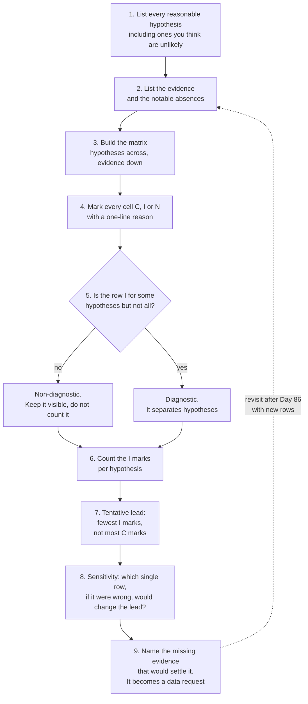
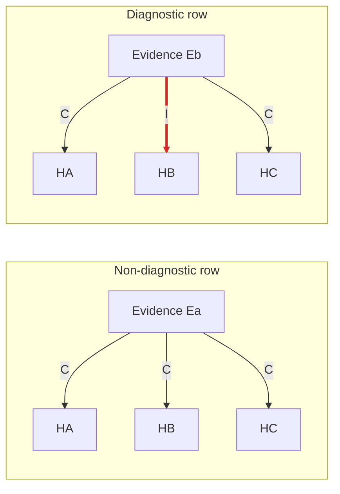

# Day 85: Intake and planning

Phase: 7. Capstone and career · Track goal: Turn the client's questions into questions the evidence can answer, lay out the competing explanations, and plan the forensics and fraud analysis before doing any of it.

## Concept

Days 83 and 84 gave you custody of the evidence and a first look at the attacker's side. Today you collect nothing new. You decide what the case is about and how you will know when you are done.

The client asked five questions in plain business language. Some of them map directly onto evidence ("Was Jordan's account taken over?"). Some cannot be answered from what you hold, at least not fully ("Did the information leak from us or from Castellan?" needs Castellan's logs, which you will never see). An intake that copies the client's questions unchanged sets you up to either overreach or quietly skip the hard ones. A good intake restates each question as something evidence can settle, and says up front which parts will likely stay open and why.

The second job is to generate hypotheses before you start the forensics. If you walk into the logs with one story in your head, every event will look like it fits. Analysis of Competing Hypotheses (ACH), from Richards Heuer's work for the CIA, is a simple guard against that. You list every reasonable explanation, list the evidence, and mark each piece of evidence as consistent or inconsistent with each explanation. The useful evidence is the kind that is inconsistent with some hypotheses, because it eliminates options. Evidence consistent with everything feels persuasive and settles nothing.

The ACH process as you will run it today and again after Day 86:

The difference between the two kinds of row, with placeholder hypotheses. Ea fits all three, so it feels like support for whichever one you already believe and eliminates nothing. Eb is inconsistent with HB, so it is the row that does work.

Your Day 84 recon changes the plan. If you found signs that the same infrastructure was used against another supplier's customers, you are no longer looking at a one-off. That affects the hypotheses about where the invoice leaked and what the client should block.

## Resources

- Richards J. Heuer Jr., [Psychology of Intelligence Analysis](https://www.cia.gov/resources/csi/books-monographs/psychology-of-intelligence-analysis-2/), chapter 8 on Analysis of Competing Hypotheses. Free from the CIA's Center for the Study of Intelligence.
- [LibreOffice Calc](https://www.libreoffice.org/) or any spreadsheet, for the ACH matrix.
- Your Day 83 rules-of-engagement sheet and your Day 84 recon log.

## Practical: LibreOffice Calc, a one-page intake and an ACH matrix

The artifact is `notes/intake.md` (one page) plus `notes/ach-q3.ods` (or `.xlsx`).

### Section 1: the case questions

Restate each of the client's five questions as an investigative question. For each one, write what evidence could answer it, and whether you expect to answer it fully, partly or not at all with the packet as it stands.

Worked example for the client's third question:

> Client's question: "Did that information leak from us or from Castellan?"
> Investigative question: Where did the attacker get message M1 (the real 3 March invoice), and when is the earliest point at which evidence shows they had it?
> Evidence that bears on it: the phishing email's `In-Reply-To` header; the earliest attacker activity in the client's audit log; registration dates of the attacker's domains; the fake letter's metadata; Castellan's comments.
> Expected answer: partial. The client's audit log starts on 9 March and does not cover the shared `ap@` mailbox, and Castellan's own logs are out of reach. I expect to reach a likelihood. A firm determination would need logs I cannot get.

Do the other four. For the fourth ("Is the same group targeting other suppliers or staff?"), fold in what you found on Day 84.

### Section 2: scope and data gaps

Summarize your Day 83 rules of engagement in three or four lines. Then list the evidence you would need that the packet does not contain, as a numbered data request to the client. For example:

1. Sign-in and mailbox audit events for `jpike` from the earliest retained date up to 9 March 2026.
2. Mailbox audit events for the shared mailbox `ap@orrinvalley.example`, same period.
3. The ERP change log for the Castellan vendor record.

Add at least two more. For this exercise the client's answer to every request is "not available in time for your report." Record that answer in your decisions log. The gaps then go into the report as limits on your findings.

### Section 3: hypotheses and the ACH matrix

Build the matrix for the investigative version of question 3. Put hypotheses across the top and evidence down the side. Start with these four hypotheses and add any you think are missing:

- H1: The attacker obtained M1 on Castellan's side, from a Castellan mailbox or system.
- H2: The attacker obtained M1 from Jordan's mailbox, through access before 9 March that the audit export does not cover.
- H3: The attacker obtained M1 from the shared `ap@` mailbox or another Orrin Valley recipient.
- H4: The attacker obtained M1 some other way, for example from a third party that handles either company's email.

Mark each cell C (consistent), I (inconsistent) or N (not applicable), and write a short reason in a comment. Worked row:

| Evidence | H1 | H2 | H3 | H4 | Diagnostic? |
|---|---|---|---|---|---|
| E1: The phish's `In-Reply-To` is M1's exact Message-ID (P2, P3 M1) | C | C | C | C | No. Anyone holding a copy of M1 would have its Message-ID. It proves the attacker had the original message, and says nothing about whose copy. |

Set the sheet up in LibreOffice Calc so it counts for you:

1. Row 1 holds the headers: `Evidence` in A1, `H1` to `H4` in B1 to E1, `Diagnostic?` in F1, `Source` in G1. Add a column after E for each hypothesis you add, and shift the formulas below to match.
2. Put one evidence row per line from row 2 down, with the packet citation in column G. Type only `C`, `I` or `N` in the hypothesis cells. To stop typos, select B2:E30 and use Data, Validity, Allow: List, Entries `C`, `I`, `N`.
3. Attach the reason to each cell as a comment (Insert, Comment). The reason is what a reviewer will check, so a cell without one is unfinished.
4. In F2, enter `=IF(OR(COUNTIF(B2:E2;"I")=0;COUNTIF(B2:E2;"I")=COUNTA(B2:E2));"non-diagnostic";"diagnostic")` and fill it down. A row with no I counts against nothing, and a row that is I for every hypothesis counts against all of them equally, so neither one separates the hypotheses. These are the rows Heuer tells you not to lean on.
5. In the first empty row under the evidence, label A as `I count` and in B enter `=COUNTIF(B2:B30;"I")`, then fill right to E.
6. Select B2:E30 and add Format, Conditional, Condition: cell value is equal to `"I"`, with a red background. The columns with the most red are the hypotheses the evidence is working against.

Calc uses `;` between function arguments by default in many locales. If it rejects the formula, use `,` instead. Excel and Google Sheets take the same formulas with commas.

Add at least five more evidence rows from the packet and your recon. Look at dates in particular: when the lookalike domain was registered relative to when M1 was sent, when the fake letter was created and to whom it was addressed, who the phish was sent to and who received M1, and what the audit log does and does not show between 9 March and 14:31 UTC on 10 March.

When the matrix is filled, count the I marks per hypothesis. Heuer's rule is to prefer the hypothesis with the least evidence against it, rather than the one with the most evidence for it. Write two sentences: which hypothesis currently leads, and which single piece of missing evidence would most change the picture.

Do not treat this as your conclusion. You will revisit the matrix after Day 86, when the forensics may add rows.

### Section 4: the plan

Write a table that assigns each investigative question to a method, the evidence, a check that tells you the step is done, and a day:

| Question | Method | Evidence | Done when | Day |
|---|---|---|---|---|
| Was Jordan's account taken over, and when? | Merge the three logs into one UTC timeline; attribute sign-in sessions | P7, P8, P9, P2 headers | Every sign-in to `jpike` from 9 to 17 March is attributed to Jordan, the attacker, IT or "unknown", with a reason | 86 |

Cover all five questions. Then list the node types you expect on the final case graph (domains, IPs, email addresses, accounts, messages, the payment, and so on) and the edge types that will connect them. Day 88 will check your graph against this list.

### Section 5: check your scope against your Day 1 limit

Reread your Day 1 answer to "what would make me stop, even if I technically could." Does your scope statement actually honor it? The packet offers several temptations: a named person at the supplier, a phone number the attacker probably answers, a phishing page that may still be live, a second company's brand on the attacker's infrastructure. Name each temptation you noticed in your plan, write the rule that stops you, and confirm you have not acted on any of them.

## Checkpoint

1. Each of the five client questions has an investigative restatement.
2. Each restatement has an expected answer of full, partial or none.
3. Each expected answer has a reason.
4. The ACH matrix has at least four hypotheses.
5. The ACH matrix has at least six evidence rows.
6. Column F marks at least one row as non-diagnostic.
7. Every row of the plan has a "done when" check someone else could verify.
8. Your plan names each temptation you noticed.
9. Each named temptation has the rule that stops you.
10. Your decisions log and recon log record no action taken on any of them.
11. Without notes, can you state Heuer's rule for choosing between hypotheses?
